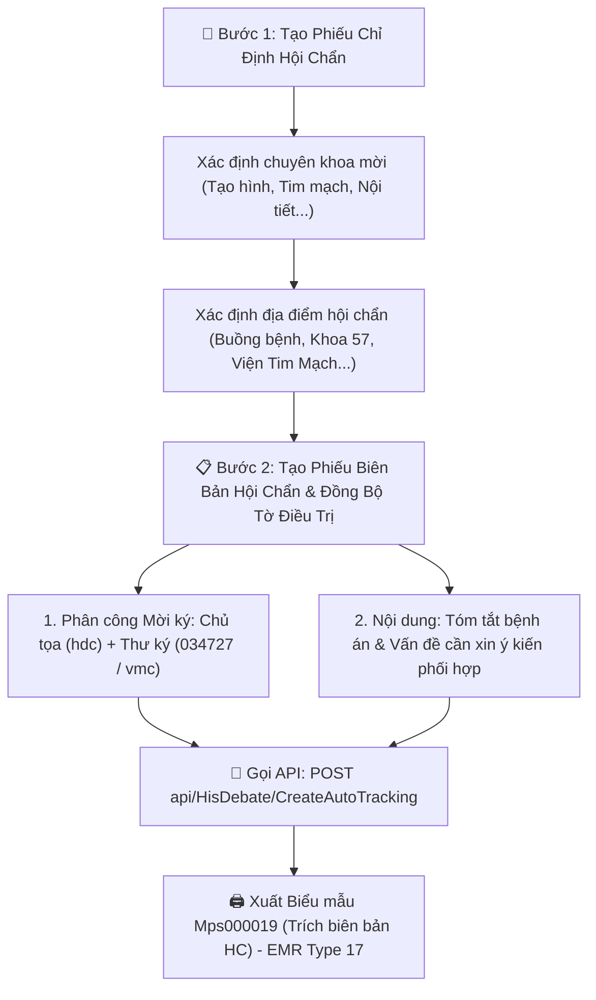

# HIS Specialist Consultation & Debate Orders (Chỉ Định & Biên Bản Hội Chẩn Chuyên Khoa)

Skill này chuẩn hóa 100% quy trình 2 bước lâm sàng khi thực hiện **Hội chẩn chuyên khoa** và **Hội chẩn liên viện/toàn viện** trên hệ thống HIS/MOS Bệnh viện Bạch Mai, đồng thời tự động cập nhật Tờ điều trị (`HIS_TRACKING`) và sinh biểu mẫu trích biên bản hội chẩn phục vụ ký số EMR.

---

## 1. QUY TRÌNH LÂM SÀNG 2 BƯỚC CHUẨN HÓA

Quy trình hội chẩn trên hệ thống HIS gồm 2 bước cốt lõi:



---

## 2. QUY CHUẨN THÀNH PHẦN MỜI KÝ & CHỦ TỌA - THƯ KÝ

Khi lập biên bản hội chẩn tại Khoa Chấn thương Chỉnh hình & Cột sống (Khoa 57):

| Vị trí | Loginname | Họ tên Bác sĩ | Cờ DTO `HIS_DEBATE_USER` | Ghi chú lâm sàng |
| :--- | :---: | :--- | :---: | :--- |
| **Chủ tọa** | `hdc` | **BS HÀ ĐỨC CƯỜNG** | `IS_PRESIDENT = 1` | Bác sĩ lãnh đạo / phụ trách hội chẩn |
| **Thư ký** | `034727` | **Ths.BS NGUYỄN HỮU SÂM** | `IS_SECRETARY = 1` | Bác sĩ điều trị chính (Mặc định) |
| **Thư ký (Dự phòng)** | `vmc` | **BS VŨ MINH CƯỜNG** | `IS_SECRETARY = 1` | Bác sĩ phụ trách buồng / hỗ trợ |
| **Bác sĩ mời** | *(Theo CK)* | *(Bác sĩ chuyên khoa đến khám)* | `HIS_DEBATE_INVITE_USER` | Ghi nhận ý kiến chuyên khoa |

---

## 3. CÔNG CỤ CLI THỰC THI 1-CLICK (`HisDebateCreator.exe`)

Công cụ được đóng gói sẵn tại:
`.agents\skills\his-clinical-operations\scripts\HisDebateCreator.exe`

### Cú pháp lệnh:
```powershell
.\.agents\skills\his-clinical-operations\scripts\HisDebateCreator.exe -t <mã_bệnh_án> -s <tên_chuyên_khoa> -m <tóm_tắt_bệnh_án> [-l <địa_điểm>] [--president <login>] [--secretary <login>]
```

### Các ví dụ mẫu thực chiến:

#### 1. Mời Hội chẩn Tạo hình thẩm mỹ (Vết thương phức tạp / hoại tử vạt da):
```powershell
.\.agents\skills\his-clinical-operations\scripts\HisDebateCreator.exe -t 000007070917 -s "ck tạo hình thẩm mỹ" -m "Bn nam chẩn đoán Vết thương phức tạp mu bàn chân (P). Hiện tại vết lóc da có diện da hoại tử đen vạt ngược kích thước 4cm, xin ý kiến CK tạo hình xét nhận bệnh nhân điều trị / phối hợp." -l "Khoa Chấn thương Chỉnh hình và Cột sống"
```

#### 2. Mời Hội chẩn Tim mạch (Tăng huyết áp / Rung nhĩ / Bilan trước mổ):
```powershell
.\.agents\skills\his-clinical-operations\scripts\HisDebateCreator.exe -t 000007070917 -s "Viện Tim Mạch" -m "Bệnh nhân cao tuổi có tiền sử THA kiểm soát kém kèm cơn rung nhĩ kịch phát, xin ý kiến chuyên khoa tim mạch tối ưu hóa thuốc và đánh giá nguy cơ gây mê phẫu thuật." -l "Phòng 716 Khoa 57"
```

#### 3. Mời Hội chẩn Nội tiết (Đái tháo đường / Đường huyết dao động):
```powershell
.\.agents\skills\his-clinical-operations\scripts\HisDebateCreator.exe -t 000007070917 -s "Khoa Nội tiết - ĐTĐ" -m "Bệnh nhân ĐTĐ type 2 đường huyết dao động nhiều (15-18 mmol/L), dự kiến phẫu thuật kết hợp xương, xin ý kiến điều chỉnh phác đồ Insulin trước và sau mổ."
```

---

## 4. THÔNG SỐ KỸ THUẬT & API MOS BACKEND

* **Endpoint chính**: `POST http://192.168.7.236:1608/api/HisDebate/CreateAutoTracking`
* **Loại nội dung**: `CONTENT_TYPE = 1` (Hội chẩn chuyên khoa).
* **Mã khoa yêu cầu**: `DEPARTMENT_ID = 57` (Khoa CTCH & Cột sống).
* **Biểu mẫu In**: `Mps000019` - `HC_TrichBienBanHoiChan___CT_001.xlsx` (**Trích biên bản hội chẩn**).
* **Mã loại tài liệu EMR**: `EMR_DOCUMENT_TYPE_CODE = 17` (Trích biên bản hội chẩn EMR).

---

## 5. TÍCH HỢP TRỢ LÝ AI SOẠN THẢO TÓM TẮT HỘI CHẨN (OPENROUTER FREE MULTI-TIER)

Khi cần soạn thảo nhanh tóm tắt bệnh án và câu hỏi hội chẩn chuyên khoa từ hồ sơ thô của bệnh nhân:
- Sử dụng công cụ CLI:
  ```powershell
  .\HisAiCli.bat ask "Soạn tóm tắt bệnh án mời hội chẩn Tim mạch cho BN 72 tuổi gãy liên mấu chuyển kèm suy tim phân suất tống máu giảm EF 40%"
  ```
- Hoặc gọi module `openrouter_client.py` với nhóm mô hình suy luận sâu: **`minimax/minimax-m3:free`** (1M tokens, 100% Free) hoặc **`openrouter/free`**.

---

## 6. TRA CỨU & ĐỌC Ý KIẾN BIÊN BẢN HỘI CHẨN TỪ CÁC CHUYÊN KHOA KHÁCH (READING CONSULTATION MINUTES)

Để kiểm tra xem các đơn vị khách (Hô hấp, Bệnh Nhiệt đới, Tim mạch, Hồi sức...) đã sang khám và cho ý kiến hay chưa:

### 1. Lệnh thực thi 1-Click:
```powershell
.\.agents\skills\his-clinical-operations\scripts\HisClinicalCli.exe debate <MãBN|MãĐT>
```

### 2. Nguyên lý kiến trúc 2 tầng:
* **Tầng 1 - `HIS_DEBATE`**: Lấy thông tin phiên hội chẩn nội khoa (Chủ tọa, Thư ký, chẩn đoán, tóm tắt diễn biến).
* **Tầng 2 - `HIS_SERVICE_REQ` + `HIS_SERE_SERV_EXT`**: Trích xuất kết luận của từng chuyên khoa khách:
  - Trạng thái xử lý (`🟢 ĐÃ CÓ KẾT QUẢ` hoặc `🟡 ĐANG CHỜ XỬ LÝ`).
  - Bác sĩ chuyên khoa khám, chức danh và số điện thoại liên hệ (VD: `BS Hiếu B - 0344300246`).
  - Toàn văn ý kiến điều trị, đề xuất kháng sinh, chỉ định cận lâm sàng bổ sung (AFB, cấy đờm, KMĐM...) và lời dặn chăm sóc.

