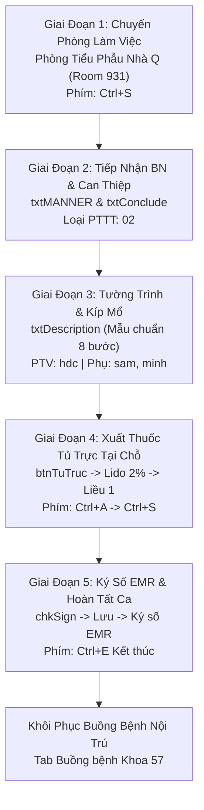

# HIS/EMR Minor Surgery & Procedure Automation Skill (Kỹ Năng Tiểu Phẫu & Thủ Thuật)

Kỹ năng này cung cấp tài liệu hướng dẫn, ma trận điều khiển giao diện (UI controls), phím tắt thao tác nhanh và quy trình tự động hóa cho các ca **Tiểu phẫu / Thủ thuật can thiệp ngoại khoa** (Minor Surgery / Procedures) tại Bệnh viện Bạch Mai, được trích xuất và tinh gọn trực tiếp từ dữ liệu học máy của bộ ghi `HisUiWrapper` (83 bước thực tế).

---

## 1. Bối Cảnh & Thông Số Mặc Định

- **Khoa thực hiện**: Khoa Chấn thương Chỉnh hình & Cột sống (Khoa 57 - `DEPARTMENT_ID = 57`)
- **Phòng thực hiện**: **Phòng Tiểu Phẫu (Nhà Q)** (`ExecuteRoomId = 931`)
- **Tủ trực dược cấp phát tại chỗ**: **`810` (`TT_KCTCHCS`)**
- **Kíp phẫu thuật / thủ thuật chuẩn**:
  - **Phẫu thuật viên chính**: `hdc` - **BS Hà Đức Cường** (Trưởng khoa)
  - **Phụ mổ 1 / Thư ký**: `034727` / `sam` - **Ths.BS Nguyễn Hữu Sâm**
  - **Phụ mổ 2 / Giúp việc**: `vmc` / `minh` - **BS Vũ Minh Cường**

---

## 2. Quy Trình Lâm Sàng 5 Giai Đoạn Chuẩn Hóa

Quy trình thực hiện gồm **5 Giai Đoạn Tuần Tự**. Bác sĩ hoặc Agent có thể thực hiện siêu tốc bằng tổ hợp phím tắt:



---

### GIAI ĐOẠN 1: Chuyển Đổi Môi Trường & Phòng Làm Việc

1. Trên cửa sổ chính `frmMain`, click biểu tượng **`Chọn phòng`** trên Quick Access Toolbar (góc trên bên trái).
2. Khi cửa sổ **`Chọn phòng`** (`frmChooseRoom`) xuất hiện:
   - Click ô tìm kiếm `txtKeyword` (AutomationId: `526252`).
   - Nhập từ khóa: `"tiểu"` hoặc `"nhà Q"`.
   - Click chọn dòng `Phòng Tiểu Phẫu (Nhà Q) (Khoa Chấn Thương Chỉnh Hình & CS)`.
   - Nhấn nút **`Chọn (Ctrl S)`** (AutomationId: `btnChoice`) hoặc phím tắt **`Ctrl + S`**.
3. Cửa sổ chuyển về tab phòng làm việc mới.

---

### GIAI ĐOẠN 2: Tiếp Nhận Bệnh Nhân & Khai Báo Can Thiệp

1. Click Tab **`Phòng Tiểu Phẫu (Nhà Q)`** trên thanh Ribbon.
2. Click nút **`Xử lý yêu cầu khám/cls/pttt`** trên thanh công cụ Ribbon.
3. Danh sách bệnh nhân chờ thực hiện hiển thị trên bảng `gridControlServiceReq`:
   - Tìm và **Double Click** vào dòng bệnh nhân cần can thiệp.
4. Giao diện thực hiện can thiệp `SurgServiceReqExecuteControl` mở ra:
   - **Cách thức phẫu thuật / thủ thuật (`txtMANNER`)**: Sửa dịch vụ gốc (ví dụ "Thay băng...") thành can thiệp thực tế (ví dụ: `rút đinh khx ngón chân phải`).
   - **Kết luận (`txtConclude`)**: Dán nội dung can thiệp tương tự (`rút đinh khx ngón chân phải`).
   - **Loại phẫu thuật / thủ thuật (`cboLoaiPT`)**: Chọn độ ưu tiên `02` (Loại 2 hoặc Loại 3).

---

### GIAI ĐOẠN 3: Tường Trình Tiểu Phẫu & Khai Báo Kíp Can Thiệp

1. Click vào ô **Mô tả quá trình phẫu thuật / Tường trình tiểu phẫu (`txtDescription`)** (AutomationId: `2557146`).
2. Nhập nội dung tường trình phẫu thuật theo mẫu chuẩn lâm sàng (xem thư viện mẫu tại `references/surgical_templates.md`).
   *Ví dụ ca Rút đinh Krischner:*
   ```text
   - Sát khuẩn trải toan
   - Tê gốc chi
   - Rạch da nhỏ
   - Bộc lộ đầu xa đinh Krischner
   - Kẹp lấy đinh
   - Lấy đủ 2 đinh
   - Sát khuẩn
   - Băng vết mổ
   ```
3. Khai báo kíp thực hiện:
   - **Phẫu thuật viên chính**: Click ô `txtSurgeon` (AutomationId: `3212878`), gõ mã `hdc` -> chọn **BS Hà Đức Cường**.
   - **Thư ký / Bác sĩ phụ**: Click ô (AutomationId: `2098482`), gõ `sam` -> chọn **BS Nguyễn Hữu Sâm**; thêm `minh` -> chọn **BS Vũ Minh Cường**.

---

### GIAI ĐOẠN 4: Xuất Dược & Vật Tư Tủ Trực Phòng Khám

1. Nhấp nút **`Tủ trực`** (AutomationId: `btnTuTruc`) ở góc dưới màn hình.
2. Cửa sổ **`Xuất thuốc tủ trực (phòng khám)`** hiện lên:
   - Click ô tìm kiếm thuốc/vật tư (AutomationId: `7800386`).
   - Gõ tên hoạt chất/thuốc: `"lido"` (Lidocain 2% 2ml).
   - Chọn dòng thuốc tương ứng trên bảng `gridControlMediMaty`.
   - Nhập số lượng: `1` (ống).
   - Nhập hướng dẫn dùng: `"tê dưới da"`.
   - Nhấn nút **`Bổ sung (Ctrl A)`** (AutomationId: `btnAdd`) hoặc phím **`Ctrl + A`**.
   - Nhấn nút **`Lưu (Ctrl S)`** (AutomationId: `btnSave`) hoặc phím **`Ctrl + S`**.
   - Bấm nút **`Close`** để đóng cửa sổ xuất tủ trực.

---

### GIAI ĐOẠN 5: Ký Số Điện Tử EMR & Hoàn Tất Ca Bệnh

1. Tích chọn vào ô **`chkSign`** ("Ký số sau khi lưu").
2. Nhấn nút **`Lưu (Ctrl S)`** (AutomationId: `btnSave`) hoặc phím **`Ctrl + S`**.
3. Xuất hiện hộp thoại Thông báo: Bấm **`Có`** (hoặc phím Enter).
4. Cửa sổ **`Văn bản điện tử` (EMR Viewer)** tự động bật lên:
   - Bấm nút **`Ký`** trên thanh công cụ văn bản điện tử.
   - Chờ hệ thống EMR ký số chứng thư số thành công và đóng văn bản.
5. Quay lại màn hình chính của HIS:
   - Nhấn nút **`Kết thúc xử lý (Ctrl E)`** (AutomationId: `btnFinish`) hoặc phím **`Ctrl + E`**.
   - Xuất hiện hộp thoại xác nhận kết thúc ca: Bấm **`Có`**.
6. **Khôi phục buồng bệnh nội trú**:
   - Trên thanh Ribbon trên cùng, click chuyển về tab **`Buồng bệnh Khoa Chấn thương Chỉnh hình và Cột sống`**.
   - Click nút **`Buồng bệnh`** để trở lại màn hình theo dõi bệnh nhân nội trú.

---

## 3. Bảng Phím Tắt Thần Tốc (Speed Hotkey Cheat Sheet)

Khi hướng dẫn Bác sĩ hoặc Điều dưỡng thực hiện trên giao diện, luôn ưu tiên các tổ hợp phím tắt nhanh:

| Phím Tắt | Ý Nghĩa / Hành Động | Cửa Sổ Áp Dụng |
| :---: | :--- | :--- |
| **`Ctrl + S`** | **Chọn phòng làm việc** | Cửa sổ `Chọn phòng` |
| **`Ctrl + A`** | **Bổ sung thuốc tủ trực vào danh sách xuất** | Cửa sổ `Xuất thuốc tủ trực (phòng khám)` |
| **`Ctrl + S`** | **Lưu phiếu xuất thuốc tủ trực** | Cửa sổ `Xuất thuốc tủ trực (phòng khám)` |
| **`Ctrl + S`** | **Lưu kết quả tiểu phẫu & kích hoạt ký số** | Màn hình `Xử lý yêu cầu khám/cls/pttt` |
| **`Enter`** | **Xác nhận "Có" trên các hộp thoại thông báo** | Cửa sổ thông báo hệ thống |
| **`Ctrl + E`** | **Kết thúc xử lý ca bệnh (Finish Procedure)** | Màn hình `Xử lý yêu cầu khám/cls/pttt` |

---

## 4. Thư Viện Mẫu Tường Trình Tiểu Phẫu Chuẩn

Xem tài liệu chi tiết tại [surgical_templates.md](file:///d:/his%203-9/his-x64-28-11fix%20GDYK/his-x64/.agents/skills/his-minor-surgery/references/surgical_templates.md) bao gồm:
1. **Rút đinh Krischner ngón tay / ngón chân**
2. **Thay băng & điều trị vết thương mạn tính**
3. **Cắt chỉ vết mổ sạch / nhiễm trùng**
4. **Khâu vết thương phần mềm / xử trí vết thương hở**
5. **Chọc hút dịch bao hoạt dịch khớp gối**
6. **Tiêm phong bế gân cơ / điểm bám gân**
7. **Bó bột / Nắn chỉnh bột gãy xương chi**
