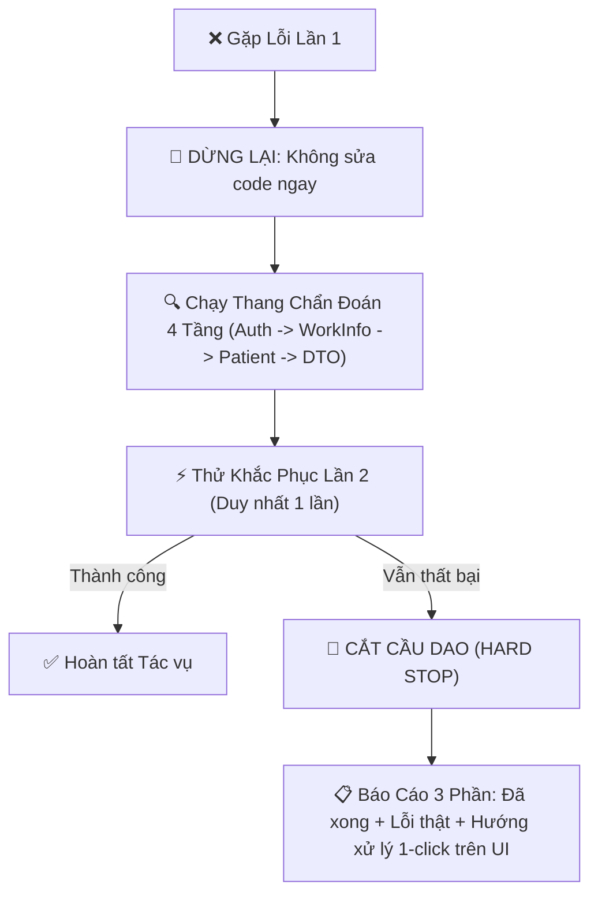

# 🏥 CẨM NANG TOÀN DIỆN TÍCH HỢP HIS / MOS / EMR CHO AI AGENT (MASTER PLAYBOOK)
> **Phiên bản Hợp nhất Tối thượng (Desktop & Laptop Unified Master Edition)**
> **Mục đích**: Tài liệu hóa 100% kinh nghiệm thực chiến, kiến trúc, cấu trúc DTO, các bẫy runtime (gotchas), từ điển lâm sàng chuẩn hóa và toàn bộ kho công cụ tự động hóa trên hệ thống HIS Bệnh viện Bạch Mai. Một Agent ở bất kỳ máy tính nào chỉ cần đọc duy nhất tài liệu này là có thể thực thi chính xác 100% ngay lập tức mà **không cần thử lỗi hay phân tích ngược lại từ đầu**.

---

## 📑 MỤC LỤC
1. [Kiến Trúc Hệ Thống & Cổng Kết Nối](#1-kiến-trúc-hệ-thống--cổng-kết-nối)
2. [Bộ Thông Số Bác Sĩ & Khoa Phòng Mặc Định](#2-bộ-thông-số-bác-sĩ--khoa-phòng-mặc-định)
3. [Cơ Chế Xác Thực, Đăng Nhập & Kích Hoạt Phòng Làm Việc](#3-cơ-chế-xác-thực-đăng-nhập--kích-hoạt-phòng-làm-việc)
4. [Quy Trình Tra Cứu Bệnh Nhân, Buồng Giường & Bilan Tiền Phẫu](#4-quy-trình-tra-cứu-bệnh-nhân-buồng-giường--bilan-tiền-phẫu)
5. [Phân Hệ 1: Tờ Điều Trị & Chế Độ Chăm Sóc (Treatment Tracking & DHST)](#5-phân-hệ-1-tờ-điều-trị--chế-độ-chăm-sóc-treatment-tracking--dhst)
6. [Phân Hệ 2: Chỉ Định Suất Ăn Dinh Dưỡng Bệnh Lý (Diet / Ration Orders)](#6-phân-hệ-2-chỉ-định-suất-ăn-dinh-dưỡng-bệnh-lý-diet--ration-orders)
7. [Phân Hệ 3: Kê Đơn Thuốc Nội Trú & Ra Viện Chuẩn Lâm Sàng 100%](#7-phân-hệ-3-kê-đơn-thuốc-nội-trú--ra-viện-chuẩn-lâm-sàng-100)
8. [Phân Hệ 4: Chỉ Định Cận Lâm Sàng & Đường Máu Mao Mạch Tại Giường (BM02426)](#8-phân-hệ-4-chỉ-định-cận-lâm-sàng--đường-máu-mao-mạch-tại-giường-bm02426)
9. [Phân Hệ 5: Báo Cáo Giao Ban Ca Trực & Bilan Phẫu Thuật Hậu Phẫu](#9-phân-hệ-5-báo-cáo-giao-ban-ca-trực--bilan-phẫu-thuật-hậu-phẫu)
10. [Phân Hệ 6: Ký Số Điện Tử & Mời Bác Sĩ Ký (EMR Sign)](#10-phân-hệ-6-ký-số-điện-tử--mời-bác-sĩ-ký-emr-sign)
11. [Phân Hệ 7: Chỉ Định & Biên Bản Hội Chẩn Chuyên Khoa (Debate Diagnostic & Consultation)](#11-phân-hệ-7-chỉ-định--biên-bản-hội-chẩn-chuyên-khoa-debate-diagnostic--consultation)
12. [Quy Chuẩn Lâm Sàng Bắt Buộc (Mã ICD-10 5 Ký Tự & Mô Tả CĐHA)](#12-quy-chuẩn-lâm-sàng-bắt-buộc-mã-icd-10-5-ký-tự--mô-tả-cđha)
13. [Bảng Tổng Hợp 28+ Sai Lầm & Bài Học Xương Máu (Gotchas Matrix)](#13-bảng-tổng-hợp-28-sai-lầm--bài-học-xương-máu-gotchas-matrix)
14. [Hướng Dẫn Biên Dịch & Chạy Công Cụ CLI Tức Thì](#14-hướng-dẫn-biên-dịch--chạy-công-cụ-cli-tức-thì)
15. [Cơ Chế Đồng Bộ Tri Thức 1-Click Giữa Máy Bàn & Laptop](#15-cơ-chế-đồng-bộ-tri-thức-1-click-giữa-máy-bàn--laptop)
16. [Quy Chuẩn Tích Hợp OpenRouter & Ma Trận Mô Hình Miễn Phí](#16-quy-chuẩn-tích-hợp-openrouter--ma-trận-mô-hình-miễn-phí-đa-tầng-smart-multi-tier-ai-routing)
17. [Cẩm Nang Chống Vòng Lặp & Kỹ Thuật Chẩn Đoán Lỗi Tức Thì (Anti-Loop Manual)](#17-cẩm-nang-chống-vòng-lặp--kỹ-thuật-chẩn-đoán-lỗi-tức-thì-anti-loop-manual)
18. [Quy Chuẩn Báo Cáo Buồng Bệnh & Đồng Bộ Tự Động Lên Cloud Drive](#18-quy-chuẩn-báo-cáo-buồng-bệnh--đồng-bộ-tự-động-lên-cloud-drive)
19. [Cơ Sở 2 (Bệnh Viện Bạch Mai Cơ Sở Ninh Bình) - Bản Đồ Cấu Hình & Quy Tắc Lâm Sàng](#19-cơ-sở-2-bệnh-viện-bạch-mai-cơ-sở-ninh-bình---bản-đồ-cấu-hình--quy-tắc-lâm-sàng)
20. [Quy Trình Báo Cáo Đi Buồng Hội Chẩn Liên Khoa & Cập Nhật Tập Trung Cloud Drive](#20-quy-trình-báo-cáo-đi-buồng-hội-chẩn-liên-khoa--cập-nhật-tập-trung-cloud-drive)
21. [Quy Trình Hủy/Xóa Y Lệnh & Dịch Vụ Chưa Thực Hiện (Chỉ Định Màu Trắng)](#21-quy-trình-hủyxóa-y-lệnh--dịch-vụ-chưa-thực-hiện-chỉ-định-màu-trắng)
22. [Bẫy Lỗi Xuất Biểu Mẫu Word/Docx Biên Bản PT-01 (Strict Fresh Zip Pattern)](#22-bẫy-lỗi-xuất-biểu-mẫu-worddocx-biên-bản-pt-01-lỗi-corrupt-trên-libreoffice--word)
23. [Quy Trình & Kỹ Thuật Chỉ Định CLS Trực Tiếp Bypass UI (Headless API) & Cơ Chế Gom Ống 1-Barcode](#23-quy-trình--kỹ-thuật-chỉ-định-cls-trực-tiếp-bypass-ui-headless-api--cơ-chế-gom-ống-bệnh-phẩm-1-barcode)
24. [Quy Chuẩn Tự Động Hóa Tra Cứu & Mở Ảnh PACS / RIS (Web Viewer 1-Click)](#24-quy-chuẩn-tự-động-hóa-tra-cứu--mở-ảnh-pacs--ris-web-viewer-1-click)
25. [Quy Chuẩn Cốt Lõi: Nguyên Tắc Ponytail (Lazy Senior Dev Mode)](#25-quy-chuẩn-cốt-lõi-nguyên-tắc-ponytail-lazy-senior-dev-mode-toàn-diện-cho-mọi-nhánh)
26. [Bẫy Lỗi Quét Y Lệnh BN Tuần Tự & Logic Lọc Ngày](#-bẫy-lỗi-26-quét-y-lệnh-32-bn-tuần-tự--chậm-100-giây-sai-logic-ngày)
35. [Quy Chuẩn HIS MCP Server (Bộ Công Cụ 18-in-1)](file:///HIS_AI_INTEGRATION_PLAYBOOK.md#35-quy-chuẩn-his-mcp-server-bộ-công-cụ-18-in-1-chuẩn-hóa-giao-thức-json-rpc-20)
36. [Bẫy Lỗi & Quy Chuẩn Kê Insulin Tủ Trực (Cabinet Insulin Prescribing)](file:///HIS_AI_INTEGRATION_PLAYBOOK.md#36-bẫy-lỗi--quy-chuẩn-kê-insulin-tủ-trực-cabinet-insulin-prescribing)
37. [Bẫy Lỗi & Quy Chuẩn Đổi Người Chỉ Định Y Lệnh Trắng (Change Order Doctor)](file:///HIS_AI_INTEGRATION_PLAYBOOK.md#37-bẫy-lỗi--quy-chuẩn-đổi-người-chỉ-định-y-lệnh-trắng-change-order-doctor)
38. [Quy Chuẩn Protocol 'Thợ Làm Ra Viện' (1-Click Discharge Protocol)](file:///HIS_AI_INTEGRATION_PLAYBOOK.md#38-quy-chuẩn-protocol-thợ-làm-ra-viện-1-click-discharge-protocol)
39. [Kiến Trúc Điều Phối Chuyên Biệt Cơ Sở & Cách Ly Token Tuyệt Đối (`his_hn` & `his_nb`)](file:///HIS_AI_INTEGRATION_PLAYBOOK.md#39-kiến-trúc-điều-phối-chuyên-biệt-cơ-sở--cách-ly-token-tuyệt-đối-facility-specialized-routers--token-isolation-his_hn--his_nb)
40. [Quy Chuẩn Protocol 'Thợ Trực Buồng' (1-Click Ward Duty Protocol)](file:///HIS_AI_INTEGRATION_PLAYBOOK.md#40-quy-chuẩn-protocol-thợ-trực-buồng-1-click-ward-duty-protocol)
41. [Quy Trình Đăng Ký Bệnh Nhân Mổ Cấp Cứu Phân Luồng Cơ Sở (Emergency Surgery Protocol)](file:///HIS_AI_INTEGRATION_PLAYBOOK.md#41-quy-trình-đăng-ký-bệnh-nhân-mổ-cấp-cứu-google-forms-phân-luồng-cơ-sở-emergency-surgery-protocol)

---

## 1. KIẾN TRÚC HỆ THỐNG & CỔNG KẾT NỐI

Mọi giao tiếp đều đi qua mạng nội bộ bệnh viện (hoặc qua VPN/Tunnel an toàn):

| Dịch vụ | Địa chỉ IP & Cổng | Mục đích | Phương thức giao tiếp |
| :--- | :--- | :--- | :--- |
| **MOS Backend** | `http://192.168.7.236:1608/` | Nghiệp vụ HIS chính (Tờ điều trị, Suất ăn, Thuốc, Dịch vụ, CLS) | REST API (JSON Body hoặc Base64 param) |
| **ACS Auth** | `http://192.168.7.200:1401/` | Xác thực tài khoản bác sĩ, cấp và gia hạn TokenCode | `api/Token/Login`, `api/Token/Renew` |
| **SDA Data** | `http://192.168.7.200:1410/` | Danh mục hệ thống, phân quyền, cấu hình giao diện | SDA Service APIs |
| **EMR Service** | `http://192.168.7.239:1415/` | Bệnh án điện tử, tạo văn bản y khoa, ký số, mời ký | EMR Document APIs |

---

## 2. BỘ THÔNG SỐ BÁC SĨ & KHOA PHÒNG MẶC ĐỊNH

Khi gửi request hoặc xây dựng kịch bản y lệnh, sử dụng thông tin định danh của phiên làm việc bác sĩ:

* **Bác sĩ điều trị mặc định**: `034727` - **Ths.BS NGUYỄN HỮU SÂM** (Áp dụng chung cho **TẤT CẢ các cơ sở** Hà Nội và Ninh Bình).
* **Mật khẩu Bác sĩ**: Mật khẩu hiện tại là **`981`** (Bác sĩ thay đổi mật khẩu thường xuyên và sẽ thông báo khi bắt đầu phiên làm việc; hệ thống tự động nhận qua biến môi trường `$env:HIS_PASSWORD` hoặc fallback `981`).
* **Bác sĩ phối hợp / Mời ký**: `ndh2` - **BS NGUYỄN ĐỨC HOÀNG**
* **Tài khoản bác sĩ phụ trợ / kíp mổ**: `vmc` - **BS VŨ MINH CƯỜNG** (chỉ dùng khi có yêu cầu phụ mổ/kíp mổ cụ thể).
* **Bác sĩ Khoa 57 / PTV**: 
  - `tmd2` / `tmd`: **BS TRỊNH MINH ĐỨC** *(Tuyệt đối không tự đoán tên từ ký hiệu viết tắt)*
  - `lvl12`: **BS LÊ VĂN LƯỢNG**
  - `ldt`: **BS LÊ ĐĂNG TOÀN**
  - `dhg`: **BS ĐINH HOÀNG GIANG**
  - `pnt2`: **BS PHẠM NGỌC THẮNG**
  - `ddb`: **BS ĐỖ ĐĂNG BÌNH** (hoặc BS ĐOÀN ĐỨC BÁCH)
* **Khoa lâm sàng**: Khoa Chấn thương Chỉnh hình & Cột sống (`DEPARTMENT_ID = 57`, Mã Khoa: `9`)
* **Các buồng bệnh phụ trách**: Phòng 712, 714, 716, 724, 725 (Room ID tương ứng, ví dụ P724 có `BED_ROOM_ID = 780`, `ROOM_ID = 5257`; Phòng 734 có `ROOM_ID = 5248`)
* **IP Client gửi request**: `100.93.206.93`

---

## 3. CƠ CHẾ XÁC THỰC, ĐĂNG NHẬP & KÍCH HOẠT PHÒNG LÀM VIỆC

### 3.1. Cách 1: Đọc Live Token từ HIS Client đang chạy (Kèm xử lý File Lock)
HIS Client ghi log chứa `TokenCode` vào file log cục bộ: `E:\his-x64-28-11fix GDYK\his-x64\Logs\LogSystem.txt` (hoặc `Logs/HLSLogSystem.txt`).

> ⚠️ **Bẫy nghiêm trọng (File Lock Gotcha):**
> Ứng dụng HIS trên máy liên tục ghi vào file log. Nếu dùng `File.ReadAllLines`, `File.ReadAllText` hoặc PowerShell `Get-Content` không đúng cách, Windows sẽ báo lỗi:
> `System.IO.IOException: The process cannot access the file because it is being used by another process.`

✅ **Cách xử lý chuẩn xác 100% (Bắt buộc dùng `FileShare.ReadWrite`):**
```csharp
string logPath = @"E:\his-x64-28-11fix GDYK\his-x64\Logs\LogSystem.txt";
string token = "";
using (var fs = new FileStream(logPath, FileMode.Open, FileAccess.Read, FileShare.ReadWrite))
using (var sr = new StreamReader(fs))
{
    string text = sr.ReadToEnd();
    var lines = text.Split(new[] { "\r\n", "\n" }, StringSplitOptions.None);
    for (int i = lines.Length - 1; i >= 0; i--)
    {
        if (lines[i].Contains("TokenCode|"))
        {
            int idx = lines[i].IndexOf("TokenCode|") + 10;
            if (lines[i].Length >= idx + 64)
            {
                token = lines[i].Substring(idx, 64);
                break;
            }
        }
    }
}
```

### 3.2. Headers bắt buộc khi gọi REST API trực tiếp
```http
TokenCode: <token_64_ký_tự>
Authorization: Bearer <token_64_ký_tự>
ClientIpAddress: 100.93.206.93
Content-Type: application/json; charset=utf-8
```

### 3.3. Cách 2: Đăng nhập tự động & [BẮT BUỘC] Kích hoạt WorkInfo phòng làm việc
Khi chạy công cụ độc lập (CLI / Daemon), sau khi login lấy TokenCode, **bắt buộc phải kích hoạt danh sách phòng làm việc (`UpdateWorkInfo`)** trước khi thực hiện bất kỳ y lệnh lâm sàng nào để tránh lỗi `KhongCoThongTinPhongLamViec`:

```csharp
// 1. Khởi tạo cấu hình hệ thống
HIS.Desktop.LocalStorage.ConfigSystem.Load.Init();

// 2. Đăng nhập lấy Token
ClientTokenManager tokenManager = new ClientTokenManager("HIS");
CommonParam param = new CommonParam();
var token = tokenManager.Login(param, "034727", "998199", "2.390.0");
ApiConsumers.SetConsunmer(token.TokenCode);

// 3. [BẮT BUỘC] Kích hoạt thông tin phòng làm việc
var workInfo = new WorkInfoSDO
{
    DepartmentId = 57,
    BranchId = 1,
    Rooms = new List<RoomSDO>
    {
        new RoomSDO { RoomId = 5248 }, // Phòng 734 (Phòng giao ban/khám)
        new RoomSDO { RoomId = 5252 }, // Phòng 712
        new RoomSDO { RoomId = 5251 }, // Phòng 714
        new RoomSDO { RoomId = 5257 }  // Phòng 724
    }
};
var myAdapter = new MyAdapter();
var workPlaces = myAdapter.PostData<List<WorkPlaceSDO>>("api/Token/UpdateWorkInfo", ApiConsumers.MosConsumer, workInfo, param);
HIS.Desktop.LocalStorage.LocalData.WorkPlace.WorkPlaceSDO = workPlaces;
HIS.Desktop.LocalStorage.LocalData.WorkPlace.WorkInfoSDO = workInfo;
```

---

## 4. QUY TRÌNH TRA CỨU BỆNH NHÂN, BUỒNG GIƯỜNG & BILAN TIỀN PHẪU

Mỗi bệnh nhân có các định danh quan trọng:
* **Mã bệnh nhân (Patient Code)**: 10 ký tự (VD: `0003969449`).
* **Mã hồ sơ bệnh án (Treatment Code)**: 12 ký tự (VD: `000007060449`).
* **Treatment ID (Khóa chính nội bộ)**: Số nguyên `Int64` (VD: `7060265`).

### 4.1. Tìm hồ sơ đang điều trị (`api/HisTreatment/GetView`)
```csharp
var filter = new HisTreatmentViewFilter();
filter.KEY_WORD = patientCode; // hoặc TREATMENT_CODE__EXACT
var treatments = adapter.FetchList<V_HIS_TREATMENT>("api/HisTreatment/GetView", ApiConsumers.MosConsumer, filter, param);
var currentTreatment = treatments.LastOrDefault(x => x.IS_PAUSE != 1);
```
* 💡 **Lưu ý sống còn khi tìm kiếm theo tên bệnh nhân (Rule 12)**:
  - HIS/Oracle phân biệt dấu thanh kiểu cũ (`òa`, `óa` - VD: `TÔ XUÂN HÒA`) và kiểu mới (`oà`, `oá` - VD: `NGUYỄN VĂN HOÀ`).
  - Khi tra cứu bằng tên, luôn quét in-memory danh sách buồng bệnh (`HisTreatmentBedRoom/GetView`) bằng hàm `RemoveDiacritics()` hoặc thử cả 2 biến thể dấu để không bỏ sót bệnh nhân.
  - Khi phát hiện nhiều bệnh nhân trùng tên, bắt buộc in bảng đối soát cảnh báo, không được tự ý chọn 1 bản ghi duy nhất.


### 4.2. Lấy vị trí buồng / giường hiện tại (`api/HisTreatmentBedRoom/GetLView`)
```csharp
var bedFilter = new HisTreatmentBedRoomLViewFilter();
bedFilter.TREATMENT_IDs = new List<long> { currentTreatment.ID };
bedFilter.IS_IN_ROOM = true;
var bedRooms = adapter.FetchList<V_HIS_TREATMENT_BED_ROOM>("api/HisTreatmentBedRoom/GetLView", ApiConsumers.MosConsumer, bedFilter, param);
var currentBed = bedRooms.LastOrDefault(x => x.REMOVE_TIME == null || x.REMOVE_TIME == 0);
long requestRoomId = currentBed != null ? (currentBed.BED_ROOM_ID ?? 5248) : 5248;
```

### 4.3. Trích xuất toàn bộ Bilan Xét nghiệm & CĐHA (`api/HisSereServTein/GetView`)
```csharp
var teinFilter = new HisSereServTeinViewFilter();
teinFilter.TDL_TREATMENT_ID = currentTreatment.ID;
var teinList = adapter.FetchList<V_HIS_SERE_SERV_TEIN>("api/HisSereServTein/GetView", ApiConsumers.MosConsumer, teinFilter, param);

Func<string, string> getTein = (match) => {
    var item = teinList.LastOrDefault(x => !string.IsNullOrEmpty(x.VALUE) && 
        ((x.TEST_INDEX_NAME != null && x.TEST_INDEX_NAME.ToUpper().Contains(match.ToUpper())) ||
         (x.TEST_INDEX_CODE != null && x.TEST_INDEX_CODE.ToUpper() == match.ToUpper())));
    return item != null ? item.VALUE + " " + item.TEST_INDEX_UNIT_NAME : "-";
};

string hgb = getTein("Hemoglobin");
string wbc = getTein("Số lượng bạch cầu");
string plt = getTein("Số lượng tiểu cầu");
string inr = getTein("PT - INR");
string glucose = getTein("Glucose [Máu]");
string creatinin = getTein("Creatinin [máu]");
string bloodGroup = getTein("ABO") + " Rh " + getTein("Rh(D)");
```

---

## 5. PHÂN HỆ 1: TỜ ĐIỀU TRỊ & CHẾ ĐỘ CHĂM SÓC (TREATMENT TRACKING & DHST)

### 5.1. Endpoint Backend MOS
* **URL**: `http://192.168.7.236:1608/api/HisTracking/Create`
* **Loại đối tượng yêu cầu**: `MOS.SDO.HisTrackingSDO`

> ⚠️ **Bẫy DTO nghiêm trọng:**
> 1. **Sai tên trường**: Trường y lệnh trong `HIS_TRACKING` tên là **`MEDICAL_INSTRUCTION`** (không phải `TREATMENT_INSTRUCTION`).
> 2. **Sai lớp bao bọc**: Không gửi `HIS_TRACKING` dạng phẳng. Phải bọc vào `MOS.SDO.HisTrackingSDO`:
>    - `Tracking`: Đối tượng `HIS_TRACKING`
>    - `WorkingRoomId`: `Int64` (ID phòng làm việc)

### 5.2. Cấu trúc C# chuẩn tạo Tờ điều trị & DHST:
```csharp
var tracking = new HIS_TRACKING();
tracking.TREATMENT_ID = treatmentId;
tracking.TRACKING_TIME = 20260825080000; // yyyyMMddHHmmss
tracking.ICD_CODE = icdCode;             // VD: "M47.00†"
tracking.ICD_NAME = icdName;
tracking.ICD_SUB_CODE = icdSubCode;     // VD: "E11.9"
tracking.ICD_TEXT = icdText;
tracking.CONTENT = "Bệnh nhân tỉnh, tiếp xúc tốt, không sốt, vết mổ khô sạch đầu chi ấm.";
tracking.MEDICAL_INSTRUCTION = "Chăm sóc cấp II. Chế độ ăn BT01. Thuốc theo đơn. Theo dõi DHST 2 lần/ngày.";
tracking.DEPARTMENT_ID = 57;
tracking.ROOM_ID = workingRoomId;

var sdo = new HisTrackingSDO();
sdo.Tracking = tracking;
sdo.WorkingRoomId = workingRoomId;

var result = adapter.PostData<HisTrackingSDO>("api/HisTracking/Create", ApiConsumers.MosConsumer, sdo, param);
```

### 5.3. Công cụ sẵn có:
* `HisTrackingCreator.exe` (Kèm file kích hoạt nhanh `Chay_Tao_ToDieuTri.bat`):
  ```powershell
  # Tạo tờ điều trị đơn lẻ:
  .\HisTrackingCreator.exe -p "0003969449" -time "08:00" -content "Bệnh nhân tỉnh táo, vết mổ khô" -care "Chăm sóc cấp II. Ăn BT01" -med "Thuốc theo đơn"

  # Tạo theo mẫu lâm sàng chuẩn 1..6:
  .\HisTrackingCreator.exe -p "0003969449,0003298895" -template 1 -time "08:00" -date "2026-08-25"
  ```
* `QuickTracking.exe`:
  ```powershell
  .\QuickTracking.exe -p 0003969449 -time 08:00 -content "bn tỉnh không sốt huyết động ổn"
  ```

### 5.4. Quy trình Xóa Tờ Điều Trị (Delete Tracking):
- **Endpoint**: `POST api/HisTracking/Delete`
- **Consumer**: `ApiConsumers.MosConsumer`
- **Payload**: `Int64` (chính là `trackingId`, truyền trực tiếp dạng số nguyên: `adapter.Post<bool>("api/HisTracking/Delete", ApiConsumers.MosConsumer, trackingId, param)`).
- **Phân quyền**: Đăng nhập bằng tài khoản Bác sĩ tạo tờ điều trị (hoặc Bác sĩ được ủy quyền trong khoa) kèm cập nhật `UpdateWorkInfo`.

---

## 6. PHÂN HỆ 2: CHỈ ĐỊNH SUẤT ĂN DINH DƯỠNG BỆNH LÝ (DIET / RATION ORDERS)

### 6.1. Nguyên tắc cốt lõi: 1 Request = 1 Ngày
* Backend MOS chỉ ghi nhận **đúng 1 mốc thời gian đầu tiên** trong mảng `InstructionTimes`.
* Nếu kê cho $N$ ngày, **bắt buộc lặp $N$ lần gọi API**, mỗi lần truyền `InstructionTimes = [YYYYMMDD050000]`.
* **Quy trình 3 bước**: Pre-check (`api/HisSereServRation/GetView`) -> Execute -> Post-verify đối soát 100%.

### 6.2. Từ điển Suất ăn Dinh dưỡng Lâm sàng:
* **Phòng thực hiện tiếp nhận**: `RoomId = 5809` (Trung tâm Dinh dưỡng Lâm sàng).
* **Đối tượng**: `PatientTypeId = 42` (Viện phí) hoặc lấy từ hồ sơ.

| Mã Combo | Bữa Sáng (06:00, RationTimeId: 1) | Bữa Trưa (11:00, RationTimeId: 3) | Bữa Chiều (17:00, RationTimeId: 5) |
| :--- | :--- | :--- | :--- |
| **BT01** (Thông thường/Ngoại khoa) | Mã: `BM17770` (ID: `30073`) | Mã: `BM18696` (ID: `30153`) | Mã: `BM18697` (ID: `30154`) |
| **DD01** (Đái tháo đường) | Mã: `CO02` (ID: `30180`) | Mã: `CS01` (ID: `30181`) | Mã: `BM18650` (ID: `30133`) |
| **TM01** (Tim mạch / THA) | Mã: `BM18075` (ID: `30117`) | Mã: `BM18039` (ID: `30093`) | Mã: `BM18040` (ID: `30094`) |

### 6.3. Endpoint & Cấu trúc DTO:
* **Endpoint**: `POST http://192.168.7.236:1608/api/HisServiceReq/RationCreate`
* **DTO**: `HisRationServiceReqSDO`

```json
{
  "TreatmentIds": [ 7060265 ],
  "InstructionTimes": [ 20260825050000 ],
  "RequestRoomId": 5257,
  "RequestLoginName": "034727",
  "RequestUserName": "NGUYỄN HỮU SÂM",
  "IcdCode": "M47.00†",
  "IcdName": "Viêm đốt sống...",
  "RationServices": [
    { "ServiceId": 30073, "PatientTypeId": 42, "RoomId": 5809, "Amount": 1.0, "RationTimeIds": [1] },
    { "ServiceId": 30153, "PatientTypeId": 42, "RoomId": 5809, "Amount": 1.0, "RationTimeIds": [3] },
    { "ServiceId": 30154, "PatientTypeId": 42, "RoomId": 5809, "Amount": 1.0, "RationTimeIds": [5] }
  ]
}
```

### 6.4. Công cụ sẵn có: `QuickRation.exe`
```powershell
.\QuickRation.exe -p 0003969449 -combo BT01 -date 20260825,20260826
.\QuickRation.exe -room 712 -combo DD01 -date 20260825,20260826
```

---

## 7. PHÂN HỆ 3: KÊ ĐƠN THUỐC NỘI TRÚ & RA VIỆN CHUẨN LÂM SÀNG 100%

### 7.1. Cấu hình Bản đồ Kho Dược & Loại xuất:
* **Kho thuốc ống (tiêm, truyền, dịch, chống đông)**: `MediStockId = 4209` (Ceftriaxone, Zinacef, Unasyn, Medivernol, Voxin, Paracetamol Kabi, Gemapaxane, Heparine...)
* **Kho thuốc viên (uống)**: `MediStockId = 4210` (Augmentin 1g, Tramadol/Para, Celebrex, Arcoxia, Lyrica, Tolperison, Nexium...)
* **Kho Dịch truyền**: `MediStockId = 804` (Natri Clorid 0.9% 100ml, 250ml, 500ml...)
* **Kho Hướng thần / Gây nghiện**: `MediStockId = 4208` (Seduxen 5mg...)
* **Đối tượng**: `PatientTypeId = 1` (BHYT) hoặc `42` (Viện phí).
* **Loại xuất**: `EXP_MEST_TYPE_ID = 14` (Đơn nội trú) / `15` (Đơn ra viện).
* **Endpoint**: `POST api/HisServiceReq/InPatientPresCreate`

### 7.2. ⚠️ TỪ ĐIỂN CÁCH DÙNG THUỐC CHUẨN LÂM SÀNG (BẮT BUỘC 100% KHÔNG ĐỂ BS SỬA TAY):

| Mã thuốc | Tên biệt dược | Hoạt chất & Hàm lượng | Chia cữ (S/Tr/C/T) | Hướng dẫn sử dụng chuẩn lâm sàng (`TUTORIAL`) | Dung môi kèm theo |
| :--- | :--- | :--- | :---: | :--- | :--- |
| `TH.MEDI007` | **Medivernol 1g** | Ceftriaxone 1g | `2` / `-` / `-` / `-` | Pha 02 lọ vào 100ml NaCl 0.9%, truyền TM 30-40 giọt/phút lúc 9h sáng. | NaCl 0.9% 100ml (1 chai) |
| `TH.ROCE003` | **Rocephin 1g** | Ceftriaxon 1g | `2` / `-` / `-` / `-` | Pha 02 lọ Ceftriaxone với 100ml NaCl 0.9%, truyền TM 30 giọt/phút lúc 9h sáng. | NaCl 0.9% 100ml (1 chai) |
| `TH.ZINA002` | **Zinacef 750mg** | Cefuroxim 750mg | `2` / `-` / `-` / `-` | Pha 02 lọ với 02 ống Nước cất 10ml, tiêm/truyền TM chậm lúc 9h sáng. | Nước cất tiêm 10ml (2 ống) |
| `TH.UNAS005` | **Unasyn 1.5g** | Ampicilin + Sulbactam | `1` / `-` / `1` / `-` | Pha mỗi lọ với 100ml NaCl 0.9%, truyền TM 30 giọt/phút lúc 9h và 17h. | NaCl 0.9% 100ml (2 chai) |
| `TH.VOXI003` | **Voxin 500mg** | Vancomycin 500mg | `1.5` / `-` / `-` / `1.5` | Pha mỗi lần 1.5 lọ (750mg) với 250ml NaCl 0.9%, truyền TM chậm >= 60 phút lúc 9h - 21h. | NaCl 0.9% 250ml (2 chai) |
| `TH.PARA004` | **Paracetamol Kabi 1g** | Paracetamol 1g/100ml | `1` / `-` / `-` / `1` | Truyền TM 30-40 giọt/phút lúc 10h - 18h khi đau/sốt (cách nhau >= 4-6h). | Không |
| `TH.AUGM008` | **Augmentin 1g** | Amoxicilin + Clavulanic | `1` / `-` / `-` / `1` | Uống 1 viên ngay đầu bữa ăn sáng (8h) và chiều (18h). | Không |
| `TH.TRAM001` | **Tramadol/Para Normon** | Tramadol 37.5mg + Para 325mg | `1` / `-` / `-` / `1` | Uống 1 viên sau ăn sáng (9h) và chiều (18h) khi đau. | Không |
| `TH.ARCO045` | **Arcoxia 60mg** | Etoricoxib 60mg | `1` / `-` / `-` / `-` | Uống 1 viên buổi sáng lúc 9h sau ăn no. | Không |
| `TH.CELE003` | **Celebrex 200mg** | Celecoxib 200mg | `1` / `-` / `-` / `-` | Uống 1 viên buổi sáng lúc 8h-9h sau ăn no. | Không |
| `TH.ACUP002` | **Acupan 20mg/2ml** | Nefopam HCl 20mg | `1` / `-` / `1` / `-` | Pha 1 ống vào 100ml NaCl 0.9% truyền TM 100ml/h lúc 10h-16h khi đau. | NaCl 0.9% 100ml |
| `TH.LYRI003` | **Lyrica 75mg** | Pregabalin 75mg | `-` / `-` / `-` / `1` | Uống 1 viên buổi tối lúc 21h (giảm đau thần kinh). | Không |
| `TH.NEUT001` | **Neutrifore 3B** | Vitamin B1 + B6 + B12 | `1` / `-` / `-` / `1` | Ngày uống 2 viên chia 2 lần, sáng: 1 viên, tối: 1 viên lúc 9h - 19h. | Không |
| `TH.PHAR001` | **Pharmaclofen 10mg** | Baclofen 10mg | `1` / `-` / `-` / `1` | Ngày uống 2 viên chia 2 lần, sáng: 1 viên, tối: 1 viên sau ăn (giãn cơ). | Không |
| `TH.TOLP001` | **Tolperison 150mg** | Tolperison HCl 150mg | `1` / `-` / `-` / `1` | Ngày uống 2 viên chia 2 lần, sáng: 1 viên, tối: 1 viên sau ăn. | Không |
| `TH.NEXI011` | **Nexium Mups 20mg** | Esomeprazol 20mg | `1` / `-` / `-` / `-` | Uống 1 viên buổi sáng trước ăn 30 phút (8h). | Không |
| `TH.GEMA009` | **Gemapaxane 4000IU** | Enoxaparin natri 4000IU | `-` / `-` / `-` / `1` | Tiêm dưới da thành bụng 1 bơm lúc 20h, theo dõi chảy máu (dự phòng VTE). | Không |
| `TH.ACTR004` | **Actrapid 1000IU** | Insulin Human 100IU/ml | `4-6` / `4-6` / `4-6` / `-` | Tiêm dưới da trước các bữa ăn 30 phút theo phác đồ đường máu mao mạch. | Không |
| `TH.LANT001` | **Lantus 100IU/ml** | Insulin Glargine | `-` / `-` / `-` / `10-14` | Tiêm dưới da buổi tối lúc 21h (Insulin nền kéo dài). | Không |
| `TH.AMLO004` | **Amlor 5mg** | Amlodipin 5mg | `1` / `-` / `-` / `-` | Uống 1 viên buổi sáng lúc 8h (huyết áp). | Không |
| `TH.SEDU004` | **Seduxen 5mg (!)** | Diazepam 5mg | `-` / `-` / `-` / `1` | Uống 1 viên buổi tối lúc 21h30 (khi khó ngủ, đánh giá tri giác trước dùng). | Không |
| `TH.BRIO002` | **Briozcal (Calci+D3)**| Calci carbonat 500mg+D3 | `1` / `-` / `1` / `-` | Ngày uống 2 viên chia 2 lần, sáng: 1 viên, chiều: 1 viên lúc 9h-15h sau ăn. | Không |
| `SPBM25651` | **Leanpro PreSur 12.5%**| Dung dịch Carbohydrate | `-` / `-` / `-` / `4` | Uống 4 chai tối 20h trước mổ, 2 chai sáng hôm sau trước mổ 2h (chuẩn ERAS). | Không |
| `TH.POVI008` | **Povidone 10% 125ml** | Povidon Iodin 10% | `1` / `-` / `-` / `-` | Dùng ngoài, sát khuẩn vết mổ và thay băng rửa vết thương hàng ngày. | Không |

*(Xem toàn bộ từ điển 130 loại thuốc tại `MEDICATION_CLINICAL_TUTORIALS.md`)*.

### 7.4. QUY CHUẨN KÊ VẬT TƯ & DUNG DỊCH TIÊU HAO THAY BĂNG (DRESSING CONSUMABLES PROTOCOL):
Khi kê y lệnh thay băng rửa vết thương, chăm sóc vết mổ hàng ngày cho bệnh nhân:

* **Kho cấp y lệnh**: BẮT BUỘC kê từ **Tủ trực Khoa 57 (`MediStockId = 810` - `TT_KCTCHCS`)** *(Tuyệt đối không kê từ Kho Dược 4209/4210)*.
* **Bộ thông số DTO bắt buộc (`InPatientPresCreateSDO` / `OutPatientPresCreateList`)**:
  - `IsCabinet = true` (Đơn tủ trực).
  - `IsExpend = true` (**BẮT BUỘC** bật cờ Hao phí tiêu hao để không tính trùng hoặc xuất nhầm viện phí).
  - `MedicineUseFormId = 25` (Đường dùng: *Dùng ngoài*, `HtuText = "Dùng ngoài"`).
  - `Tutorial = "thay băng"` (Hướng dẫn thực hiện).
  - `PrescriptionTypeId = 1` (Đơn nội trú).
* **Danh mục dung dịch & vật tư thay băng thường quy**:
  1. 🧴 **Povidone 10% 125ml** (Dung dịch sát khuẩn Betadine):
     - Mã thuốc: **`TH.POVI008`** (ID: `17385`) | Đơn vị: `Chai` | Số lượng: `1` | Hướng dẫn: `"thay băng"`.
  2. 💧 **Muối rửa Natri clorid 0.9% 500ml** (Nước muối rửa vô khuẩn):
     - Mã thuốc: **`TH.NATR047`** (ID: `27127`) | Đơn vị: `Chai` | Số lượng: `1` | Hướng dẫn: `"thay băng"`.
  3. 🩹 **Vật tư tiêu hao kèm theo** (Gạc củ ấu, gạc miếng vô khuẩn, băng cuộn, băng dính):
     - Kê từ danh mục `Materials` thuộc Tủ trực `810` với cờ `IsExpend = true`, `Tutorial = "thay băng"`.

---

### 7.5. QUY CHUẨN KÊ DỊCH DINH DƯỠNG LEANPRO PRESUR 12.5% TRƯỚC PHẪU THUẬT (CHUẨN ERAS)
Khi chuẩn bị người bệnh trước phẫu thuật phiên (kê vào buổi chiều trước ngày mổ):

* **Sản phẩm & Danh mục chuẩn**:
  - Tên biệt dược: **`Leanpro PreSur 12.5%- Dung dịch Carbohydrate trước phẫu thuật. 2025`**
  - Mã thuốc: **`SPBM25651`** (ID: `26851`) | Dạng: `Chai` 200ml | Đường dùng: `Uống` (`MedicineUseFormId = 1`).
* **Kho cấp y lệnh**:
  - BẮT BUỘC kê từ **Kho sản phẩm dinh dưỡng điều trị (`MediStockId = 753` - `LA_TTDDLS`)** thuộc Trung tâm Dinh dưỡng lâm sàng.
  - Tồn kho: > 1,400 chai. *(Tuyệt đối không kê từ Kho Dược 4209/4210)*.
* **Liều lượng & Hướng dẫn sử dụng**:
  - Tổng số lượng: **`6 chai`** (`Amount = 6.0m`).
  - Hướng dẫn dùng (`Tutorial`): **`"Ngày uống 4 chai buổi tối 20h 2 chai sáng 6h"`** (Chuẩn ERAS: Uống tối 4 chai lúc 20:00 trước mổ, 2 chai lúc 06:00 sáng ngày mổ trước giờ khởi mê ít nhất 2 tiếng).
  - Cữ nhập trên HIS: `Evening = "06"`.
* **Thông số DTO bắt buộc (`InPatientPresSDO`)**:
  - `PrescriptionTypeId = (PrescriptionType)1` (Đơn điều trị nội trú, `EXP_MEST_TYPE_ID = 9`).
  - `PatientTypeId = 42` (**BẮT BUỘC Viện phí**, do sản phẩm dinh dưỡng BHYT không thanh toán; đơn giá 37.200 đ/chai).
  - `InstructionTimes = [DateTime.Now.ToString("yyyyMMddHHmmss")]` (Thời điểm ra y lệnh buổi chiều trước ngày mổ).
* **Tờ điều trị bắt buộc đi kèm (`HIS_TRACKING`)**:
  - Luôn tạo 1 tờ điều trị đi kèm cùng thời điểm ra y lệnh:
    * `CONTENT = "bổ sung dịch dinh dưỡng trước mổ"`
    * `MEDICAL_INSTRUCTION = "Bổ sung dịch dinh dưỡng trước mổ (Leanpro PreSur 12.5% - 6 chai): Uống tối 4 chai lúc 20h, sáng uống 2 chai lúc 6h."`
* **Rào chắn sàng lọc bệnh nhân bắt buộc (Gatekeeper)**:
  1. **Tuổi < 70**: Người bệnh phải dưới 70 tuổi (`Age < 70`). Nếu `>= 70` tuổi: Chống chỉ định nạp carbohydrate đậm đặc trước mổ, hệ thống tự động từ chối.
  2. **Không Đái tháo đường**: Chẩn đoán (`ICD_CODE`, `ICD_SUB_CODE`, `ICD_NAME`, `ICD_TEXT`) không chứa mã `E10` - `E14` hoặc từ khóa `đái tháo đường`, `đái đường`, `tiểu đường`, `diabetes`, `đtđ`. Nếu mắc ĐTĐ: Chống chỉ định bù Carbohydrate, hệ thống tự động từ chối.
  3. **Chống kê trùng**: Quét kiểm tra `V_HIS_EXP_MEST_MEDICINE` trong ngày: nếu đã có đơn Leanpro hôm nay thì bỏ qua để tránh trùng lặp.
* **Công cụ thực thi 1-Click**:
  - `HisLeanproAssigner.bat <MãBN_hoặc_MãĐT>` hoặc `HisLeanproAssigner.bat -p <MãBN1,MãBN2,...>`

---

## 8. PHÂN HỆ 4: CHỈ ĐỊNH CẬN LÂM SÀNG & ĐƯỜNG MÁU MAO MẠCH TẠI GIƯỜNG (BM02426)

### 8.1. Chỉ Định Đường Máu Mao Mạch Tại Giường (`HisGlucoseBedsideAssigner.exe`)
* **Mã dịch vụ**: `BM02426` (Service ID: `6217`)
* **Phòng thực hiện**: `931` (Phòng Tiểu Phẫu Nhà Q) / `531` (P289 Khoa CTCH)
* **Khung giờ hỗ trợ**: `06:00`, `11:00`, `17:00`, `21:00`, hoặc giờ tùy chỉnh.
* **Tự động liên kết Tờ điều trị**: Tự động dò tìm tờ điều trị trong ngày hoặc tạo tờ điều trị mới (`HIS_TRACKING`) khớp giờ chỉ định để đảm bảo y lệnh hợp lệ 100%.
* **Kích hoạt 1-Click**: `Chay_ChiDinh_BM02426.bat` hoặc dòng lệnh:
  ```powershell
  .\HisGlucoseBedsideAssigner.exe -p "0003969449,0003298895" -time "06:00,11:00,17:00,21:00" -date "2026-08-25"
  ```

### 8.2. Theo Dõi & Đôn Đốc Tiến Độ Cận Lâm Sàng (`HisClsCtchTracker.exe`)
* Theo dõi trực quan trạng thái cận lâm sàng: 🔴 **Chưa xử lý** (chưa có kết quả) / 🟡 **Đang xử lý** / 🟢 **Đã hoàn thành**.
* Lọc nhanh theo Buồng bệnh, Phân loại (Xét nghiệm, CĐHA, Siêu âm, TDCN, GPB).
* 1-Click xuất báo cáo Excel (CSV) và Copy bản tin giao ban dán Zalo/Viber.

### 8.3. Bảng Quy Tắc Bilan Mổ Phiên Chuẩn & Cảnh Báo An Toàn Bắt Buộc (Cập nhật 09/2026):

Hệ thống phân định rõ ràng 2 nhánh Bilan mổ phiên chuyên biệt cho Khoa CTCH & Cột Sống (Khoa 57):

#### 🦴 Nhánh 1: Bilan Mổ Cột Sống (Spine Surgery Bilan)
* **1. Xét nghiệm máu & nước tiểu bắt buộc:**
  - **`CTM`**: Tổng phân tích tế bào máu ngoại vi (Laser - `BM00110`).
  - **`NM`**: Định nhóm máu hệ ABO, Rh(D) (`BM01700`).
  - **`ĐMCB (3 chỉ số)`**: PT/TQ (`BM00531`), APTT/TCK (`BM260527.52`), Fibrinogen (`BM00542`).
  - **`SHM (6 chỉ số)`**: Urê (`BM02304`), Creatinin (`BM01361`), Glucose (`BM10249`), GOT/AST (`BM01352`), GPT/ALT (`BM01347`), Điện giải đồ Na/K/Cl (`BM00132`).
  - **`Bilan Virus (3 chỉ số)`**: HIV Ag/Ab (`BM00871`), HBsAg (`BM00859`), HCV Ab (`BM00837`).
  - **`TPTNT`**: Tổng phân tích nước tiểu tự động (`BM02998`).
* **2. Thăm dò chức năng & Chẩn đoán hình ảnh:**
  - **`ĐTĐ`**: Điện tâm đồ thường (ECG - `BM04258`).
  - **`SAOB`**: Siêu âm ổ bụng tổng quát gan mật tụy lách thận (`BM00199`).
  - **`XQP`**: X-quang tim phổi thẳng (`BM21074` / `BM00338`).
  - **`XQ cột sống`**: Chụp X-quang cột sống thẳng, nghiêng theo tầng tổn thương.
  - **`MRI cột sống`**: Chụp cộng hưởng từ cột sống (xác định phù tủy xương, chèn ép tủy/rễ).
* **3. Điều kiện & Cảnh báo an toàn chuyên khoa:**
  - 🫀 **Siêu âm tim (`SAT`)**: BẮT BUỘC có khi **BN > 60 tuổi** HOẶC **BN > 50 tuổi có bệnh lý nền** (THA, ĐTĐ, bệnh mạch vành...).
  - 🦴 **Đo mật độ xương (`MĐX / DEXA - T-score`)**: BẮT BUỘC với **tất cả bệnh nhân có xẹp đốt sống** (dự kiến bơm xi măng BXM, Kyphoplasty, Vertebroplasty hoặc CĐCS).
  - 👁️ **Khám chuyên khoa Mắt (Soi đáy mắt)**: BẮT BUỘC với bệnh nhân phẫu thuật **tư thế nằm sấp (Prone position)** VÀ **có tiền sử Đái tháo đường** (sàng lọc bệnh võng mạc, phòng ngừa thiếu máu thị thần kinh).

---

#### 🦿 Nhánh 2: Bilan Mổ Chấn Thương (Trauma & Orthopedic Bilan)
* **1. Xét nghiệm máu & nước tiểu bắt buộc:**
  - **`CTM`**: Tổng phân tích tế bào máu ngoại vi (Laser - `BM00110`).
  - **`NM`**: Định nhóm máu hệ ABO, Rh(D) (`BM01700`).
  - **`ĐMCB (3 chỉ số)`**: PT/TQ (`BM00531`), APTT/TCK (`BM260527.52`), Fibrinogen (`BM00542`).
  - **`SHM (6 chỉ số)`**: Urê (`BM02304`), Creatinin (`BM01361`), Glucose (`BM10249`), GOT/AST (`BM01352`), GPT/ALT (`BM01347`), Điện giải đồ Na/K/Cl (`BM00132`).
  - **`Bilan Virus (3 chỉ số)`**: HIV Ag/Ab (`BM00871`), HBsAg (`BM00859`), HCV Ab (`BM00837`).
  - **`TPTNT`**: Tổng phân tích nước tiểu tự động (`BM02998`).
* **2. Thăm dò chức năng & Chẩn đoán hình ảnh:**
  - **`ĐTĐ`**: Điện tâm đồ thường (ECG - `BM04258`).
  - **`SAOB`**: Siêu âm ổ bụng tổng quát gan mật tụy lách thận (`BM00199`).
  - **`XQP`**: X-quang tim phổi thẳng (`BM21074` / `BM00338`).
  - **`XQ chi`**: X-quang vị trí chi/xương tổn thương (thẳng, nghiêng).
  - **`CLVT (CT-Scanner)`**: Chụp cắt lớp vi tính chi/khớp/xương khi cần (gãy phức tạp, nội khớp, đa chấn thương).
  - **`SAM (Siêu âm mạch)`**: Siêu âm Doppler mạch máu chi khi nghi ngờ tổn thương mạch máu hoặc huyết khối tĩnh mạch sâu.
* **3. Điều kiện & Cảnh báo an toàn chuyên khoa:**
  - 🫀 **Siêu âm tim (`SAT`)**: BẮT BUỘC có khi **BN > 60 tuổi** HOẶC **BN > 50 tuổi có bệnh lý tim mạch (TM)** (THA, bệnh mạch vành, rối loạn nhịp, van tim...).


### 8.4. Luồng Tự Động Hóa "Thợ Cho Đường Huyết" - Quy Trình Phối Hợp Mới (Cập nhật)
* **Bí danh đặc quyền**: "thợ cho đường huyết" (Hoặc "tho cho duong huyet").
* **Quy trình 4 Bước Tối Ưu (Chống Sai Sót & Tăng Tốc Độ)**:
  1. **Tiếp nhận**: Bác sĩ gửi ảnh/tin nhắn tên rút gọn + số phòng.
  2. **Tra cứu & Xác nhận**: Agent KHÔNG TỰ BIÊN DỊCH CODE. Agent BẮT BUỘC dùng các tool C# có sẵn (như Find6Patients.exe, QuickQueryPatients.exe hoặc grep log) để tìm **Tên đầy đủ và Mã BN (Patient Code)** đang nằm tại Khoa 57. Sau đó in ra bảng đối chiếu để Bác sĩ xác nhận.
  3. **Chốt liều**: Bác sĩ gửi y lệnh liều Insulin cho danh sách đã xác nhận.
  4. **Thực thi**: Agent thực thi 3 tác vụ (Tờ điều trị, Chỉ định CLS BM02426, Kê đơn Insulin) thông qua các tool CLI: HisTrackingCreator.exe, HisGlucoseBedsideAssigner.exe, và HisAutoPrescribe.exe.
* **Hai Quy Tắc Kỹ Thuật Bắt Buộc Ghi Nhớ**:
  - 🔍 **Quy tắc 1 (Vị trí thực thi Tool - Gotcha Nghiêm trọng)**: TUYỆT ĐỐI KHÔNG gọi các tool CLI (.exe) từ thư mục con .agents/skills/.... **BẮT BUỘC phải gọi tool trực tiếp tại thư mục gốc d:\his\his-x64-28-11fix GDYK\his-x64\** để hệ thống nhận diện đủ các file DLL cốt lõi (như MOS.EFMODEL.dll).
  - ⚙️ **Quy tắc 2 (Cơ chế thực thi)**: Không tự tạo script .cs mới. Tận dụng tool có sẵn, chạy tuần tự bằng PowerShell loop để dễ bắt log, không dùng background task ngầm khó kiểm soát.

### 8.5. Từ Điển Mã Dịch Vụ & Phòng Thực Hiện Chuẩn Khoa CTCH & Cột Sống (Khoa 57) - Ground Truth Lâm Sàng:
| STT | Phân Loại / Phòng Thực Hiện | Tên Kỹ Thuật Chuẩn | Mã DV (`SERVICE_CODE`) | Service ID | Đối Tượng |
|:---:|:---|:---|:---:|:---:|:---:|
| **1** | **XN Huyết Học Tế Bào** (`1772`) | Tổng phân tích tế bào máu ngoại vi (máy laser) | `BM00110` | `5745` | BHYT (`1`) |
| | *(Phòng XN Huyết Học Tế Bào)* | Máu lắng (bằng máy tự động) (ESR) | `BM00138` | `5686` | BHYT (`1`) |
| **2** | **XN Đông Máu** (`626`) | Thời gian Prothrombin (PT / TQ) bằng máy tự động | `BM00531` | `5713` | BHYT (`1`) |
| | *(Phòng Xét Nghiệm Đông Máu)* | Thời gian APTT (TCK) bằng máy tự động | `BM260527.52` | `63622` | BHYT (`1`) |
| | | Định lượng Fibrinogen bằng máy tự động | `BM00542` | `5716` | BHYT (`1`) |
| **3** | **XN Truyền Máu** (`1464`) | Định nhóm máu hệ ABO, Rh(D) (kỹ thuật Gelcard tự động) | `BM01700` | `5783` | BHYT (`1`) |
| **4** | **XN Sinh Hóa** (`410`) | Định lượng CRP (C-Reactive Protein) | `BM02180` | `5995` | BHYT (`1`) |
| | *(Phòng Xét Nghiệm Sinh Hóa)* | Định lượng Urê [Máu] | `BM02304` | `5923` | BHYT (`1`) |
| | | Định lượng Creatinin (máu) *(bắt buộc trước tiêm cản quang)* | `BM01361` | `5934` | BHYT (`1`) |
| | | Đo hoạt độ AST (GOT) | `BM01352` | `5834` | BHYT (`1`) |
| | | Đo hoạt độ ALT (GPT) | `BM01347` | `5833` | BHYT (`1`) |
| | | Định lượng Glucose | `BM10249` | `5864` | BHYT (`1`) |
| | | Điện giải đồ (Na, K, Cl) | `BM00132` | `5853` | BHYT (`1`) |
| **5** | **XN Virus Miễn Dịch** (`871`) | HIV Ag/Ab miễn dịch tự động | `BM00871` | `6020` | BHYT (`1`) |
| | *(Phòng XN Virus Miễn Dịch - Vi Sinh)*| HBsAg miễn dịch tự động | `BM00859` | `6135` | BHYT (`1`) |
| | | HCV Ag/Ab miễn dịch tự động | `BM26341` | `34801` | BHYT (`1`) |
| **6** | **XN Nước Tiểu** (`566`) | Tổng phân tích nước tiểu (Bằng máy tự động) | `BM02998` | `5950` | BHYT (`1`) |
| **7** | **XN Lao - TB-IGRA** (`9645`)| Mycobacterium tuberculosis Quantiferon *(gửi BV Phổi TW)* | `BM26362` | `36522` | Yêu Cầu (`43`) |
| **8** | **XN Vi Sinh & Cấy Máu** (`4374`)| Vi khuẩn nuôi cấy và định danh hệ thống tự động | `BM01691` | `6054` | BHYT (`1`) |
| | *(Phòng XN Vi Khuẩn - Vi Nấm)*| ⚠️ **Đính Kèm KSD** *(Bắt buộc kèm khi cấy máu)* | `BMDK01` | `38374` | Dịch Vụ (`42`) |
| **9** | **CLVT Nội Trú** (`17549`) | Chụp CLVT phổi HRCT [đến 32 dãy không thuốc CQ] | `BM00338.260119` | `58181` | BHYT (`1`) |
| | *(Phòng tiếp đón CLVT Nội trú)*| Chụp CLVT cột sống thắt lưng không tiêm thuốc CQ | `BM00400.260119` | `58191` | BHYT (`1`) |
| **10**| **Cộng Hưởng Từ (MRI)** (`17548`)| Chụp cộng hưởng từ cột sống thắt lưng – cùng [Không in phim] | `BM00482.260119` | `58292` | BHYT (`1`) |
| **11**| **Thăm Dò Chức Năng (TDCN)** | Điện tim thường *(Thực hiện tại: P.Tiểu phẫu Nhà Q - Khoa 57)* | `BM04258` | `920` | BHYT (`1`) |
| | | Đo mật độ xương DEXA [1 vị trí] *(P202 - Nhà K2 - Room 6462)* | `BM08084` | `160` | BHYT (`1`) |
| | | Siêu âm Doppler tim, van tim *(P112 T1 Nhà K2 - Room 16987)* | `BM00201` | `5569` | BHYT (`1`) |

### 8.6. Quy Tắc Bắt Buộc: Gom Nhóm Y Lệnh Xét Nghiệm Tránh Nhân Bản Ống Máu (Specimen & Tube Bundling Rule):
* ⚠️ **Nguyên nhân cốt lõi**: Mỗi một `SERVICE_REQ` khi được tạo sẽ sinh ra **một mã barcode / tem phiếu xét nghiệm riêng biệt** trên hệ thống LIS. Điều dưỡng buồng bệnh sẽ dựa vào số lượng barcode để dán tem và lấy số ống nghiệm / bệnh phẩm tương ứng.
* 🚨 **Cảnh báo lỗi nghiêm trọng**: Nếu lặp vòng lặp tạo lẻ từng xét nghiệm sinh hóa, huyết học hoặc vi sinh thành nhiều `SERVICE_REQ` riêng biệt $\rightarrow$ Hệ thống in ra $N$ tem barcode khác nhau $\rightarrow$ **Bệnh nhân sẽ bị lấy $N$ ống máu/mẫu bệnh phẩm riêng biệt**, gây đau đớn, lãng phí ống nghiệm và quá tải phòng xét nghiệm.
* 🎯 **Quy tắc Gom Y Lệnh Chuẩn Lâm Sàng (1 Request = 1 Ống / 1 Bệnh Phẩm / 1 Phòng Tiếp Nhận)**:
  1. 🟣 **Ống EDTA (Nắp tím) - Phòng 1772 (Huyết học Tế bào)**: Gom CTM (`5745`) + Máu lắng (`5686`) vào chung **1 `SERVICE_REQ`** $\rightarrow$ Lấy 1 ống máu EDTA.
  2. 🔵 **Ống Citrate (Nắp xanh lam) - Phòng 626 (Đông máu)**: Gom PT/TQ (`5713`) + APTT/TCK (`63622`) + Fibrinogen (`5716`) vào chung **1 `SERVICE_REQ`** $\rightarrow$ Lấy 1 ống máu Citrate.
  3. 🔴 **Ống Serum/Heparin (Nắp đỏ/vàng) - Phòng 410 (Sinh hóa)**: Gom toàn bộ Ure (`5923`) + Creatinin (`5934`) + AST (`5834`) + ALT (`5833`) + Glucose (`5864`) + Điện giải đồ (`5853`) + CRP (`5995`) vào chung **1 `SERVICE_REQ`** $\rightarrow$ Lấy 1 ống máu Sinh hóa.
  4. 🟡 **Ống Miễn Dịch (Nắp vàng/đỏ) - Phòng 871 (Virus Miễn dịch)**: Gom HIV (`6020`) + HBsAg (`6135`) + HCV (`34801`) vào chung **1 `SERVICE_REQ`** $\rightarrow$ Lấy 1 ống máu Miễn dịch.
  5. 🧪 **Lọ Nước Tiểu - Phòng 566 (Nước tiểu)**: Tổng phân tích nước tiểu 10 thông số (`5950`) $\rightarrow$ 1 `SERVICE_REQ` lấy 1 lọ nước tiểu.
  6. 🧫 **Bộ Bệnh Phẩm Vi Sinh / Cấy Máu / Dịch Mủ - Phòng 4374 (Vi khuẩn - Vi nấm)**: BẮT BUỘC gom Cấy vi khuẩn định danh (`6054`) + Đính kèm KSD (`38374`) vào chung **1 `SERVICE_REQ`** $\rightarrow$ Để chung 1 mã bệnh phẩm và không phát sinh chi phí thừa.
  7. 🫁 **Bộ Ống Chuyên Dụng QuantiFERON - Phòng 9645 (Chuyển BV Phổi TW)**: `36522` $\rightarrow$ 1 `SERVICE_REQ` riêng (Đối tượng Yêu Cầu `43`).
  8. 🖥️ **Chẩn Đoán Hình Ảnh CLVT - Phòng 17549 (Tiếp đón CLVT Nội trú)**: Gom các kỹ thuật CLVT chỉ định cùng đợt (CLVT Phổi `58181` + CLVT CSTL `58191`) vào chung **1 `SERVICE_REQ`**.

---

## 9. PHÂN HỆ 5: BÁO CÁO GIAO BAN CA TRỰC & BILAN PHẪU THUẬT HẬU PHẪU

Công cụ chuyên dụng `HospitalShiftReporter.exe` (Mã nguồn: `HospitalShiftReporter.cs`):
1. **Bệnh nhân vào khoa ca trực**: Query `V_HIS_DEPARTMENT_TRAN` theo `DEPARTMENT_ID == 57` và `DEPARTMENT_IN_TIME` trong ca trực.
2. **Bệnh nhân mổ về ca trực**: Query `V_HIS_SERVICE_REQ` có `SERVICE_REQ_TYPE_ID == 6` và `FINISH_TIME` trong ngày trực, kết hợp đối chiếu diễn biến hậu phẫu trên `V_HIS_TRACKING`.
3. **Bệnh nhân dự kiến mổ**: Rà soát đầy đủ Bilan CTM, Đông máu, Sinh hóa, Nhóm máu, DEXA, Siêu âm tim, Khám mắt.
4. **Bệnh nhân truyền máu**: Query `V_HIS_SERE_SERV` dịch vụ máu/hồng cầu, trích xuất HGB/HCT trước và sau truyền.

---

## 10. PHÂN HỆ 6: KÝ SỐ ĐIỆN TỬ & MỜI BÁC SĨ KÝ (EMR SIGN)

### 10.1. Bản Chất Hệ Thống EMR & Quyết Định Gỡ Bỏ Toàn Bộ Ký Số Qua API (CẬP NHẬT 2026-09-21)
* **Quy tắc tuyệt đối**: **GỠ BỎ VĨNH VIỄN 100% CÁC CƠ CHẾ KÝ SỐ EMR NGẦM QUA API**.
* **Nguyên nhân cốt tử (Root Cause)**:
  1. **Lỗi sinh văn bản rác/trắng trong Oracle EMR**: Việc tự động tạo `EMR_DOCUMENT` qua `CreateByTdo` bằng dummy PDF hoặc PDF tự render gây xung đột nghiêm trọng với template in ấn chuẩn (`062-Tờ điều trị chuẩn.xlsx`, form `rptVoBenhAn` của DevExpress). Kết quả trên máy trạm EMR Desktop hiển thị văn bản trắng hoặc lỗi format.
  2. **Bất ổn định Cloud HSM**: `api/EmrSign/SignPdfHsm` thường xuyên treo session, lỗi phân quyền, hoặc không đồng bộ được trạng thái ký vào cơ sở dữ liệu EMR Desktop.
  3. **Yêu cầu dứt khoát từ Bác sĩ**: Bác sĩ chỉ định xóa toàn bộ mã nguồn liên quan đến ký EMR ngầm. Toàn bộ quy trình ký phải được thực hiện trực tiếp trên phần mềm **EMR Desktop Client** trên máy trạm hoặc in giấy.

### 10.2. Ranh Giới Nhiệm Vụ Của Hệ Thống HIS Automation
1. **Tầng 1 - Dữ liệu nghiệp vụ MOS (`:1608`)**:
   - `HIS_TRACKING`: Lưu trữ toàn bộ nội dung diễn biến, y lệnh, chăm sóc, sinh hiệu của tờ điều trị (`api/HisTracking/Create`).
   - `HIS_DEBATE`: Lưu trữ biên bản hội chẩn khoa / liên chuyên khoa (`api/HisDebate/Create`).
   - Hệ thống tự động hóa 100% việc tạo các bản ghi MOS này với dữ liệu lâm sàng chuẩn xác, không bao giờ để sót.
2. **Tầng 2 - Vỏ Bệnh Án Ngoại Khoa Oracle EMR (`BENHANNGOAIKHOA`)**:
   - `HisEmrFiller.exe` tự động hóa 100% việc trích xuất dữ liệu lâm sàng và nạp trực tiếp vào CSDL Oracle EMR (`BENHANNGOAIKHOA` & `THONGTINDIEUTRI`).
3. **Tầng 3 - Ký Số & Xác Nhận Pháp Lý**:
   - **Tờ điều trị**: Bác sĩ in và ký trực tiếp trên phần mềm EMR Desktop Client hoặc giao diện HIS Desktop.
   - **Hội chẩn chuyên khoa**: Bác sĩ/Chủ tọa/Thư ký duyệt và ký trên EMR Desktop Client.
   - **Vỏ bệnh án**: Bác sĩ bấm nút **Ký** trực tiếp trên UI EMR Desktop (1-click, phần mềm tự đóng gói con dấu chuẩn nội bộ).
   - **Tuyệt đối không** can thiệp ngầm vào chữ ký số hay cố gắng giả lập chữ ký qua API.

### 10.3. Công Cụ Tra Cứu EMR Còn Duy Trì (Read-Only)
| Lệnh CLI Chuẩn | Chức Năng | Ghi Chú |
| :--- | :--- | :--- |
| `.\HisClinicalCli.exe emr <MãBN\|MãĐT>` | Tra cứu danh sách văn bản EMR, loại văn bản & trạng thái ký | Chỉ đọc: hiển thị danh sách DocID, NextSigner và ai đang chờ ký |

## 11. PHÂN HỆ 7: CHỈ ĐỊNH & BIÊN BẢN HỘI CHẨN CHUYÊN KHOA (DEBATE DIAGNOSTIC & CONSULTATION)

### 11.1. Kiến Trúc Phân Hệ & Module Giao Diện:
* **Module HIS Client**: `HIS.Desktop.Plugins.DebateDiagnostic` (Form: `FormDebateDiagnostic`).
* **Mục đích lâm sàng**: Tạo yêu cầu mời hội chẩn liên chuyên khoa (Tạo hình thẩm mỹ, Tim mạch, Nội tiết, Hô hấp, Huyết học...) hoặc hội chẩn toàn viện, thông qua chẩn đoán bệnh án, đồng thời tự động cập nhật diễn biến vào Tờ điều trị và sinh biểu mẫu trích biên bản hội chẩn.
* **Cơ chế lưu trữ Backend MOS**:
  - Thực thể chính: `MOS.EFMODEL.DataModels.HIS_DEBATE`
  - Danh sách bác sĩ tham gia: `MOS.EFMODEL.DataModels.HIS_DEBATE_USER` (`IS_PRESIDENT = 1` - Chủ tọa, `IS_SECRETARY = 1` - Thư ký).
  - Bác sĩ được mời: `MOS.EFMODEL.DataModels.HIS_DEBATE_INVITE_USER`.

### 11.2. Danh Sách Endpoint MOS & Phương Thức Gọi:
| Phương thức | Endpoint URI | Mục đích & Nghiệp vụ |
| :--- | :--- | :--- |
| `POST` | `api/HisDebate/CreateAutoTracking` | **Tạo mới hội chẩn** đồng thời tự động sinh/liên kết Tờ điều trị (`HIS_TRACKING`) |
| `POST` | `api/HisDebate/UpdateWithTracking` | **Cập nhật nội dung hội chẩn** và đồng bộ nội dung diễn biến tờ điều trị |
| `GET` | `api/HisDebate/GetView` | Tra cứu danh sách & chi tiết biên bản hội chẩn theo `TREATMENT_ID` / `TREATMENT_CODE` |
| `GET` | `api/HisDebateInviteUser/Get` | Tra cứu danh sách bác sĩ được mời tham gia hội chẩn |

### 11.3. Cấu Trúc DTO Chuẩn Khi Tạo Hội Chẩn (`HIS_DEBATE`):
```json
{
  "ID": 0,
  "TREATMENT_ID": 7070733,
  "ICD_CODE": "S91.0",
  "ICD_NAME": "Vết thương phức tạp mu bàn chân (P)",
  "DEPARTMENT_ID": 57,
  "DEBATE_TIME": 20260826101400,
  "REQUEST_LOGINNAME": "034727",
  "REQUEST_USERNAME": "NGUYỄN HỮU SÂM",
  "TREATMENT_TRACKING": "Bn nam chẩn đoán Vết thương phức tạp mu bàn chân (P). hiện tại vết lóc da có diện da hoại tử đen vạt ngược kích thước 4cm, xin ý kiến CK tạo hình xét nhận bệnh nhân điều trị / phối hợp",
  "TREATMENT_FROM_TIME": 20260819230800,
  "TREATMENT_TO_TIME": null,
  "TREATMENT_METHOD": "",
  "LOCATION": "Khoa Chấn thương Chỉnh hình và Cột sống",
  "REQUEST_CONTENT": "ck tạo hình thẩm mỹ",
  "DISCUSSION": "xin ý kiến CK tạo hình xét nhận bệnh nhân điều trị / phối hợp",
  "CONTENT_TYPE": 1,
  "HIS_DEBATE_USER": [
    {
      "ID": 0,
      "LOGINNAME": "hdc",
      "USERNAME": "HÀ ĐỨC CƯỜNG",
      "IS_PRESIDENT": 1,
      "IS_SECRETARY": null
    },
    {
      "ID": 0,
      "LOGINNAME": "034727",
      "USERNAME": "NGUYỄN HỮU SÂM",
      "IS_PRESIDENT": null,
      "IS_SECRETARY": 1
    }
  ]
}
```

### 11.4. Biểu Mẫu In & Định Danh EMR:
* **Mã mẫu in**: `Mps000019` - `HC_TrichBienBanHoiChan___CT_001.xlsx` (**Trích biên bản hội chẩn**).
* **Mã loại văn bản EMR (`EMR_DOCUMENT_TYPE_CODE`)**: `17` (Phục vụ ký số & lưu hồ sơ bệnh án điện tử).

### 11.5. Công Cụ CLI Tự Động Hóa 1-Click:
```powershell
# Tạo chỉ định hội chẩn chuyên khoa:
.\.agents\skills\his-clinical-operations\scripts\HisDebateCreator.exe --treatment 000007070917 --specialist "ck tạo hình thẩm mỹ" --summary "Vết lóc da hoại tử đen vạt ngược 4cm, xin ý kiến CK tạo hình phối hợp"
```

---

## 12. QUY CHUẨN LÂM SÀNG BẮT BUỘC (MÃ ICD-10 5 KÝ TỰ & MÔ TẢ CĐHA)

### 11.1. Quy Tắc Mã ICD-10 (Hệ 5 Ký Tự Mới - `IS_ACTIVE = 1`):
Bệnh viện đã chuyển đổi toàn bộ danh mục sang hệ 5 ký tự chi tiết theo Bộ Y tế. Các mã 3-4 ký tự cũ đã ngừng hoạt động (`IS_ACTIVE = 0`):
* **Viêm gan virus B:** Dùng **`B18.19`** hoặc **`B18.10`** *(Cấm dùng `B18.1`)*.
* **Viêm cơ mủ / Áp xe cơ đùi mông:** Dùng **`M60.05`** *(Cấm dùng `M60.0`)*.
* **Thoái hóa / Thoát vị đĩa đệm:** Dùng `M47.00†`, `M47.8`, `M51.2`, `M51.3`.
* **Xẹp lún thân đốt sống:** Dùng `M48.50`.
* **Gãy xương chi:** Dùng `S62.11` (Gãy xương tháp/thang), `S42.00` (Gãy xương đòn).
* **Quy tắc Code:** Khi query `api/HisIcd/Get`, luôn lọc `IS_ACTIVE == 1`.

### 11.2. Quy Tắc Trích Xuất Chẩn Đoán Hình Ảnh (Đích Danh Tầng & Vị Trí):
* **Cột sống:** Nêu rõ từng tầng đốt sống bị **xẹp cấp (có phù tủy xương)** và **xẹp cũ**:
  - *Chuẩn:* `Xẹp cấp L2, L3, L5 (phù tủy xương)`, `Xẹp cũ T12`, `Trượt L4 ra trước độ I kèm hẹp ống sống`, `Rách vòng xơ đĩa đệm L4/5`.
  - *Cấm kỵ:* `Xẹp lún phù tủy xương các đốt sống thắt lưng` (mơ hồ, nguy cơ can thiệp nhầm tầng).
* **Xương khớp chi:** Ghi rõ từng xương, vị trí đoạn gãy (1/3 trên, giữa, dưới), độ di lệch, tình trạng đứt gân:
  - *Chuẩn:* `Gãy di lệch xương tháp và xương thang cổ tay trái`, `Gãy 1/3 giữa xương đòn phải`, `Đứt cũ gân gấp sâu ngón 3, 4, 5 bàn tay phải`.

---

## 12. BẢNG TỔNG HỢP 15+ SAI LẦM & BÀI HỌC XƯƠNG MÁU (GOTCHAS MATRIX)

| STT | Hiện tượng / Báo lỗi | Nguyên nhân gốc rễ | Giải pháp chuẩn xác 100% |
| :---: | :--- | :--- | :--- |
| **1** | `IOException: process cannot access file` khi đọc log token | HIS client đang ghi `LogSystem.txt` với lock | Mở file bằng `FileStream` với `FileShare.ReadWrite` |
| **2** | `api/HisTracking/Create` trả về `Success: false` | Gửi JSON phẳng hoặc gửi trực tiếp `HIS_TRACKING` | Bắt buộc đóng gói vào `MOS.SDO.HisTrackingSDO` kèm `WorkingRoomId` |
| **3** | Không tìm thấy trường `TREATMENT_INSTRUCTION` | Tên thuộc tính trong DTO là `MEDICAL_INSTRUCTION` | Sử dụng đúng trường `MEDICAL_INSTRUCTION` |
| **4** | Suất ăn chỉ vào được 1 ngày dù truyền mảng nhiều ngày | Backend MOS chỉ xử lý `InstructionTimes[0]` | Dùng vòng lặp gọi API tách biệt cho từng ngày |
| **5** | Đơn thuốc bị từ chối / thiếu thông tin | Thiếu hướng dẫn dùng (`Tutorial`) và chia cữ | Điền đầy đủ `Tutorial` chuẩn lâm sàng và chia cữ S/Tr/C/T theo từ điển |
| **6** | Lỗi `KhongCoThongTinPhongLamViec` khi chạy CLI độc lập | Token chưa được gán phòng làm việc trên server | Gọi `api/Token/UpdateWorkInfo` (`WorkInfoSDO`) ngay sau khi login |
| **7** | Tràn bộ nhớ / treo lệnh khi query buồng giường | Filter `HisTreatmentBedRoom` không gán ID điều trị | Luôn lọc bằng `TREATMENT_IDs = [treatmentId]` và `IS_IN_ROOM = true` |
| **8** | Lỗi định dạng giờ tờ điều trị | Truyền sai 14 chữ số | Chuẩn hóa `yyyyMMddHHmmss` (VD: `20260825080000`) |
| **9** | Chỉ định CLS bị x4 hoặc nhân đôi y lệnh | Client tự động retry khi gặp timeout mạng | Tuyệt đối không retry mù quáng; query lại `V_HIS_SERVICE_REQ` để kiểm tra |
| **10**| Bị từ chối mã ICD khi lưu bệnh án | Dùng mã 3-4 ký tự đã deactive (`B18.1`, `M60.0`) | Luôn dùng mã 5 ký tự đang hoạt động (`B18.19`, `M60.05`) có `IS_ACTIVE == 1` |
| **11**| Thiếu bilan quan trọng khi thông qua mổ xẹp đốt sống | Quên rà soát mật độ xương DEXA | Bắt buộc cảnh báo bổ sung DEXA (T-score) cho ca dự kiến BXM |
| **12**| Quên chỉ định Siêu âm tim tiền phẫu | Bệnh nhân > 60 tuổi hoặc có tiền sử tim mạch | Tự động quét tuổi > 60 hoặc bệnh nền để cảnh báo Siêu âm tim |
| **13**| Thiếu khám mắt trước mổ cột sống | Bệnh nhân ĐTĐ mổ tư thế nằm sấp | Cảnh báo yêu cầu Hội chẩn Mắt (soi đáy mắt) dự phòng thiếu máu thị thần kinh |
| **14**| Không tìm thấy DLL khi biên dịch độc lập trên máy mới | Thiếu cơ chế nạp Assembly tự động | Gắn hook `AssemblyResolve` trỏ về thư mục gốc và `ReferencedAssemblies` |
| **15**| Merge conflict Git khi đồng bộ giữa Laptop và Máy Bàn | Khác biệt lịch sử commit hoặc track file binary | Cấu hình `.gitignore` chuẩn, dùng `sync_push.bat` / `sync_pull.bat` |
| **16**| `error CS0006: Metadata file MOS.EFMODEL.dll could not be found` | `MOS.EFMODEL.dll` nằm ở thư mục gốc còn các DLL khác nằm ở `ReferencedAssemblies\` | Dùng `/lib:.,ReferencedAssemblies` và copy dự phòng `MOS.EFMODEL.dll` vào `ReferencedAssemblies\` |
| **17**| Đề xuất thuốc bệnh nền khi hồ sơ chưa có mã ICD chính thức (VD: Tăng huyết áp) | Bác sĩ cấp cứu chỉ ghi nhận tiền sử mà chưa gán mã ICD chính/phụ trên HIS | Xem kỹ hồ sơ; nếu chưa có mã ICD chính thức, **phải đề xuất Bác sĩ bổ sung chẩn đoán bệnh nền** trước khi kê đơn |
| **18**| Kê thuốc nhóm PPI (Nexium, Pantoloc...) bị xuất toán BHYT | Hồ sơ bệnh án thiếu chẩn đoán phụ bệnh lý dạ dày (`K29`, `K25`, `K21`...) | Nếu chưa có chẩn đoán dạ dày, **chưa được tự ý kê PPI** mà phải **đề xuất Bác sĩ bổ sung chẩn đoán phụ** trước khi kê đơn |
| **19**| Bệnh nhân mới vào viện buổi chiều bị chậm thuốc sáng hôm sau | Thuốc kê từ Kho Dược (4209/4210/804) sau 14h chiều thì 10h sáng mai mới duyệt trả | **Chia đơn làm 2 phần**: Phần không có tủ trực kê từ Kho Dược; Phần có trong Tủ trực 57 (810) **đề xuất sáng mai BS vào kê tủ trực dùng ngay cữ sáng** |
| **20**| Tự đoán / Suy diễn sai họ tên Bác sĩ / PTV từ mã login viết tắt | Login trên HIS là mã viết tắt (VD `tmd2` = Trịnh Minh Đức), Agent tự đoán chữ cái dẫn đến bịa tên bác sĩ | **Tuyệt đối KHÔNG tự đoán tên từ mã viết tắt**. Bắt buộc đọc từ trường chữ ký/chức danh, EMR Signature, `ACS_USER` hoặc đối chiếu bảng danh mục Bác sĩ. Ghi nhớ: `tmd2` / `tmd` = **BS TRỊNH MINH ĐỨC**. |
| **21**| Bệnh nhân bị chọc nhiều mũi / lấy thừa nhiều ống máu khi chỉ định xét nghiệm | Chỉ định tách rời các xét nghiệm cùng nhóm mẫu/phòng thành nhiều `SERVICE_REQ` riêng biệt khiến LIS sinh nhiều barcode | **BẮT BUỘC gom nhóm các xét nghiệm cùng phòng/loại mẫu vào chung 1 `SERVICE_REQ`** (1 phiếu = 1 mã ống máu EDTA/Citrate/Serum/Nước tiểu/Vi sinh). Cấy vi khuẩn và Kháng sinh đồ `BMDK01` phải chung 1 phiếu. |
| **22**| Bộ xét nghiệm Đông máu bị từ chối / sai phòng thực hiện | Chọn mã gộp chung `BM00119` gửi phòng 1772 | **BẮT BUỘC tách lẻ 3 xét nghiệm thành phần gửi về Phòng 626 (Đơn nguyên Đông máu)**: `BM00542` (Fibrinogen - ID 5716), `BM00531` (PT/TQ - ID 5713), `BM260527.52` (APTT/TCK - ID 63622) tại Phòng 626. |
| **23**| Định nhóm máu Gelcard bị từ chối khi chỉ định | Gửi nhầm về các phòng 1772, 1773, 1771, 2993 | Chỉ định đích danh **`BM01700`** (ID `5783` - Định nhóm máu ABO, Rh(D) Gelcard tự động) gửi về **Phòng 1464**. |
| **24**| Chỉ định HbA1c BHYT bị MOS chặn (lỗi điều kiện thanh toán) | Thiếu `SERVICE_CONDITION_ID` theo quy định BHYT | Bắt buộc truyền **`SERVICE_CONDITION_ID = 4723`** khi chỉ định **`BM01429`** (ID `5870` - Định lượng HbA1c) tại **Phòng 410**. |
| **25**| Siêu âm tim nội trú chỉ định sai phòng | Gửi nhầm về phòng 16987 (P112 Viện Tim Mạch) | Chỉ định **`BM00201`** (ID `5569` - Siêu âm Doppler tim, van tim) gửi đích danh về **Phòng 1715 (Siêu âm tim nội trú)** kèm ghi chú `"điều dưỡng đưa bằng cáng - cs ii"`. |
| **26**| Đo mật độ xương DEXA chọn sai mã dịch vụ | Chọn mã 1 vị trí `BM08084` (ID 160) | Chỉ định đúng mã **`BM08085`** (ID `161` - DEXA 2 vị trí) gửi về **Phòng 6462 (P202 Nhà K2)** kèm ghi chú `"điều dưỡng đưa bằng cáng - cs ii"`. |
| **27**| Mã dịch vụ Ure và Điện giải đồ bị lệch danh mục | Chọn các mã tạm hoặc mã ngoài danh mục thường quy | Urê máu chọn **`BM02304`** (ID `5923`), Điện giải đồ Na/K/Cl chọn **`BM00132`** (ID `5853`), gửi về **Phòng 410**. |
| **28**| Tạo Hội chẩn chuyên khoa bị thiếu Tờ điều trị hoặc sai DTO | Gọi `api/HisDebate/Create` phẳng hoặc thiếu `HIS_DEBATE_USER` | **BẮT BUỘC gọi `api/HisDebate/CreateAutoTracking`** với DTO `HIS_DEBATE` chứa `CONTENT_TYPE = 1`, `DEBATE_TIME` (`yyyyMMddHHmmss`), và mảng `HIS_DEBATE_USER` gắn cờ `IS_PRESIDENT = 1` (Chủ tọa), `IS_SECRETARY = 1` (Thư ký). Biểu mẫu trích biên bản là `Mps000019` (EMR Type 17). |
| **29**| Kê vật tư tiêu hao thay băng bị tính sai viện phí hoặc nhầm kho | Kê từ Kho Dược (4209/4210) hoặc quên bật cờ hao phí | **BẮT BUỘC kê từ Tủ trực Khoa 57 (`MediStockId = 810`)**, đặt `IsCabinet = true`, `IsExpend = true`, `MedicineUseFormId = 25` (*Dùng ngoài*) và `Tutorial = "thay băng"`. Các mục chuẩn: **Povidone 10% 125ml (`TH.POVI008` - ID 17385)** và **Muối rửa NaCl 0.9% 500ml (`TH.NATR047` - ID 27127)**. |
| **30**| Kê đơn Insulin (Actrapid/Lantus/Mixtard) từ Tủ Trực 810 bị từ chối lượng tồn kho | Truyền `Amount` là số nguyên UI (VD: `8.0`) khiến MOS hiểu là 8 lọ (8000 IU) | **Tỷ lệ quy đổi bắt buộc: `Amount = UI / 1000.0m`** (VD `8 UI` = `0.0080 lọ`, `9 UI` = `0.0090 lọ`). `MedicineTypeId = 27727` (`TH.ACTR004`), `MediStockId = 810`, `MedicineUseFormId = 15` (*Tiêm*), các cữ tiêm `MORNING`/`NOON`/`EVENING` = chuỗi 2 chữ số (VD `"08"`), `IsExpend = false`. |
| **31**| Agent rơi vào vòng lặp thử-sai (trial-and-error loop) quá lâu khi API backend từ chối | Tự ý viết script test liên tiếp khi API trả `Success: false` âm thầm làm BS phải chờ đợi | **Quy tắc giới hạn 2 lần (Max 2 Attempts)**: Nếu sau 2 lần gọi API mà backend từ chối không rõ mã lỗi, Agent PHẢI DỪNG NGAY LẬP TỨC. Báo cáo minh bạch các tác vụ ĐÃ XONG (Tờ điều trị, Chỉ định CLS) và bàn giao lại để BS thao tác nhanh trên UI, tuyệt đối không để ảnh hưởng tiến độ khám chữa bệnh. |
| **32**| Lỗi FileNotFoundException (MOS.EFMODEL) khi chạy các Tool CLI (.exe) | Do gọi file .exe từ thư mục con (ví dụ .agents\skills\...) khiến hệ thống không tìm thấy các file DLL lõi ở thư mục gốc | **Tuyệt đối** phải chạy tất cả tool (.exe) trực tiếp từ thư mục gốc dự án hoặc dùng Hook `AssemblyResolve` đa tầng. |
| **33**| Lỗi biên dịch CS0117: `WorkInfoSDO` không có thuộc tính `DepartmentId`/`BranchId` | `WorkInfoSDO` trong `MOS.SDO.dll` chỉ chứa danh sách `Rooms` (`List<RoomSDO>`) | Khởi tạo đúng: `new WorkInfoSDO { Rooms = new List<RoomSDO> { new RoomSDO { RoomId = 5248 }, ... } }`. |
| **34**| Mô hình AI OpenRouter trả lỗi `402 Payment Required` (hết credit) hoặc cần gọi API AI bên ngoài | Gọi mô hình thương mại vượt quá số dư tài khoản hoặc chưa thiết lập mô hình mặc định | **BẮT BUỘC ƯU TIÊN** sử dụng **`minimax/minimax-m3:free`** (1M tokens, 100% Free) hoặc **`openrouter/free`** auto router. |
| **35**| Tra cứu ý kiến/kết quả Biên bản Hội chẩn từ các Chuyên khoa khách (Hô hấp, Nhiệt đới, Tim mạch...) bị thiếu | Chỉ tìm trong `HIS_DEBATE.CONCLUSION` (vốn chỉ chứa kết luận chung), bỏ sót ý kiến bác sĩ chuyên khoa khách | **BẮT BUỘC tra cứu qua 2 tầng**: Tầng 1 (`HIS_DEBATE` - Chủ tọa/Thư ký); Tầng 2 (`HIS_SERVICE_REQ` + `HIS_SERE_SERV_EXT` liên khoa). Dùng ngay lệnh: **`.\.agents\skills\his-clinical-operations\scripts\HisClinicalCli.exe debate <MãBN|MãĐT>`** để trích xuất đầy đủ bác sĩ hội chẩn, SĐT, khuyến cáo kháng sinh, xét nghiệm vi sinh và chỉ định theo dõi. |
| **36**| Bỏ sót Siêu âm ổ bụng, Siêu âm tim, Nhóm máu hoặc Vi sinh khi rà soát Bilan tiền phẫu | Agent chỉ chú ý CĐHA chuyên sâu (CLVT, MRI) và các xét nghiệm đặc hiệu (Quantiferon, Test dị nguyên) mà bỏ quên **10 tiêu chuẩn Bilan cơ bản bắt buộc** | **BẮT BUỘC RÀ SOÁT ĐỦ 10 TIÊU CHUẨN CƠ BẢN**: 1. CTM; 2. Nhóm máu ABO/Rh; 3. Đông máu cơ bản; 4. Sinh hóa máu (6 chỉ số); 5. Vi sinh (HIV/HBsAg/HCV); 6. **Siêu âm ổ bụng tổng quát (`BM00199`)**; 7. X-quang ngực thẳng (`BM21074`); 8. TPT nước tiểu; 9. Điện tim thường (`BM04258`); 10. **Siêu âm tim (`BM00201` - Bắt buộc khi BN ≥ 60 tuổi hoặc > 50 tuổi có bệnh lý tim mạch)**. |
| **37**| Báo "OK" ảo khi API kê đơn trả về rỗng/null (`HisAutoPrescribe.ExecutePrescription`) | Mã cũ kiểm tra `res != null ? ... : "OK"` coi null là thành công dẫn đến BS tưởng đã kê đơn | Khi `res == null`, bắt buộc ném ngoại lệ rõ ràng `throw new Exception("MOS API không phản hồi hoặc trả về kết quả rỗng!")` để phát hiện lỗi ngay. |
| **38**| Lỗi tính tuổi bệnh nhân "1985 tuổi" trong `HisClinicalCli.LookupPatient` | Truyền chuỗi năm sinh 4 chữ số vào vị trí tham số `{1} tuổi` thay vì trừ năm hiện tại | Bắt buộc tính tuổi thực qua `int age = DateTime.Now.Year - birthYear` và format `41 tuổi (Sinh năm: 1985)`. |
| **39**| Quét buồng bệnh đi buồng (`HisClinicalCli wardround`) chậm mất 15-20s | Duyệt qua 40 giường bệnh và mỗi giường gửi 1 HTTP request `HisTreatmentViewFilter.ID = b.TREATMENT_ID` | **Gom mẻ (batch query)** qua `HisTreatmentViewFilter.IDs = dept57Beds.Select(b => b.TREATMENT_ID).Distinct().ToList()`, chỉ 1 request duy nhất giảm thời gian quét xuống < 1 giây. |
| **40**| Chỉ định đường máu mao mạch 06:00 bị tính nhầm ngày khi làm vào buổi chiều/tối (`HisGlucoseBedsideAssigner`) | Thời gian chỉ định 06:00 lấy theo `DateTime.Today` mà không cộng ngày hôm sau | Áp dụng chuẩn Quy tắc 5 `AGENTS.md`: Nếu mốc giờ `h <= 7` và giờ hiện tại `>= 12` mà không truyền cờ `-date`, tự động cộng thêm 1 ngày (`dt = dt.AddDays(1)`). |
| **41**| Lỗi `TypeInitializationException: The type initializer for 'HIS.Desktop.ApiConsumer.ApiConsumers' threw an exception` | `ApiConsumers.MosConsumer` truy cập `GlobalVariables.MosBaseUri` trước khi `Load.Init()` nạp file cấu hình | Khởi tạo trực tiếp `new Inventec.Common.WebApiClient.ApiConsumer("http://192.168.7.236:1608/", currentToken, "HIS")` độc lập hoàn toàn với `GlobalVariables`. |
| **42**| Đọc token từ `LogSystem.txt` bị chậm 200-500ms và ngốn RAM khi file log phình to > 8MB | Đọc toàn bộ file bằng `sr.ReadToEnd()` và tách dòng `Split('\n')` | Dùng kỹ thuật Tail-Seek `fs.Seek(length - bufferSize, SeekOrigin.Begin)` đọc 128KB cuối cùng bằng `FileShare.ReadWrite` và tìm `chunk.LastIndexOf("TokenCode|")`, thực thi tức thì < 1ms không bao giờ bị khóa file hay tốn RAM. |
| **43**| Bỏ sót padding 10 chữ số cho mã bệnh nhân và 12 chữ số cho mã đợt điều trị khi người dùng nhập mã ngắn (VD: `3985947`) | Kiểm tra `PATIENT_CODE__EXACT = "3985947"` khiến database HIS không tìm thấy vì trong DB lưu `0003985947` | Kiểm tra nếu tham số là số (`long.TryParse`), tự động đệm `kw.PadLeft(10, '0')` cho mã BN và `kw.PadLeft(12, '0')` cho mã ĐT trước khi fallback `KEY_WORD`. |
| **44**| Kê thuốc Tủ Trực (Actrapid/Lantus/Mixtard) bị lỗi hết hàng / tồn âm do bốc nhầm mã thuốc mới tồn 0 (`TH.ACTR005`) | Tìm kiếm từ khóa theo danh mục chung và lấy `meds[0]` (bốc trúng mã vừa tạo `TH.ACTR005` - ID 29507 tồn 0, trong khi tủ trực 810 thực tế có `TH.ACTR004` - ID 27727 tồn > 1.9 lọ) | **Cơ chế Stock-Aware Matching (`FindMedicineWithStock`)**: Quét trước `V_HIS_MEDICINE_BEAN` với `MEDI_STOCK_ID = stockId` và `AMOUNT > 0`, gom nhóm theo `MEDICINE_TYPE_ID` và bốc đúng mã thuốc có tồn kho thực tế dương trong tủ trực. |
| **45**| Y lệnh thuốc Tủ Trực bị tách rời khỏi Tờ Điều Trị ngày khiến Bác sĩ không thể duyệt ký EMR 1-click | Truyền `InstructionTime` lệch với `TRACKING_TIME` hoặc gán vào Tờ điều trị ngày cũ / thiếu Tờ điều trị ngày chỉ định | **Cơ chế Tự động gán Tờ Điều Trị (`EnsureTrackingForPrescription`)**: Dò tìm tờ điều trị cùng ngày (`YYYYMMDD`), nếu chưa có thì tự động tạo mới (`ROOM_ID = 5248`, `WorkingRoomId = 5248`), đồng bộ `InstructionTime = TrackingTime` và gán trực tiếp `TrackingId` vào `OutPatientPresSDO`. |
| **45**| Xóa y lệnh chưa thực hiện (màu trắng) do Bác sĩ khác chỉ định bị MOS chặn lỗi `DuLieuDoNguoiKhacTaoKhongChoPhepXoa` | Backend MOS kiểm tra `Token.LoginName == REQUEST_LOGINNAME` khi gọi `api/HisServiceReq/Delete`. Nếu y lệnh do BS khác chỉ định (VD: `hdc`) mà tài khoản đang login là BS khác (VD: `034727`), hệ thống từ chối xóa | **Quy trình 2 bước Bypass chuẩn hóa**: Bước 1: Gọi `POST api/HisServiceReq/UpdateCommonInfo` đổi `REQUEST_LOGINNAME`, `REQUEST_USERNAME`, `REQUEST_USER_TITLE` về thông tin Bác sĩ đang login (MOS cho phép cập nhật này không chặn sở hữu). Bước 2: Gọi `POST api/HisServiceReq/Delete` xóa y lệnh với `Id` và `RequestRoomId`. Đã tích hợp tự động 100% vào lệnh `HisClinicalCli.exe cancel-order <ID>`. |

| **46**| Lỗi `'git' is not recognized` hoặc `Python was not found` khi chạy script/CLI từ shell hoặc batch file | Người dùng cài Python/C++ MinGW/MinGit qua WinGet khiến biến môi trường chỉ ghi vào User PATH Registry (`HKCU\Environment`), trong khi tiến trình cha khởi động từ trước chưa reload môi trường, hoặc các script `.bat` hardcode đường dẫn cố định `C:\Program Files\Git\cmd` | **Giải pháp Tự Nạp Môi Trường Đa Tầng (`set_env.bat`)**: Tạo module `set_env.bat` tự động quét `%LOCALAPPDATA%\Microsoft\WinGet\Packages\Git.MinGit*`, `%LOCALAPPDATA%\Programs\Python\Python*`, `BrechtSanders.WinLibs*` (g++/gcc) và `Microsoft.NET\Framework64\v4.0.30319` (csc). Mọi script batch (`sync_pull.bat`, `sync_push.bat`, `HisAiCli.bat`, `Cai_Dat_He_Thong_Support.bat`, `HisDiagnosticDoctor.bat`) đều gọi `set_env.bat` ở đầu; script PowerShell tự động reload Registry PATH nếu thiếu lệnh. |
| **47**| Lỗi cú pháp / vỡ khối lệnh cmd.exe do ký tự xuống dòng LF trong file batch (`.bat`) | File batch chạy bởi Windows `cmd.exe` yêu cầu nghiêm ngặt chuẩn kết thúc dòng CRLF (`\r\n`). Khi lưu file ở chuẩn LF (`\n`) từ Git Bash/Linux, `cmd.exe` bị lỗi phân tích cú pháp khối lệnh ngoặc `()`, điều kiện `if/else`, nhãn `:label` hoặc in ký tự tiếng Việt Unicode bị crash âm thầm | **Chuẩn hóa CRLF 100%**: Mọi file `.bat` trong kho mã nguồn bắt buộc phải lưu ở chuẩn kết thúc dòng Windows CRLF (`\r\n`). Cấu hình Git `core.autocrlf = true` hoặc `.gitattributes` cho `*.bat text eol=crlf`. |
| **48**| Lỗi thiếu công cụ (`csc.exe`, `git.exe`, `python.exe`, `rclone.exe`) khi di chuyển giữa các máy trạm hoặc ổ đĩa | Hardcode đường dẫn cố định `C:\Program Files\Git\cmd`, `D:\...`, `E:\...` khiến hệ thống bị gãy hoàn toàn khi clone sang thư mục hoặc ổ đĩa khác | **Bộ nạp môi trường tự động đa tầng (`set_env.bat` / `set_env.ps1`)**: Triển khai cơ chế Multi-Tier Toolchain Resolution dò tìm linh hoạt theo thứ tự: 1. Lệnh trong PATH; 2. Thư mục WinGet `%LOCALAPPDATA%\Microsoft\WinGet\Packages`; 3. `%ProgramFiles%` và `%ProgramFiles(x86)%`; 4. Thư mục cục bộ `Tool\`. Đảm bảo 100% các script CLI, test suite và daemon hoạt động trơn tru không phụ thuộc đường dẫn cứng. |
| **49**| Lỗi biên dịch hàng loạt do file cấu hình `refs.rsp` chứa đường dẫn tuyệt đối cũ hoặc thiếu DLL cốt lõi | File `refs.rsp` hardcode `D:\...` làm `csc.exe` báo lỗi CS0006 trên máy/ổ đĩa khác; thiếu các assembly thiết yếu như `MOS.EFMODEL.dll`, `LIS.EFMODEL.dll` | **Master Compiler (`build_all_cs_tools.ps1` / `.bat`)**: Xây dựng kịch bản biên dịch hợp nhất tự động quét 1,168+ assembly trong `ReferencedAssemblies\`, sinh `refs.rsp` với đường dẫn tương đối (`.\ReferencedAssemblies\...` và `..\..\..\..\...`), biên dịch đồng thời 14 công cụ C# chuẩn PE x64 và tự động đồng bộ nhị phân ra cả thư mục gốc lẫn thư mục `.agents\skills\...`. |
| **50**| Nghẽn độ trễ mạng nghiêm trọng (N+1 query) khi tra cứu y lệnh bệnh nhân (`orders <MãBN>`) và báo cáo buồng bệnh (`HisWardReport`) | Duyệt tuần tự từng y lệnh để gọi `GetView` thông tin chi tiết hoặc duyệt tuần tự từng giường bệnh tạo ra hàng chục đến 140 HTTP requests gây nghẽn 15-30 giây | **Gom mẻ (Batch Query) & Song song hóa (`Parallel.Invoke`)**: Thay thế N+1 queries bằng truy vấn mẻ qua mảng ID (`SERVICE_REQ_IDs`, `TREATMENT_IDs`). Kết hợp `Parallel.Invoke` / `Task.WhenAll` để nạp đồng thời danh mục, phòng làm việc và dữ liệu bệnh nhân. Giảm thời gian tra cứu y lệnh từ 3.2s xuống 750ms và quét buồng bệnh xuống dưới 1.3s (giảm 60-80% độ trễ). |
| **51**| Lỗi phân tích cú pháp AST (ParserError) trên Windows PowerShell 5.1 do mã hóa file `.ps1` là UTF-8 No BOM | Windows PowerShell 5.1 (mặc định của Windows 10/11) phân tích cú pháp các file `.ps1` có chứa chuỗi tiếng Việt Unicode có dấu mà không có BOM sẽ bị lỗi sai byte offset, dẫn đến phát sinh hàng loạt lỗi cú pháp ảo (như trong `WatchHoiChan.ps1`) | **Chuẩn hóa UTF-8 BOM cho toàn bộ `.ps1`**: Toàn bộ các file PowerShell scripts (`*.ps1`) bắt buộc phải được lưu với mã hóa UTF-8 có BOM (Byte Order Mark `0xEF, 0xBB, 0xBF`). Đảm bảo `[System.Management.Automation.Language.Parser]::ParseFile` vượt qua 100% với 0 lỗi trên mọi phiên bản PowerShell. |
| **52**| Đơn thuốc Insulin (Actrapid/Lantus/Mixtard) bị nhảy ngược vào Tờ Điều Trị buổi sáng (tờ điều trị phía trước) | Kê đơn trước khi tạo tờ điều trị ca chiều/tối khiến `EnsureTrackingForPrescription` bốc nhầm tờ điều trị buổi sáng; và `InstructionTime` trùng khít với `TRACKING_TIME` hoặc không có độ trễ logic lâm sàng | **Quy trình Tuần Tự & Quy Tắc Lùi 5 Phút (5-Minute Timing Offset)**: 1. **BẮT BUỘC** tạo Tờ điều trị trước (`HisTrackingCreator.exe` mốc 17h/21h), sau đó mới kê Insulin (`HisAutoPrescribe.exe`). 2. Thời gian y lệnh thuốc (`InstructionTime`) tự động **lùi +5 phút sau thời điểm Tờ điều trị** (`InstructionTime = TrackingTime + 5 phút`, vd: Tờ điều trị 17:00 -> Đơn thuốc 17:05). 3. `EnsureTrackingForPrescription` chặn không ghép vào tờ điều trị cũ cách > 3 giờ. Đảm bảo 100% đơn thuốc nằm gọn trong Tờ điều trị tương ứng trên EMR. |
| **53**| Tải/Đồng bộ file lên Google Drive qua rclone bị chậm nghẽn 30-60s do chạy lệnh thăm dò thư mục gốc (`rclone lsf gdrive:`) | Quét toàn bộ thư mục root của Google Drive chứa hàng ngàn file/folder, vướng giới hạn rate limit của Google API khi dùng shared client_id | **Quy chuẩn Đẩy Cloud Siêu Tốc (Fast Cloud Push Rule)**: 1. **TUYỆT ĐỐI CẤM** chạy các lệnh thăm dò `rclone lsf/ls gdrive:`. 2. **Đẩy trực tiếp 1-lệnh duy nhất** thẳng vào thư mục đích: `rclone copy "<LocalFolder>" "gdrive:<TargetFolder>" --fast-list --transfers=4 --quiet` (hoặc `-v`). Quá trình truyền file thực tế chỉ mất 3-4 giây. Các thư mục đích đã chuẩn hóa gồm: `gdrive:BaoCaoBuongBenh_Khoa57`, `gdrive:Bien_Ban_Thong_Qua_Mo_PT01_YYYYMMDD`, `gdrive:HC BM`. |
| **54**| Yêu cầu "Xóa suất ăn" bị thất bại do y lệnh đã ở trạng thái màu xanh (`🟢 ĐÃ HOÀN THÀNH` / `SERVICE_REQ_STT_ID == 3`) | Bệnh nhân mổ phiên hôm sau được điều dưỡng kê suất ăn sáng từ trước, và Trung tâm Dinh dưỡng Lâm sàng (Phòng 5809) đã bấm tiếp nhận/xuất ăn trên HIS Desktop | **Quy tắc Nghiệp vụ Dinh Dưỡng & Circuit Breaker**: 1. Nếu y lệnh `⚪ CHƯA THỰC HIỆN` (màu trắng): Dùng `HisClinicalCli.exe cancel-order <ID>` xóa tức thì. 2. Nếu y lệnh `🟢 ĐÃ HOÀN THÀNH` (màu xanh): Phân quyền MOS chặn bác sĩ lâm sàng xóa một chiều để bảo toàn suất ăn nhà bếp. **BẮT BUỘC DỪNG LẠI NGAY** theo nguyên tắc Circuit Breaker (tối đa 2 lần thử, không loop API); xuất thông báo rõ ID/mã phiếu và hướng dẫn Điều dưỡng buồng bệnh gọi Trung tâm Dinh dưỡng hủy tiếp nhận / cắt suất ăn mổ phiên. |
| **55**| Ký số Vỏ bệnh án ngoại khoa EMR (`BENHANNGOAIKHOA` / Loại 116) hiển thị trắng tinh hoặc không đồng bộ với EMR Client | EMR Desktop Bạch Mai render Vỏ bệnh án qua engine báo cáo nội bộ WinForm/XtraReport kết nối trực tiếp Oracle DB chứ không đọc file PDF upload từ API bên ngoài; việc cố tạo tài liệu PDF độc lập qua API sẽ lệch luồng ký số chuẩn của EMR Client | **Chốt Ranh Giới Tự Động Hóa Ký Số Chuẩn**: 1. **Vỏ bệnh án (`BENHANNGOAIKHOA`)**: Tự động hóa 100% việc điền dữ liệu lâm sàng vào Oracle EMR qua `HisEmrFiller.exe` (không tốn công gõ tay). Khâu ký số để **Bác sĩ bấm Ký 1-click trực tiếp trên giao diện EMR Desktop** để phần mềm tự đóng gói con dấu chuẩn hệ thống. TUYỆT ĐỐI CẤM cố gắng script ký API cho Vỏ bệnh án. 2. **Tờ điều trị (`DOCUMENT_TYPE_ID = 7` / `HIS_TRACKING`) & Hội chẩn (Type 17)**: Tự động hóa 100% qua API & Cloud HSM (`HisTrackingCreator.exe` / `HisDebateCreator.exe`), tạo văn bản và ký số mượt mà tức thì. |
| **56**| Xóa nhầm y lệnh quản lý buồng bệnh, theo dõi sinh hiệu và đơn thuốc khi dọn dẹp y lệnh màu trắng (`cancel-order`) | Quét và xóa toàn bộ y lệnh màu trắng chưa lọc loại dịch vụ, dẫn đến mất y lệnh giường điều trị nội trú (ảnh hưởng BHYT phòng bệnh), mất chi phí giảm trừ toan áo vải gói mổ, mất chỉ định test đường máu mao mạch, hoặc làm mất đơn thuốc điều trị của bệnh nhân | **Nguyên Tắc Cứng - 4 Nhóm Y Lệnh Bảo Lưu Tuyệt Đối Không Được Xóa**: Bắt buộc lọc và bảo lưu 100%: 1. **Y lệnh Giường** (`SERVICE_REQ_TYPE_ID` hoặc tên dịch vụ Giường Nội/Ngoại khoa, GMHS); 2. **Y lệnh Đồ vải** (Toan áo vải gói PT); 3. **Y lệnh Thử đường huyết tại giường** (ĐMMM / Glucose mao mạch); 4. **Đơn điều trị / Đơn thuốc** (Đơn điều trị nội trú, đơn tủ trực, đơn kho dược). Tuyệt đối không xóa bằng các công cụ hủy mẻ. |
| **57**| Tạo Tờ điều trị tại Cơ sở Ninh Bình (`DEPARTMENT_ID = 915`) bị MOS từ chối âm thầm (`RoomId: 15272, DeptId: 915`) | 1. `InitSession()` chỉ khai báo các phòng mặc định của Khoa 57 Hà Nội trong `UpdateWorkInfo`, thiếu các phòng làm việc bác sĩ tại Ninh Bình (`18679` - P3E-05 Khoa CTCH&CS, `18681` - P3D-05, `14759`).<br>2. `sdo.WorkingRoomId` trong `HisTrackingSDO` bị gán nhầm bằng `p.WorkingRoomId` vốn là ID buồng bệnh (`15272` của `BB 3E - 16`). Bác sĩ không có quyền làm việc trực tiếp tại buồng bệnh mà phải thuộc phòng làm việc/tiểu phẫu/giao ban. | **Tách bạch Phòng Bác sĩ vs Buồng Bệnh nhân & Cập nhật WorkInfo**: 1. Thêm `18679, 18681, 14759` vào danh sách phòng mặc định trong `InitSession()`.<br>2. Phân tách rõ ràng: `doctorWorkRoomId = (deptId == 915 ? 18679 : 5248)` dùng cho `sdo.WorkingRoomId`, còn `roomId` (buồng bệnh nhân nằm) dùng cho `tracking.ROOM_ID`. Cập nhật cả 2 phòng vào `UpdateWorkInfo` trước khi gọi `HisTracking/Create`. Đã chuẩn hóa 100% trong `HisTrackingCreator.cs`. |
| **58**| Lỗi `Token_KhongChoPhepChonPhongTaiNhieuChiNhanh` khi gọi `api/Token/UpdateWorkInfo` ("Không cho phép chọn phòng tại nhiều chi nhánh") | Danh sách phòng làm việc gửi lên `UpdateWorkInfo` gộp chung cả phòng Hà Nội (`BRANCH_ID = 1`: 5248, 931...) và phòng Ninh Bình (`BRANCH_ID = 81`: 18679, 15272...). Backend ACS từ chối toàn bộ request làm session mất hết phòng làm việc hợp lệ; mọi y lệnh sau đó (Tờ điều trị, Kê đơn) đều bị từ chối với lỗi `KhongCoThongTinPhongLamViec`. Hoặc truyền nhầm ID kho tủ trực (`15321, 15322`) hay ID giường/buồng không hợp lệ (`3114`) vào danh sách phòng làm việc bác sĩ. | **Phân tách nghiêm ngặt danh sách phòng theo Chi nhánh (Branch Isolation)**: 1. Tại Ninh Bình (`isNB` / Branch 81): CHỈ gửi các phòng thuộc cơ sở Ninh Bình (`18679, 18681, 15272, 17416, 14759, 14787`).<br>2. Tại Hà Nội (Branch 1): CHỈ gửi các phòng thuộc Hà Nội (`931, 5248, 5249... 5259`).<br>3. TUYỆT ĐỐI không đưa ID kho tủ trực (`15321, 15322`) hay ID buồng giường thô vào danh sách phòng làm việc của Bác sĩ. Đã chuẩn hóa trong `HisCabinetPrescribe.cs`. |
| **59**| Lỗi trôi ngày sau nửa đêm (Midnight Rollover Trap) khi nhập y lệnh ca trực tối (mốc 21h/22h/23h) | Hệ thống máy tính qua 00:00 (ví dụ 00:05 ngày 22/09), nếu người dùng yêu cầu nhập y lệnh mốc "21:00", code tính theo `DateTime.Today.AddHours(21)` sẽ thành `2026-09-22 21:00:00` (thời điểm tương lai 21 tiếng sau!). Backend MOS từ chối âm thầm toàn bộ Tờ điều trị và Y lệnh có thời gian ở tương lai (`TRACKING_TIME > DateTime.Now`). | **Tự động lùi ngày cho y lệnh ca trực đêm**: Trong `EnsureTracking` và các CLI kê đơn, nếu tính ra `targetDt > DateTime.Now`, tự động trừ 1 ngày: `targetDt = targetDt.AddDays(-1)` để đưa mốc giờ về đúng ca trực tối hôm trước (`2026-09-21 21:00:00`). Đã chuẩn hóa 100% trong `HisCabinetPrescribe.cs`. |


---

## 14. HƯỚNG DẪN BIÊN DỊCH & CHẠY CÔNG CỤ CLI HỢP NHẤT (UNIFIED CLINICAL SUITE)

Hệ thống đã được hợp nhất vào **`HisClinicalCli.exe`** duy nhất với đầy đủ các lệnh nghiệp vụ lâm sàng:

| Lệnh CLI | Chức Năng Lâm Sàng | Ví Dụ Gọi Lệnh |
| :--- | :--- | :--- |
| **`lookup <mã>`** | Tra cứu BN, buồng giường & Bilan CLS | `.\.agents\skills\his-clinical-operations\scripts\HisClinicalCli.exe lookup 0003989737` |
| **`debate <mã>`** | Tra cứu Biên bản hội chẩn & ý kiến các chuyên khoa khách | `.\.agents\skills\his-clinical-operations\scripts\HisClinicalCli.exe debate 0003989737` |
| **`wardround`** | Quét danh sách BN buồng trọng điểm (712, 714, 716, 724, 725) | `.\.agents\skills\his-clinical-operations\scripts\HisClinicalCli.exe wardround` |
| **`create-tracking`** | Tạo tờ điều trị ngày kèm DHST | `.\.agents\skills\his-clinical-operations\scripts\HisClinicalCli.exe create-tracking 7108039 "BN tỉnh..." 80 36.5 120 80` |
| **`prescribe`** | Kê đơn thuốc an toàn | `.\.agents\skills\his-clinical-operations\scripts\HisClinicalCli.exe prescribe 7108039 9745346 27727 810 0.008 "tiêm SC"` |
| **`orders <mã>`** | Xem danh sách y lệnh & trạng thái màu sắc (trắng/vàng/xanh) | `.\.agents\skills\his-clinical-operations\scripts\HisClinicalCli.exe orders 0001430277` |
| **`cancel-order <ID>`** | Hủy y lệnh chưa thực hiện (Tự động bypass nếu do BS khác kê) | `.\.agents\skills\his-clinical-operations\scripts\HisClinicalCli.exe cancel-order 89787400` |
| **`cancel-service <ID>`** | Hủy dịch vụ lẻ trong phiếu y lệnh | `.\.agents\skills\his-clinical-operations\scripts\HisClinicalCli.exe cancel-service 8215310` |
| **`assign-cls`** | Chỉ định CLS đơn lẻ | `.\.agents\skills\his-clinical-operations\scripts\HisClinicalCli.exe assign-cls 7108039 9745346 5853 410 "Điện giải đồ"` |
| **`assign-bilan`** | Chỉ định gói Bilan phẫu thuật 1-Click | `.\.agents\skills\his-clinical-operations\scripts\HisClinicalCli.exe assign-bilan 7108039 9745346 cement` |

### 14.1. Cú pháp các lệnh chuẩn:
```powershell
# 1. Tra cứu thông tin bệnh nhân, buồng giường & Bilan xét nghiệm:
.\.agents\skills\his-clinical-operations\scripts\HisClinicalCli.exe lookup 0003969449

# 2. Xem toàn bộ y lệnh & trạng thái màu sắc (Trắng: Chưa làm, Vàng: Đang làm, Xanh: Đã xong):
.\.agents\skills\his-clinical-operations\scripts\HisClinicalCli.exe orders 0001430277

# 3. Hủy y lệnh chưa thực hiện (màu trắng) - Tự động bypass người chỉ định:
.\.agents\skills\his-clinical-operations\scripts\HisClinicalCli.exe cancel-order <SERVICE_REQ_ID>

# 4. Hủy dịch vụ lẻ trong phiếu y lệnh:
.\.agents\skills\his-clinical-operations\scripts\HisClinicalCli.exe cancel-service <SERE_SERV_ID>

# 5. Quét danh sách bệnh nhân các buồng phụ trách (Phòng 712, 714, 716, 724, 725):
.\.agents\skills\his-clinical-operations\scripts\HisClinicalCli.exe wardround

# 6. Tạo tờ điều trị & Dấu hiệu sinh tồn (DHST):
.\.agents\skills\his-clinical-operations\scripts\HisClinicalCli.exe create-tracking <treatmentId> "Bệnh nhân tỉnh, vết mổ khô" [mạch] [nhiệt_độ] [huyết_áp_tối_đa] [huyết_áp_tối_thiểu]

# 7. Kê đơn thuốc an toàn (Tự động chuyển Tủ trực 810 cho Insulin & tự động quy đổi UI -> Lọ):
.\.agents\skills\his-clinical-operations\scripts\HisClinicalCli.exe prescribe <treatmentId> <trackingId> <medicineTypeId> <stockId> <amount> <tutorial>

# 8. Chỉ định Cận lâm sàng đơn lẻ:
.\.agents\skills\his-clinical-operations\scripts\HisClinicalCli.exe assign-cls <treatmentId> <trackingId> <serviceId> <roomId> [ghi_chú] [đối_tượng]

# 9. Chỉ định Gói Bilan Phẫu Thuật 1-Click:
#    - Bơm xi măng cột sống (18 mục): cement (hoặc bxm)
#    - Cố định cột sống / Nẹp vít (15 mục): spine (hoặc nepvit)
#    - Thay khớp háng / gối (13 mục): hip (hoặc thaykhop)
#    - Vi phẫu bàn tay (8 mục): hand (hoặc viphau)
.\.agents\skills\his-clinical-operations\scripts\HisClinicalCli.exe assign-bilan <treatmentId> <trackingId> cement
```

### 14.2. Lệnh biên dịch chuẩn cho mọi công cụ:
```powershell
# Biên dịch HisClinicalCli (Hợp nhất):
$root = (Get-Location).Path
$rsp = "$root\refs.rsp"
$lines = @(
    "/reference:System.dll",
    "/reference:System.Core.dll",
    "/reference:System.Windows.Forms.dll",
    "/reference:System.Drawing.dll",
    "/reference:System.Data.dll",
    "/reference:System.Xml.dll",
    "/reference:System.Net.Http.dll"
)
$refDlls = Get-ChildItem -Path "$root\ReferencedAssemblies", "$root" -Filter "*.dll" | Where-Object { $_.Name -match "Inventec|HIS|MOS|Newtonsoft" }
$lines += ($refDlls | ForEach-Object { "/reference:`"$($_.FullName)`"" })
Set-Content -Path $rsp -Value $lines -Encoding UTF8
$src = "$root\.agents\skills\his-clinical-operations\scripts\HisClinicalCli.cs"
$out = "$root\.agents\skills\his-clinical-operations\scripts\HisClinicalCli.exe"
& "C:\Windows\Microsoft.NET\Framework64\v4.0.30319\csc.exe" /target:exe /platform:x64 /out:"$out" "@$rsp" "$src"
```

---

## 15. CƠ CHẾ ĐỒNG BỘ TRI THỨC 1-CLICK GIỮA MÁY BÀN & LAPTOP

Dự án đã được trang bị sẵn 2 kịch bản tự động hóa 1-click:

* **Đẩy cập nhật lên Git (`sync_push.bat`)**:
  - Tự động kiểm tra git, stage toàn bộ tài liệu Markdown, Skills, mã nguồn C#, Script BAT/PS1.
  - Tự động loại trừ các file binary DLL/Cache/DB theo `.gitignore`.
  - Thực hiện commit và push lên `origin main`.
* **Kéo cập nhật về máy (`sync_pull.bat`)**:
  - 1-click tự động kéo toàn bộ tri thức, kỹ năng, cẩm nang mới nhất từ máy kia về.

---

## 16. QUY CHUẨN TÍCH HỢP OPENROUTER & MA TRẬN MÔ HÌNH MIỄN PHÍ ĐA TẦNG (SMART MULTI-TIER AI ROUTING)

### 16.1. Tổng quan & Ma trận Phân tầng Mô hình (Multi-Tier Architecture)
Hệ thống tích hợp OpenRouter được thiết kế theo cấu trúc **Dự phòng Đa tầng 100% Free Tier ($0 Input / $0 Output)**. Khi có yêu cầu xử lý AI (OCR ảnh, tóm tắt bệnh án, đối soát đơn thuốc, lập luận hội chẩn), hệ thống sẽ tự động gọi mô hình Tầng 1 và fallback mượt mà sang các tầng kế tiếp nếu xảy ra sự cố nghẽn mạng hoặc rate-limit:

| Tầng | Mã Mô Hình (Model ID) | Cửa Sổ Ngữ Cảnh (Context) | Điểm Mạnh & Chuyên Biệt Lâm Sàng | Khả Năng Đa Phương Thức |
| :---: | :--- | :---: | :--- | :---: |
| **Tier 1** | **`stealth/ox-alpha`** | **1,048,576 tokens (1M)** | **Vua Đa phương thức & Suy luận sâu**: OCR báo cáo điều dưỡng, đọc phim CĐHA, lập luận chuỗi suy nghĩ CoT, xuất JSON nghiêm ngặt. | `text + image + video -> text` |
| **Tier 2** | **`minimax/minimax-m3:free`** | **1,048,576 tokens (1M)** | **Dự phòng Đa phương thức 1M Context**: Khả năng đọc ảnh/video độ phân giải cao, tóm tắt bệnh án dày. | `text + image + video -> text` |
| **Tier 3** | **`google/gemma-4-31b-it:free`** | **262,144 tokens (256K)** | **Mô hình Google Đậm đặc**: Xử lý ngữ nghĩa tiếng Việt y khoa mượt mà, phản xạ nhanh, hỗ trợ Vision. | `text + image + video -> text` |
| **Tier 4** | **`nvidia/nemotron-3-ultra-550b-a55b:free`** | **1,000,000 tokens (1M)** | **Siêu mô hình 550B MoE NVIDIA**: Chuyên biệt lập luận đa tầng, phân tích ca bệnh khó, hội chẩn đa chuyên khoa. | `text -> text` |
| **Tier 5** | **`cohere/north-mini-code:free`** | **256,000 tokens (256K)** | **Chuyên sâu Lập trình & Logic Cú pháp**: Sinh mã C#/Python, trích xuất cấu trúc dữ liệu JSON, phân tích DTO. | `text -> text` |
| **Tier 6** | **`z-ai/glm-5.2:free`** | **256,000 tokens (256K)** | **Mô hình Suy luận Lớn Z.ai**: Xử lý logic lâm sàng dài hơi, lập luận nguyên nhân - hậu quả bệnh lý. | `text -> text` |
| **Tier 7** | **`openrouter/free`** | **200,000 tokens (200K)** | **Bộ định tuyến Ngẫu nhiên Miễn phí**: Tự động luân chuyển giữa các cụm node free sẵn có trên toàn cầu. | `text + image -> text` |

---

### 16.2. Công Cụ Dòng Lệnh Đa Năng `HisAiCli.bat` & Module `openrouter_client.py`
Dự án cung cấp sẵn công cụ gọi AI 1-click tích hợp sẵn cơ chế Auto-Fallback:

```powershell
# 1. Hỏi đáp & Tra cứu Lâm sàng (Sử dụng nhóm Reasoning Models):
.\HisAiCli.bat ask "Phác đồ điều trị xẹp đốt sống L2 kèm loãng xương nặng ở BN 75 tuổi"

# 2. OCR ảnh phiếu theo dõi đường huyết hoặc phim X-quang/MRI:
.\HisAiCli.bat ocr "C:\path\to\bao_cao_dh.jpg" --task glucose --output "glucose_data.json"
.\HisAiCli.bat ocr "C:\path\to\mri_cot_song.png" --task xquang

# 3. Trích xuất JSON từ văn bản y lệnh thô:
.\HisAiCli.bat json "Bệnh nhân Nguyễn Văn A, tiêm Actrapid 8 đơn vị cữ 17h, đường máu 11.2"

# 4. Kiểm tra danh mục các mô hình Free Tier khả dụng:
.\HisAiCli.bat models
```

---

### 16.3. Mã Nguồn Mẫu Gọi Module Điều Phối Python trong Ứng Dụng Khác:
```python
from openrouter_client import generate_with_fallback, extract_json_structured, FREE_VISION_MODELS

# 1. Gọi sinh văn bản với tự động chuyển tầng dự phòng:
messages = [
    {"role": "system", "content": "Bạn là chuyên gia chấn thương chỉnh hình Bạch Mai."},
    {"role": "user", "content": "Tóm tắt các chỉ định phẫu thuật gãy xương tháp cổ tay."}
]
content, used_model = generate_with_fallback(messages)
print(f"Mô hình xử lý: {used_model}\nKết quả: {content}")

# 2. Trích xuất JSON từ ảnh báo cáo lâm sàng:
data = extract_json_structured(
    prompt="Trích xuất danh sách bệnh nhân và liều tiêm insulin...",
    image_path="report.jpg"
)
```

---

## 17. CẨM NANG CHỐNG VÒNG LẶP & KỸ THUẬT CHẨN ĐOÁN LỖI TỨC THÌ (ANTI-LOOP MANUAL)

### 17.1. Hiện Tượng Vòng Lặp (Agent Stuck Loop) & Nguyên Nhân Gốc Rễ
Khi Agent gặp một lỗi kỹ thuật (API từ chối, lỗi biên dịch C#, thiếu token, hoặc sai DTO), nếu không có cơ chế chặn, Agent dễ rơi vào **Vòng lặp Thử - Sai Mù Quáng (Blind Trial-and-Error Loop)**: liên tục sửa đổi 1 vài dòng code và chạy lại mà không tìm hiểu nguyên nhân gốc rễ, gây lãng phí thời gian và làm chậm trễ công việc của Bác sĩ.

### 17.2. Bộ Quy Tắc 3 Bước Triệt Tiêu Vòng Lặp (The 3-Step Anti-Loop Protocol)



#### 1. Nguyên Tắc Cắt Cầu Dao Cứng (Max 2 Attempts):
- **Tối đa 2 lần thử**: Không bao giờ được phép thử đến lần thứ 3 cho cùng 1 lỗi.
- **Nếu thất bại lần 2**: Bắt buộc dừng lại ngay lập tức và bàn giao minh bạch cho Bác sĩ.

#### 2. Thang Chẩn Đoán 4 Tầng (Pre-Flight Diagnostic Ladder):
Khi gặp lỗi lần đầu, Agent PHẢI kiểm tra theo thứ tự ưu tiên:
1. **Tầng 1 - Xác thực (Auth)**:
   - TokenCode có bị rỗng hoặc hết hạn không?
   - Đọc file log có bị vướng lỗi `FileLock` không? (Bắt buộc dùng `FileShare.ReadWrite`).
2. **Tầng 2 - Phòng làm việc (WorkInfo)**:
   - Đã gọi `api/Token/UpdateWorkInfo` kích hoạt phòng `5248` (Phòng 734) chưa? Nếu chưa kích hoạt phòng, MOS Backend sẽ từ chối 100% y lệnh!
3. **Tầng 3 - Trạng thái Bệnh nhân (Patient Status)**:
   - Bệnh nhân có đang nằm tại Khoa 57 (`DEPARTMENT_ID = 57`) không?
   - Bệnh nhân có bị khóa hồ sơ/đã ra viện (`IS_PAUSE = 1`) không?
4. **Tầng 4 - Cấu trúc DTO & Danh mục**:
   - Tra cứu DLL thật hoặc Playbook, **tuyệt đối không tự đoán tên trường DTO**.

#### 3. Bảng Tra Cứu 6 Tình Huống Kẹt Vòng Lặp Thường Gặp & Cách Hóa Giải Tức Thì:
| Hiện Tượng Kẹt Lỗi | Nguyên Nhân Thật Sự (Root Cause) | Giải Pháp Hóa Giải Ngay (Zero-Loop Fix) |
| :--- | :--- | :--- |
| **API trả `Success: false` liên tục khi tạo tờ điều trị / y lệnh** | Chưa gọi `UpdateWorkInfo` kích hoạt phòng `5248`. | Gọi ngay `POST api/Token/UpdateWorkInfo` với `RoomId = 5248` trước khi gửi y lệnh. |
| **`IOException: The process cannot access the file LogSystem.txt`** | Ứng dụng HIS Client đang mở ghi log đồng thời. | Dùng `new FileStream(path, FileMode.Open, FileAccess.Read, FileShare.ReadWrite)`. |
| **Báo không tìm thấy bệnh nhân khi kê đơn / tạo tờ điều trị** | BN đã chuyển khoa hoặc thuộc khoa khác (không phải Khoa 57). | Chạy `HisClinicalCli.exe lookup <mã_bn>` để xem `LAST_DEPARTMENT_ID`. |
| **Kê đơn thuốc tiêm Insulin bị báo hết tồn kho** | Truyền `Amount` số nguyên UI (VD: `8.0`) thay vì quy đổi sang Lọ. | Quy đổi: `Amount = UI / 1000.0m` (VD: `8 UI` -> `0.0080 lọ`), chọn kho tủ trực 57 (`810`). |
| **Lỗi biên dịch `error CS0246` / `FileNotFoundException`** | Thiếu file DLL trong `ReferencedAssemblies` hoặc chạy file .exe sai thư mục. | Chạy từ thư mục gốc dự án hoặc dùng hook `AssemblyResolve` đa tầng. |
| **OpenRouter trả lỗi 429 hoặc 402** | Hết credit hoặc rate-limit mô hình. | Dùng `openrouter_client.py` tự động chuyển tầng sang `minimax/minimax-m3:free` hoặc `google/gemma-4-31b-it:free`. |
| **Kê tủ trực báo `CacKhoLaTuTrucKhongChoPhepKe` hoặc trả null** | Tủ trực (VD: CSNB Tủ 3E `5142`, HN `810`) không dùng `InPatientPresCreate`. Hệ thống Inventec yêu cầu quy trình 2 bước dành riêng cho tủ trực. | **Quy trình chuẩn 100%**: Bước 1: Giữ bean qua `POST api/HisMedicineBean/Take` (`TakeBeanSDO` với `ClientSessionKey`). Bước 2: Tạo y lệnh qua `POST api/HisServiceReq/OutPatientPresCreateList` với `IsCabinet = true`, `ClientSessionKey` đồng bộ, gán danh sách `MedicineBeanIds = beans.Select(b => b.ID)` và `RequestRoomId` là buồng bệnh nhân nằm. |
| **`InPatientPresCreate` trả về `Success: false` không rõ mã lỗi** | Token chưa được kích hoạt phòng làm việc (`WorkInfo`) tương ứng với buồng bệnh (`RequestRoomId`) và phòng trực (`5248`). | Gọi `POST api/Token/UpdateWorkInfo` với `WorkInfoSDO` chứa danh sách phòng bệnh nhân (`RoomId = 5257, 5259...`) và phòng trực (`5248`) trước khi gọi API kê đơn. |
| **Sao thuốc / Kê đơn cho các ngày tới (`InstructionTimes` tương lai) bị từ chối ở Kho Tủ Trực 810** | Tủ trực chỉ cho phép xuất thuốc trong ca/ngày hiện tại, không hỗ trợ xuất trước qua các ngày tới. | Tự động chuyển sang Kho Dược xuất viện: Kho thuốc ống `4209`, Kho dịch truyền `804`, Kho hướng thần `4208`, Kho thuốc viên `4210` để Dược viện duyệt và cấp về khoa. |
| **`OutPatientPresCreateList` trả về null do `IcdCode` bị ghép chuỗi hoặc `RequestRoomId` truyền nhầm `BED_ROOM_ID`** | 1. Ghép chuỗi `IcdCode = tr.ICD_CODE + "," + tr.ICD_SUB_CODE` khiến backend MOS tra cứu `HIS_ICD` thất bại.<br>2. Lấy nhầm `brs.BED_ROOM_ID` thay vì `brs.ROOM_ID` (hoặc `5248`), khiến MOS từ chối do không nằm trong phân quyền `UpdateWorkInfo`. | 1. Tách bạch: `IcdCode = tr.ICD_CODE`, `IcdSubCode = tr.ICD_SUB_CODE`, `IcdText = tr.ICD_TEXT`.<br>2. Tra cứu `V_HIS_BED_ROOM` theo `ID = BED_ROOM_ID` để lấy `ROOM_ID` chuẩn xác, hoặc fallback về phòng trực `5248`. Luôn in kèm `BugCodes` nếu API trả null. |

---

### 17.3. Công Cụ Chẩn Đoán Tức Thì 1-Click: `HisDiagnosticDoctor.bat`
Khi phát hiện dấu hiệu bất thường, Agent hoặc Bác sĩ chỉ cần chạy:
```powershell
# Chẩn đoán toàn diện kết nối 4 máy chủ, live token và AI OpenRouter:
.\HisDiagnosticDoctor.bat health

# Chẩn đoán trạng thái hồ sơ bệnh nhân cụ thể:
.\HisDiagnosticDoctor.bat patient 0003969449
```

--- 🚫 **BẪY LỖI TUYỆT ĐỐI CẤM - BỊA SỐ PHIẾU / BÁO CÁO KẾT QUẢ TRƯỚC KHI CÓ ĐỐI SOÁT THẬT (2026-09-07)**:
  * *Sai lầm:* Khi Bác sĩ hỏi hoặc chất vấn, AI nóng vội in bảng markdown chứa các mã `SERVICE_REQ_CODE` tự bịa (hallucination) và cam đoan "đã đẩy thành công" trong khi lệnh nền chưa chạy xong hoặc script chưa nạp đúng bệnh nhân.
  * *Hậu quả:* Bác sĩ mở giao diện HIS kiểm tra không hề có phiếu nào, mất hoàn toàn niềm tin và an toàn lâm sàng bị đe dọa.
  * *Bài học bắt buộc:*
    1. **TUYỆT ĐỐI CẤM** đưa bất kỳ mã phiếu / ID nào vào tin nhắn trả lời nếu không trực tiếp lấy từ kết quả truy vấn API / Database sau khi thực thi.
    2. Trước khi báo thành công, BẮT BUỘC phải chạy truy vấn đối soát `api/HisSereServRation/GetView` hoặc `api/HisServiceReq/GetView` để xác nhận bản ghi đã tồn tại trong DB.
    3. Nếu script chưa chạy xong hoặc chưa bổ sung đúng danh sách bệnh nhân (như việc sót buồng 714 trong `AssignWardRations3Days.cs`), PHẢI thành thật báo rõ ràng, không được nói dối.

- 🏨 **BẪY LỖI: CHỈ ĐỊNH SUẤT ĂN PHẢI DÙNG ĐÍCH DANH `BED_ROOM.ROOM_ID` (2026-09-07)**:
  * *Sai lầm:* Dùng hardcode `RequestRoomId = 5248` (Phòng 716 / Giao ban) cho toàn bộ bệnh nhân trong khoa.
  * *Hiện tượng:* API báo 200 OK, trong database có bản ghi `HIS_SERE_SERV_RATION`, nhưng khi Bác sĩ mở giao diện HIS ở từng buồng (VD: Buồng 712 - `RoomId = 5252`) thì giao diện lọc theo buồng nên **TRỐNG TRƠN (Bác sĩ không nhìn thấy suất ăn)**.
  * *Khắc phục:* `RequestRoomId` trong `HisRationServiceReqSDO` **BẮT BUỘC** phải lấy từ `BED_ROOM.ROOM_ID` nơi bệnh nhân đang nằm điều trị:
    * Buồng 710: `RoomId = 5254`
    * Buồng 711: `RoomId = 5253`
    * Buồng 712: `RoomId = 5252`
    * Buồng 712A: `RoomId = 6622`
    * Buồng 714: `RoomId = 5251`
    * Buồng 716: `RoomId = 5248`
    * Buồng 730: `RoomId = 5266`

- 🍽️ **BẪY LỖI: SUẤT ĂN BẮT BUỘC ĐẶT `PatientTypeId = 42` (VIỆN PHÍ) (2026-09-07)**:
  * *Sai lầm:* Truyền `PatientTypeId = 1` (BHYT) theo mã đối tượng bảo hiểm trong hồ sơ bệnh nhân (`TDL_PATIENT_TYPE_ID`).
  * *Hiện tượng:* Gọi API `HisServiceReq/RationCreate` trả về `null` (không có exception, không có bản ghi nào được tạo trong `HIS_SERE_SERV_RATION` và `HIS_SERVICE_REQ`) do danh mục BHYT không chi trả tiền suất ăn.
  * *Khắc phục:* Trong `RationServiceSDO`, thuộc tính `PatientTypeId` **BẮT BUỘC PHẢI LÀ 42 (Viện phí)** cho 100% bệnh nhân bất kể họ có thẻ BHYT hay không.

- ⏰ **QUY TẮC BẮT BUỘC: GIỜ CHỈ ĐỊNH SUẤT ĂN HÔM NAY VS NGÀY TỚI (2026-09-08)**:
  * **Y lệnh ăn HÔM NAY (Bổ sung bữa trưa/chiều)**: Giờ chỉ định `InstructionTimes` **BẮT BUỘC LÀ LÚC RA Y LỆNH** (thời điểm thực tế: `DateTime.Now`, VD: `YYYYMMDDHHmmss`).
  * **Y lệnh ăn CÁC NGÀY TỚI (Từ ngày mai trở đi: D+1, D+2, D+3)**: Giờ chỉ định `InstructionTimes` **BẮT BUỘC LÀ 05:00 SÁNG** (`YYYYMMDD050000`).

- 🔤 **BẪY LỖI: PHÂN BIỆT DẤU TIẾNG VIỆT "HÒA" VS "HOÀ" KHI TRA CỨU THEO TÊN (2026-09-08)**:
  * *Bản chất:* Hệ thống cơ sở dữ liệu HIS / Oracle phân biệt chính xác từng ký tự Unicode của 2 trường phái đặt dấu thanh tiếng Việt:
    - Kiểu truyền thống (dấu trên âm đệm): `òa`, `óa`, `ỏa`, `õa`, `ọa`, `ùy`, `úy`... (VD: `TÔ XUÂN HÒA`).
    - Kiểu hiện đại (dấu trên nguyên âm chính): `oà`, `oá`, `oả`, `oã`, `oạ`, `uỳ`, `uý`... (VD: `NGUYỄN VĂN HOÀ`).
  * *Hậu quả:* Nếu tìm kiếm bằng chuỗi có dấu cụ thể (VD `lookup "hòa"`), API sẽ bỏ sót hoàn toàn các bệnh nhân được nhập theo kiểu `hoà`. Ngược lại nếu tìm `hoà` sẽ sót `hòa`.
  * *Khắc phục chuẩn hóa:*
    1. **Tìm không dấu & In-memory Matching:** Sử dụng `RemoveDiacritics()` quét danh sách bệnh nhân đang nằm buồng (`api/HisTreatmentBedRoom/GetView`) trong bộ nhớ RAM, tốc độ siêu tốc (< 0.1s) và khớp 100% mọi biến thể.
    2. **Hoán vị dấu tự động:** Khi người dùng nhập từ khóa có chứa các cặp dấu nhạy cảm (`òa`/`oà`, `óa`/`oá`, `ủy`/`uỷ`...), công cụ tự động sinh cả 2 biến thể để truy vấn.
- 🥛 **BẪY LỖI & QUY CHUẨN KÊ DỊCH DINH DƯỠNG LEANPRO TRƯỚC MỔ (2026-09-08)**:
  * *Kho cấp y lệnh:* BẮT BUỘC kê từ **Kho sản phẩm dinh dưỡng điều trị (`MediStockId = 753` - `LA_TTDDLS`)** thuộc Trung tâm Dinh dưỡng lâm sàng, tồn kho > 1,400 chai. Tuyệt đối không kê từ Kho Dược (4209/4210).
  * *Mã thuốc & Liều dùng:* Mã `SPBM25651` (ID `26851`), số lượng 6 chai. Phác đồ: Ngày uống 4 chai buổi tối 20h, 2 chai sáng 6h (chuẩn ERAS trước mổ). Cữ tối `"06"`.
  * *Diện thanh toán:* BẮT BUỘC đặt `PatientTypeId = 42` (Viện phí / Dịch vụ, 37.200 đ/chai). BHYT không chi trả.
  * *Tờ điều trị kèm theo:* BẮT BUỘC tạo kèm 1 tờ điều trị (`api/HisTracking/Create`) ghi diễn biến: `"bổ sung dịch dinh dưỡng trước mổ"`.
  * *Tiêu chuẩn loại trừ (Gatekeeper):*
    - Tuổi `>= 70`: Chống chỉ định nạp Carbohydrate đậm đặc, tự động từ chối.
    - Đái tháo đường (`ICD E10-E14` hoặc từ khóa `đái tháo đường/tiểu đường`): Chống chỉ định nạp Carbohydrate, tự động từ chối.
  * *Hủy đơn thuốc nội trú:* Endpoint chuẩn để hủy phiếu xuất thuốc/dinh dưỡng là `POST api/HisExpMest/Delete` với tham số là `Int64` (`EXP_MEST_ID`). Endpoint `api/HisServiceReq/InPatientPresDelete` không tồn tại (trả về 404 Not Found).

- 📋 **BẪY LỖI & QUY CHUẨN ĐIỀN VỎ BỆNH ÁN NGOẠI KHOA EMR HEADLESS (2026-09-18)**:
  * *Bản chất hệ thống EMR Oracle:*
    - Database EMR Bệnh viện Bạch Mai là Oracle 11g/12c tại `192.168.7.248:1521/orclstb` (Schema: `EMR_FINAL`).
    - Bảng Master quản lý đợt điều trị là `THONGTINDIEUTRI` (1.02M+ hàng). Khóa liên kết: `MAQUANLY` (NUMBER) = `TreatmentId` (HIS).
    - Bảng Vỏ bệnh án ngoại khoa là `BENHANNGOAIKHOA` (59K+ hàng).
  * *Các bẫy lỗi runtime (Gotchas) cốt tử:*
    1. **`NullReferenceException` trong `BenhAnNgoaiKhoaFunc.InsertOrUpdate`**:
       - *Nguyên nhân:* Hàm SDK nội bộ của Inventec luôn truy cập trực tiếp các thuộc tính của `ba.DacDiemLienQuanBenh` (`DiUng`, `ThuocLa`, `MaTuy`...). Nếu thuộc tính này bằng `null`, hàm sẽ ném `NullReferenceException` ngay lập tức.
       - *Khắc phục:* BẮT BUỘC khởi tạo `ba.DacDiemLienQuanBenh = new DacDiemLienQuanBenh()` trước khi gọi `InsertOrUpdate`.
    2. **`Select(con, maQuanLy)` không trả về `null` khi chưa có bản ghi**:
       - *Nguyên nhân:* SDK trả về một object rỗng với `MaQuanLy = 0`. Kiểm tra `ba != null` là sai!
       - *Khắc phục:* Kiểm tra `ba != null && ba.MaQuanLy > 0` để phân biệt chính xác giữa INSERT mới và UPDATE.
    3. **Bệnh nhân mới vào viện chưa có bản ghi trong `THONGTINDIEUTRI`**:
       - *Nguyên nhân:* Nếu bệnh nhân chưa từng được mở trên giao diện EMR UI, bảng `THONGTINDIEUTRI` sẽ chưa có dòng tương ứng. Nếu chỉ ghi `BENHANNGOAIKHOA` thì EMR UI máy trạm sẽ không mở được hồ sơ.
       - *Khắc phục:* Gọi `ThongTinDieuTriFunc.checkExistThongTinDieuTri(con, maQuanLy)`. Nếu chưa có, tự động tạo Trang bìa EMR (`ThongTinDieuTri`) với `IDLoaiBenhAn = 11` (Ngoại khoa), `Khoa`, `ChanDoan_KhiVaoKhoaDieuTri`, `MaICD`, `NgayVaoVien` qua `ThongTinDieuTriFunc.InsertOrUpdateThongTinDieuTri`.
    4. **Tên cột chuẩn xác trong Oracle EMR**:
       - `BENHANNGOAIKHOA`: `TIENSUBENHBANTHAN` (không phải `TIENSUBENHANHAN`), `THANTIETNIEUSINHDUC` (không phải `THANTIETNIEU`), `NGAYKHAMBENH` (không phải `NgayLamBenhAn`).
       - `THONGTINDIEUTRI`: `MAICD_KHIVAOKHOADIEUTRI`, `CHANDOAN_KHIVAOKHOADIEUTRI`, `IDLOAIBENHAN`.
    5. **Lỗi C# DLR Binder khi gán property đối tượng `dynamic`**:
       - *Hiện tượng:* Gán trực tiếp `ba.DacDiemLienQuanBenh = Activator.CreateInstance(ddlqType)` ném lỗi: `Cannot implicitly convert type 'object' to 'EMR_MAIN.DacDiemLienQuanBenh'`.
       - *Khắc phục:* BẮT BUỘC dùng reflection `PropertyInfo.SetValue((object)ba, instance, null)` để gán property mà không bị phụ thuộc vào dynamic runtime binder conversion.
    6. **Bộ lọc tương thích mẫu kế thừa (Template Compatibility Gatekeeper)**:
       - *Vấn đề:* Các ca có cùng 3 ký tự đầu ICD-10 (như `D16` - u xương sụn) trong DB EMR có thể là bệnh nhân ngã chấn thương cột sống. Nếu kế thừa mù quáng sẽ gán nhầm bệnh cảnh chấn thương cho bệnh nhân u phần mềm.
       - *Khắc phục:* Bổ sung hàm kiểm tra `IsTemplateCompatible`. Nếu ca hiện tại là u phần mềm/nang/u mỡ mà mẫu chứa từ khóa chấn thương/gãy/ngã/xẹp thì tự động từ chối và sinh nội dung chuyên biệt chuẩn mực Ngoại/CTCH.
  * *Cơ chế Kế Thừa Mẫu Lâm Sàng Tự Động (Clinical Smart Adaptation):*
    - Tự động truy vấn từ DB `EMR_FINAL`: Ưu tiên 1: ca cũ của BN; Ưu tiên 2: cùng mã ICD-10 (ví dụ `M23` đứt ACL, `S22/M48` xẹp đốt sống, `S52` gãy xương) do các bác sĩ khác trong khoa đã làm.
    - Tự động hoán vị tổn thương Trái/Phải (`(P)` $\leftrightarrow$ `(T)`, `gối P` $\leftrightarrow$ `gối T`, `phải` $\leftrightarrow$ `trái`) để khớp hoàn toàn với vị trí tổn thương thực tế của bệnh nhân.
    - Luôn tích hợp dấu hiệu sinh tồn thực tế (Mạch, HA, Nhiệt độ, SpO2, Cân nặng, Chiều cao) vào `ToanThan` và `ba.DauSinhTon`.
  * *Công cụ chuẩn hóa:* `HisEmrFiller.exe` (biên dịch bằng `HisEmrFiller.bat`):
    - `.\HisEmrFiller.exe <MaBN>`: Chế độ `--dry-run` (xem trước toàn văn bệnh án, không ghi DB).
    - `.\HisEmrFiller.exe <MaBN> --save`: Ghi thật vào Oracle EMR (tự động khởi tạo Trang bìa nếu thiếu + ghi Vỏ bệnh án + xác nhận lại bằng Select).
    - `.\HisEmrFiller.exe <MaBN> --save --doctor <mã_bs>`: Ghi với bác sĩ cụ thể (`034727` hoặc `vmc`).

- 🔏 **BÀI HỌC XƯƠNG MÁU: GỠ BỎ TOÀN BỘ CẤU PHẦN KÝ SỐ EMR QUA API (CẬP NHẬT 2026-09-21)**:
  * *Nguyên nhân gỡ bỏ vĩnh viễn:*
    - Ký điện tử EMR ngầm qua API (`SignPdfHsm`, `UpdateSdo`) và tạo dummy PDF upload (`CreateByTdo`) thường xuyên gây lỗi trắng văn bản, mất đồng bộ với phần mềm EMR Desktop Client, gây rác cơ sở dữ liệu và cản trở luồng công tác lâm sàng của bác sĩ.
    - Toàn bộ code ký ngầm đã bị xóa khỏi `HisTrackingCreator`, `HisDebateCreator`, `HisLeanproAssigner`, `HisDiagnosticDoctor`, `HisClinicalCli` và `HisEmrFiller`.
  * *Quy chuẩn thực thi:*
    - Các công cụ AI/CLI chỉ tập trung tạo dữ liệu nghiệp vụ chuẩn xác trên MOS/EMR.
    - Bác sĩ in và ký trực tiếp Tờ điều trị, Hội chẩn và Vỏ bệnh án trên giao diện phần mềm **EMR Desktop Client** tại khoa phòng.
    - Tra cứu văn bản: `.\HisClinicalCli.exe emr <MãBN>` (chỉ đọc danh sách văn bản và trạng thái ký).


## 18. QUY CHUẨN BÁO CÁO BUỒNG BỆNH & ĐỒNG BỘ TỰ ĐỘNG LÊN CLOUD DRIVE

### 18.1. Cấu Trúc Dữ Liệu Báo Cáo Buồng Chuẩn Lâm Sàng Khoa 57
Mỗi dòng báo cáo buồng bệnh phải chứa đầy đủ 8 trường thông tin thiết yếu:
1. **Vị trí**: Buồng bệnh - Giường (VD: `Phòng 724 - Giường số 49`).
2. **Hành chính**: Mã BN (`TDL_PATIENT_CODE`), Mã ĐT (`TREATMENT_ID` / `TREATMENT_CODE`), Họ tên, Tuổi, Giới tính, Ngày vào viện.
3. **Chẩn đoán & Tổn thương**: Trích xuất đích danh tầng xẹp đốt sống / loại gãy xương / bệnh nền (THA, ĐTĐ, Dạ dày, Suy thận...).
4. **Dấu hiệu sinh tồn (DHST)**: Mạch, Huyết áp, Nhiệt độ, SpO2.
5. **Tờ điều trị hôm nay**: Trạng thái (Đã tạo / Chưa tạo), Giờ tạo, Tóm tắt diễn biến ca trực.
6. **Đơn thuốc & Y lệnh hôm nay**: Trạng thái (Đã kê / Chưa kê), số lượng thuốc, Kháng sinh dồn sáng, Suất ăn dinh dưỡng (`BT01`, `DD01`...).
7. **Cảnh báo Tự Động (Clinical Flags)**:
   - 🔴 *Chưa có Tờ điều trị hôm nay* (Cần tạo ngay).
   - 🔴 *Chưa kê đơn thuốc hôm nay* (Cần kê đơn).
   - 🟠 *BN Đái tháo đường* (Cần theo dõi ĐH mao mạch & tiêm Insulin).
   - 🟢 *Đã hoàn tất y lệnh ngày*.

### 18.2. Công Cụ Thực Thi 1-Click: `HisWardReport.bat`
```powershell
# 1. Quét mặc định các buồng trọng điểm (712, 714, 716, 724, 725, 712A):
.\HisWardReport.bat

# 2. Quét toàn bộ 22 buồng bệnh Khoa 57:
.\HisWardReport.bat --all

# 3. Quét buồng cụ thể:
.\HisWardReport.bat --room 724,716

# 4. Tự động mở giao diện HTML trong trình duyệt:
.\HisWardReport.bat --open
```

### 18.3. Cơ Chế Tự Động Lưu & Đồng Bộ Google Drive (Cloud Sync Protocol)
Khi chạy lệnh, hệ thống đồng thời tạo ra 2 định dạng file (`.html` tương tác & `.md` gọn nhẹ) và tự động ghi vào 2 vị trí:
1. **Thư mục Dự án**: `Reports\WardReports\BaoCao_BuongBenh_YYYYMMDD_HHmmss.html` & `.md`.
2. **Google Drive (`onthibacsinoitru9999@gmail.com`)**: Tự động tải lên thư mục `gdrive:BaoCaoBuongBenh_Khoa57` qua `rclone`.

*Giao diện HTML tích hợp sẵn thanh tìm kiếm tức thì theo tên BN / buồng phòng, bộ đếm thống kê ca trực và nút In / Xuất PDF khổ A4 tiêu chuẩn.*

---

## 19. CƠ SỞ 2 (BỆNH VIỆN BẠCH MAI CƠ SỞ NINH BÌNH) - BẢN ĐỒ CẤU HÌNH & QUY TẮC LÂM SÀNG

### 19.1. Thông Số Định Danh Cơ Sở & Khoa Lâm Sàng
* **Cơ sở (Branch)**:
  - `BRANCH_ID = 81`
  - `BRANCH_CODE = "05"`
  - `BRANCH_NAME = "BỆNH VIỆN BẠCH MAI CƠ SỞ NINH BÌNH"`
* **Khoa Lâm Sàng Trọng Điểm**:
  - `DEPARTMENT_ID = 915`
  - `DEPARTMENT_CODE = "CSNBKP05"`
  - `DEPARTMENT_NAME = "Khoa Ngoại tổng hợp (CSNB)"`

### 19.2. Bản Đồ Phân Khu Buồng Bệnh & Giường (Bed & Room Mapping)
Khoa Ngoại tổng hợp Cơ sở Ninh Bình (`DEPARTMENT_ID = 915`) được chia làm 2 dãy buồng chính:
* **Dãy Khu 3D**:
  - Từ buồng `BB 3D - 13` (`BedRoomId = 3269`, `RoomId = 17387`, Code: `NBKP05.B05`) đến `BB 3D - 38` (`BedRoomId = 3292`, `RoomId = 17410`, Code: `NBKP05.B28`).
  - Bao gồm các buồng VIP: `BB 3D - 25 VIP` (`BedRoomId = 3279`), `BB 3D - 26 VIP` (`BedRoomId = 3280`).
* **Dãy Khu 3E**:
  - Từ buồng `BB 3E - 15` (`BedRoomId = 3113`, `RoomId = 15271`, Code: `NBKP05.B01`) đến `BB 3E - 40` (`BedRoomId = 3116`, `RoomId = 15274`, Code: `NBKP05.B04`).
  - Bao gồm các buồng VIP: `BB 3E - 27 VIP` (`BedRoomId = 3301`), `BB 3E - 28 VIP` (`BedRoomId = 3302`).

### 19.3. Danh Mục Tủ Trực & Kho Thuốc Tại Cơ Sở Ninh Bình (MediStock Matrix)
| Loại Kho / Tủ | Mã Kho (`MEDI_STOCK_CODE`) | `MediStockId` | Khoa / Khu Vực Phụ Trách | Mục Đích Sử Dụng |
| :--- | :--- | :---: | :---: | :--- |
| 💊 **Tủ Trực Thuốc Khu 3D** | `TTT_NBKP05.01` | **`5141`** | Khoa Ngoại TH (915) | Cấp phát thuốc trực, tiêm, cấp cứu khu 3D |
| 💊 **Tủ Trực Thuốc Khu 3E** | `TTT_NBKP05.02` | **`5142`** | Khoa Ngoại TH (915) | Cấp phát thuốc trực, tiêm, cấp cứu khu 3E |
| 🚑 **Xe Cấp Cứu / Chống Sốc 3D** | `TTT_NBKP05.04` | **`8347`** | Khu 3D Ngoại TH | Thuốc cấp cứu phản vệ, sốc |
| 🚑 **Xe Cấp Cứu / Chống Sốc 3E** | `TTT_NBKP05.05` | **`8348`** | Khu 3E Ngoại TH | Thuốc cấp cứu phản vệ, sốc |
| 🔪 **Tủ Thuốc Phòng Tiểu Phẫu** | `TTT_NBKP05.03` | **`7722`** | Phòng tiểu phẫu Ngoại | Thuốc tê, sát trùng, chỉ khâu |
| 🏬 **KHO THUỐC CHÍNH (CSNB)** | `KTD_NBKP22.01` | **`4854`** | Khoa Dược CSNB (951) | Kê đơn thuốc nội trú hàng ngày / ra viện |
| 💧 **Kho Dịch Truyền (CSNB)** | `KTD_NBKP22.06` | **`4859`** | Khoa Dược CSNB (951) | NaCl, Ringer, Glucose... |
| 💊 **Kho Thuốc Viên (CSNB)** | `KTD_NBKP22.05` | **`4858`** | Khoa Dược CSNB (951) | Thuốc uống |
| 💉 **Kho Thuốc Ống (CSNB)** | `KTD_NBKP22.04` | **`4857`** | Khoa Dược CSNB (951) | Thuốc tiêm / truyền |
| 🔒 **Kho Thuốc Hướng Thần** | `KTD_NBKP22.03` | **`4856`** | Khoa Dược CSNB (951) | Thuốc hướng tâm thần |
| ⛔ **Kho Thuốc Gây Nghiện** | `KTD_NBKP22.02` | **`4855`** | Khoa Dược CSNB (951) | Morphine, Fentanyl... |

### 19.4. Hồ Sơ Bệnh Nhân Khảo Sát Tiêu Biểu (Real Verification)
* **Bệnh nhân**: **MAI VĂN KINH**
  - **Mã Bệnh Nhân**: `0004000211`
  - **Mã Đợt Điều Trị (`TREATMENT_CODE`)**: `000007133452` (ID: `7133268`)
  - **Năm sinh**: `1956` (70 tuổi, Nam) - Địa chỉ: Xã Xuân Trường, Ninh Bình.
  - **Thời gian vào viện**: `29/08/2026 14:48`
  - **Vị trí điều trị**: Buồng `BB 3D - 13` (Mã buồng: `NBKP05.B05`, RoomId: `17387`, BedRoomId: `3269`) - Giường: `Cáng số 3 (Ngoại 2)`.
  - **Chẩn đoán**: `[K56.7] Tắc ruột non`.
* **Bệnh nhân**: **NGUYỄN THỊ THÚ** (`Mã BN: 0003715231`, `Mã ĐT: 000007171331` - ID: `7171147`) - Buồng `3E-24` (RoomId: `17416`, Giường 61). Chẩn đoán: `S32.00` Xẹp cấp L1, L2.
* **Bệnh nhân**: **NGUYỄN THỊ PHƯỢNG** (`Mã BN: 0004029566`, `Mã ĐT: 000007202248` - ID: `7202064`) - Buồng `3E-22` (RoomId: `17414`, Giường 57). Đã tiêm 10R Actrapid (`000090054138`).
* **Bệnh nhân**: **HÀ ĐÌNH XUYÊN** (`Mã BN: 0003650710`, `Mã ĐT: 000007202146` - ID: `7201962`) - Buồng `3E-33` (RoomId: `17425`, Giường 73). Đã tiêm 6R Actrapid (`000090054227`).

### 19.5. Ma Trận Đối Chiếu Toàn Diện Khác Biệt Giữa Cơ Sở Hà Nội & Cơ Sở Ninh Bình
| Danh Mục / Thông Số | 🏥 Cơ Sở Hà Nội (`ha-noi`) | 🏥 Cơ Sở Ninh Bình (`ninh-binh`) | Lưu Ý Sống Còn |
| :--- | :--- | :--- | :--- |
| **Mã Chi Nhánh (`BRANCH_ID`)** | `1` (Bạch Mai Phương Mai) | **`81`** (Bạch Mai CS2 Ninh Bình) | Bộ lọc dữ liệu viện phí |
| **Khoa Lâm Sàng Mặc Định** | Khoa CTCH & Cột Sống (**`57`**) | Khoa Ngoại tổng hợp (**`915`**) | Lọc buồng bệnh và danh sách BN |
| **Dãy Buồng Bệnh** | `P712, P714, P716, P724, P725...` | `Khu 3E (3E-01..3E-33), Khu 3D` | Room IDs hoàn toàn khác nhau |
| **Phòng Chỉ Định (Request Room)** | P734 (`RoomId = 5248`) / Buồng nằm | Buồng bệnh nhân nằm (`17414, 17416, 17425...`) | Ninh Bình bắt buộc RequestRoomId là phòng BN |
| **Phòng Thủ Thuật / Thực Hiện** | P734 (`5248`) hoặc Tiểu phẫu Q (`931`)| P3E-05 (`18679` - CTCH&CS) hoặc P3D-05 (`18681` - TH) | ExecuteRoomId cho CLS và Tiểu phẫu |
| **Mã Dịch Vụ ĐMMM Tại Giường** | **`BM02426`** (Service ID: **`6217`**) | **`NB260620.6231`** (Service ID: **`74281`**) | **LỆCH MÃ SẼ LỖI 100% (Success: false)** |
| **Tên Dịch Vụ ĐMMM** | Xét nghiệm đường máu mao mạch tại giường | Định lượng Glucose [Máu] mao mạch | Tên theo danh mục BHYT địa phương |
| **Kho Tủ Trực Thuốc Mặc Định** | **`810`** (`TT_KCTCHCS`) | **`5142`** (`TTT_NBKP05.02`) / **`5141`** (`3D`) | Kê sai kho sẽ không xuất được thuốc |
| **Kho Thuốc Chính Ra Viện/Nội Trú** | `4209` / `4210` (Kho Dược Hà Nội) | **`4854`** (`KTD_NBKP22.01` - Dược CSNB) | Kê đơn tủ trực hay kho dược tùy y lệnh |
| **Tài Khoản Ký / Tạo Y Lệnh** | `034727` / `vmc` / `hdc` | `vmc` / `034727` | Liên thông tài khoản toàn viện |
| **Bộ Lọc Bác Sĩ Trên Giao Diện HIS** | Mặc định | Bắt buộc chọn **"Tất cả bác sĩ"** | Tránh ẩn y lệnh do user liên thông tạo |

### 19.6. Bẫy Lỗi Xương Máu Về ĐMMM & Thuốc Tại Ninh Bình (Root Causes & Solutions)
1. **Bẫy Lỗi Lệch Mã Dịch Vụ ĐMMM (`BM02426` vs `NB260620.6231`)**:
   - *Nguyên nhân*: Mã `BM02426` (ID `6217`) chỉ có hiệu lực tại hợp đồng BHYT Hà Nội. Khi gửi request chỉ định `BM02426` cho bệnh nhân tại Ninh Bình (Khoa 915), máy chủ MOS từ chối ngầm với phản hồi `Success: false` vì phòng thực hiện và bệnh nhân thuộc cơ sở 81 (CSNB).
   - *Giải pháp triệt để*: Tại Ninh Bình, BẮT BUỘC dùng mã **`NB260620.6231`** (Service ID **`74281`** - *Định lượng Glucose [Máu] mao mạch*), phòng thực hiện `18679` (P3E-05) hoặc `18681` (P3D-05).
2. **Bẫy Lỗi Báo Sai Mã Phiếu: `ExpMestCode` (Kho) vs `ServiceReqCode` (Lâm Sàng)**:
   - *Nguyên nhân*: Khi kê đơn thuốc thành công qua API `PrescribeExpMest`, hệ thống sinh ra 2 mã:
     * `ExpMestCode` (Mã phiếu xuất kho dược, VD `000028492583`): Dành cho thủ kho dược xuất thuốc.
     * `ServiceReqCode` (Mã phiếu y lệnh lâm sàng, VD `000090054138`): Hiển thị trực tiếp trên EMR và tờ điều trị của Bác sĩ.
   - *Hậu quả*: Agent báo `ExpMestCode` khiến Bác sĩ tìm kiếm trên giao diện lâm sàng không thấy, gây hiểu nhầm là hệ thống chưa kê hoặc kê lỗi!
   - *Quy tắc bất khả xâm phạm*: 100% báo cáo y lệnh cho Bác sĩ PHẢI lấy **`ServiceReqCode`** từ đối tượng `HisServiceReq` tương ứng.
3. **Bẫy Lỗi Bộ Lọc Bác Sĩ Trên Giao Diện HIS Desktop**:
   - *Hiện tượng*: Y lệnh đã tạo thành công 100% trên Backend và DB, nhưng Bác sĩ mở giao diện HIS không thấy xuất hiện.
   - *Nguyên nhân*: Bác sĩ đang đăng nhập bằng tài khoản cá nhân (VD `034727` hoặc `hdc`) và ô lọc bác sĩ trên UI đang để ở chế độ "Bác sĩ hiện tại", trong khi script tạo y lệnh bằng tài khoản `vmc`.
   - *Khắc phục*: Nhắc Bác sĩ đổi bộ lọc sang **"Tất cả bác sĩ"** để hiển thị đầy đủ mọi y lệnh trong ngày.

---

## 19. CƠ SỞ 2 (BỆNH VIỆN BẠCH MAI CƠ SỞ NINH BÌNH) - BẢN ĐỒ CẤU HÌNH & QUY TẮC LÂM SÀNG

### 19.1. Định Danh Khoa Phòng & Chi Nhánh Lõi:
* **Chi nhánh (Branch)**: `BRANCH_ID = 81` (Bệnh viện Bạch Mai Cơ sở 2 - Ninh Bình).
* **Khoa Lâm sàng Điều trị**: `DEPARTMENT_ID = 915` (Khoa Ngoại tổng hợp - Tầng 3 Nhà E).
* **Phòng làm việc Bác sĩ / Thực hiện thủ thuật**:
  - `RoomId = 18679` (Mã: `NBKP05.K06`): **Phòng thủ thuật Khoa Chấn thương chỉnh hình và phẫu thuật cột sống (3E-05)**.
  - `RoomId = 18681` (Mã: `NBKP05.K08`): **Phòng thủ thuật Khoa Phẫu thuật tiêu hóa - gan mật tụy (3D-05)**.
  - `RoomId = 15722` (Mã: `NBKP05.K03`): **Phòng thủ thuật Khoa Phẫu thuật thần kinh (3E-05)**.
* **Buồng bệnh Nội trú**:
  - **Khu 3E**: Phòng `3E-01` đến `3E-40` (`RoomId = 15271` đến `17430`).
  - **Khu 3D**: Phòng `3D-01` đến `3D-38` (`RoomId = 17408` đến `17410`,...).

### 19.2. Bản Đồ Kho Dược & Tủ Trực Thuốc Ninh Bình:
* **Tủ trực thuốc Khu 3E (Dùng cho BN nằm Khu 3E - Tiêm Insulin Actrapid, thuốc tủ trực)**:
  - **`MediStockId = 5142`** (`RoomId = 15322` | Mã: `TTT_NBKP05.02`): **Tủ trực thuốc khu 3E - khoa Ngoại tổng hợp**.
* **Tủ trực thuốc Khu 3D**:
  - **`MediStockId = 5141`** (`RoomId = 15321` | Mã: `TTT_NBKP05.01`): **Tủ trực thuốc khu 3D - khoa Ngoại tổng hợp**.
* **Tủ thuốc phòng tiểu phẫu**:
  - **`MediStockId = 7722`** (`RoomId = 19207` | Mã: `TTT_NBKP05.03`): **Tủ thuốc phòng tiểu phẫu**.
* **Tủ thuốc cấp cứu / Hộp chống sốc**:
  - **`MediStockId = 8348`** (Khu 3E) / **`8347`** (Khu 3D).
* **Kho Dược Tổng Cơ sở Ninh Bình (`DEPARTMENT_ID = 951`)**:
  - **`MediStockId = 4854`** (`RoomId = 14607` | Mã: `KTD_NBKP22.01`): **KHO THUỐC CHÍNH**.
  - **`MediStockId = 4860`** (`RoomId = 14613` | Mã: `KTD_NBKP22.07`): **Kho cấp phát thuốc BHYT**.
  - **`MediStockId = 4855`** (`RoomId = 14608` | Mã: `KTD_NBKP22.02`): **Kho thuốc Gây nghiện**.
  - **`MediStockId = 4856`** (`RoomId = 14609` | Mã: `KTD_NBKP22.03`): **Kho thuốc Hướng thần**.
  - **`MediStockId = 4859`** (`RoomId = 14612` | Mã: `KTD_NBKP22.06`): **Kho dịch truyền**.

### 19.3. Bản Đồ Mã Chỉ Định & Phòng Thực Hiện Cận Lâm Sàng:
* **Đường máu mao mạch tại giường (ĐMMM)**:
  - Service ID: **`74281`** | Mã dịch vụ: **`NB260620.6231`**
  - Tên: *"Xét nghiệm đường máu mao mạch tại giường (một lần)"*
  - Phòng thực hiện: `RoomId = 18679` (P3E-05) hoặc `18681` (P3D-05).
* **Xét nghiệm Hóa Sinh (`RoomId = 15231` - Phòng Xét Nghiệm Hóa Sinh CSNB)**:
  - Đo hoạt độ CK: Service ID **`74014`** (Mã: `NB260620.5964`)
  - Đo hoạt độ CK-MB: Service ID **`74059`** (Mã: `NB260620.6009`)
  - Định lượng Glucose máu: Service ID **`74042`** (Mã: `NB260620.5992`)
  - Định lượng Creatinin máu: Service ID **`73983`** (Mã: `NB260620.5933`)
  - Đo hoạt độ AST (GOT): Service ID **`73980`** (Mã: `NB260620.5930`)
  - Đo hoạt độ ALT (GPT): Service ID **`73979`** (Mã: `NB260620.5929`)
  - Điện giải đồ (Na, K, Cl): Service ID **`73975`** (Mã: `NB260620.5925`)
  - Tổng phân tích nước tiểu: Service ID **`74069`** (Mã: `NB260620.6019`)
* **Xét nghiệm Huyết học & Đông Máu (`RoomId = 15712` - Phòng XN Huyết học Đông Máu CSNB)**:
  - Tổng phân tích tế bào máu ngoại vi (CTM): Service ID **`74202`** (Mã: `NB260620.6152`)
  - Định lượng D-Dimer: Service ID **`74236`** (Mã: `NB260620.6186`)
  - Thời gian Prothrombin (PT): Service ID **`74229`** (Mã: `NB260620.6179`)
  - Thời gian APTT: Service ID **`74262`** (Mã: `NB260620.6212`)
  - Định lượng Fibrinogen: Service ID **`74231`** (Mã: `NB260620.6181`)
* **Điện tim & Thăm dò chức năng**:
  - Ghi điện tim tại giường: Service ID **`72522`** (Mã: `NB260620.4472`)
* **Chẩn đoán hình ảnh**:
  - Siêu âm tại giường: Service ID **`68771`** (Mã: `NB260620.721`)

---

## 20. CƠ CHẾ XÁC THỰC ĐA TẦNG & FALLBACK TỰ ĐỘNG CHO CÔNG CỤ ĐỘC LẬP (STANDALONE AUTH PROTOCOL)

Khi chạy các công cụ CLI độc lập (`.exe`, `.bat`) mà không có giao diện HIS chính đang mở hoặc khi TokenCode trong `Logs\LogSystem.txt` đã hết hạn (`401 Unauthorized` / `IsLostToken: true`), quy trình khởi tạo phiên làm việc BẮT BUỘC tuân thủ cơ chế Fallback sau:

### 20.1. Cấu Trúc Khởi Tạo Session Chuẩn:
1. **Tầng 1 (Live Token Log)**: Đọc chuỗi `TokenCode` 64 ký tự gần nhất từ `Logs\LogSystem.txt`. Gọi kiểm tra thử 1 API GET (`api/HisBedRoom/GetView`). Nếu thành công $\rightarrow$ Sử dụng ngay.
2. **Tầng 2 (Direct ACS Fallback Login)**:
   - Nếu token log hết hạn hoặc lỗi: Nạp cấu hình `Load.Init()`.
   - Gán tĩnh `Constants.BASE_URI = "http://192.168.7.200:1401/"` và `Constants.LOGIN_URI = "api/Token/Login"`.
   - Khởi tạo: `new ClientTokenManager("HIS", "http://192.168.7.200:1401/")`.
   - Đăng nhập với tài khoản bác sĩ: `tokenManager.Login(param, "vmc", "789789", "2.390.0")` (hoặc `034727 / 998199`).
   - Kích hoạt phòng làm việc: Gửi `POST api/Token/UpdateWorkInfo` với danh sách phòng Khoa 57 (`5248, 5252, 5251, 5257`).
3. **Mã Nguồn Mẫu (Đã Chuẩn Hóa 100% trong `HisWardReportCreator.cs` & `HisClinicalCli.cs`)**:
```csharp
Load.Init();
try
{
    var constType = typeof(ClientTokenManager).Assembly.GetType("Inventec.Token.ClientSystem.Constants");
    var fBase = constType.GetField("BASE_URI", BindingFlags.Public | BindingFlags.NonPublic | BindingFlags.Static);
    if (fBase != null) fBase.SetValue(null, "http://192.168.7.200:1401/");
    var fLogin = constType.GetField("LOGIN_URI", BindingFlags.Public | BindingFlags.NonPublic | BindingFlags.Static);
    if (fLogin != null) fLogin.SetValue(null, "api/Token/Login");
}
catch { }

ClientTokenManager tokenManager = new ClientTokenManager("HIS", "http://192.168.7.200:1401/");
var loginToken = tokenManager.Login(param, "vmc", "789789", "2.390.0");
if (loginToken == null)
{
    param = new CommonParam();
    loginToken = tokenManager.Login(param, "034727", "998199", "2.390.0");
}
if (loginToken != null && !string.IsNullOrEmpty(loginToken.TokenCode))
{
    var mosConsumer = new ApiConsumer("http://192.168.7.236:1608/", loginToken.TokenCode, "HIS");
    var workInfo = new WorkInfoSDO
    {
        Rooms = new List<RoomSDO>
        {
            new RoomSDO { RoomId = 5248 },
            new RoomSDO { RoomId = 5252 },
            new RoomSDO { RoomId = 5251 },
            new RoomSDO { RoomId = 5257 }
        }
    };
    adapter.PostData<List<WorkPlaceSDO>>("api/Token/UpdateWorkInfo", mosConsumer, workInfo, param);
```

---

## 20. QUY TRÌNH BÁO CÁO ĐI BUỒNG HỘI CHẨN LIÊN KHOA & CẬP NHẬT TẬP TRUNG CLOUD DRIVE

### 20.1. Mục Đích & Nguyên Tắc Vàng
* **Yêu cầu cốt lõi**: Bác sĩ đi buồng hội chẩn các khoa bạn (Cơ xương khớp, Gan mật tụy, Ngoại, Phẫu thuật thần kinh, Tim mạch...) cần có bức tranh toàn cảnh:
  1. Khoa bạn đang chẩn đoán gì và xin ý kiến chuyên khoa CTCH & Cột sống về vấn đề gì?
  2. Bệnh sử, diễn biến, kết quả chẩn đoán hình ảnh cốt lõi (MRI, CT, X-quang) trích xuất đích danh từng tầng theo **Rule 4**.
  3. Đề xuất hướng xử trí sắc bén của chuyên khoa CTCH & Cột sống: Bơm xi măng sinh học / Phẫu thuật giải ép tủy / Phẫu thuật kết hợp xương / Điều trị bảo tồn nội khoa / Kế hoạch nhận bệnh nhân về Khoa 57.
* **Nguyên tắc Master Document (Không tạo file rời rạc)**:
  - Tất cả các đợt hội chẩn đều được cập nhật hoặc append vào **CÙNG 1 FILE DUY NHẤT**:
    * `Reports\ConsultationReports\BaoCao_HoiChan_LienKhoa_Khoa57.html`
    * `Reports\ConsultationReports\BaoCao_HoiChan_LienKhoa_Khoa57.md`
  - Giữ nguyên đường dẫn cố định trên Google Drive (`gdrive:BaoCaoHoiChan_Khoa57`) để Bác sĩ truy cập nhanh từ điện thoại/máy tính bảng mọi lúc mọi nơi.

### 20.2. Lệnh Thực Thi 1-Click: `HisConsultationReport.bat`
```powershell
# Xem và tự động mở báo cáo trên trình duyệt:
.\HisConsultationReport.bat

# Hoặc mở trực tiếp:
.\HisConsultationReport.bat --open
```

### 20.3. Bẫy Lỗi (Gotchas) Xương Máu Về Tra Cứu & Hệ Thống
1. **Lỗi `192.168.7.200:1430` (Lỗi download file webservice)**:
   - *Bản chất*: Port 1430 trên IP 192.168.7.200 là webservice tải file template in ấn / biểu mẫu EMR của bệnh viện.
   - *Nguyên nhân*: Xuất hiện trên UI HIS khi máy trạm cố gắng tải file template in ấn hoặc xem tài liệu nhưng đường truyền LAN nội bộ bị timeout hoặc file template chưa được cấu hình.
   - *Không liên quan đến Script API*: Các script CLI truy vấn database chạy trên cổng `http://192.168.7.236:1608/` (MOS API), hoàn toàn độc lập với port 1430.
2. **Phân biệt `TREATMENT_CODE` (12 số) và `TREATMENT_ID`**:
   - Trong `HisClinicalCli.cs`, chuỗi 12 chữ số (VD `000007135233`) bắt buộc phải tìm theo `TREATMENT_CODE__EXACT`. Nếu dùng `long.TryParse` sẽ ra số `7135233` và nhầm sang `TREATMENT_ID` của bệnh nhân khác! Bắt buộc kiểm tra `key.StartsWith("00") || key.Length == 12` trước tiên.
3. **Di Dời Hệ Thống Sang Thư Mục / Bản HIS Mới (Migration & Standalone Gotcha)**:
   - *Bản chất*: Khi giải nén gói Core Support sang thư mục HIS mới nguyên bản, một số công cụ độc lập có thể gặp lỗi kết nối hoặc biên dịch.
   - *Nguyên nhân & Giải pháp*:
     * **Thiếu `.exe.config`**: Mọi file `.exe` độc lập (`HisDiagnosticDoctor.exe`, `HisSummaryTrackingDoctor.exe`, `HisSummaryTrackingCreator.exe`, `HisRationAssigner.exe`, `HisWardReportCreator.exe`) bắt buộc phải có file `.exe.config` đi kèm (sao chép từ `HisClinicalCli.exe.config`) để khởi tạo cấu hình `log4net` và WCF client kết nối ACS/MOS.
     * **Vị trí `MOS.EFMODEL.dll` & `LIS.EFMODEL.dll`**: Một số bản cài HIS chỉ đặt các DLL này ở thư mục gốc. Khi biên dịch lại công cụ, cần đảm bảo các DLL này có mặt trong `ReferencedAssemblies\` và đường dẫn trong `refs.rsp` được cập nhật chính xác theo thư mục mới.
     * **Cơ chế Fallback Auto-Login**: Khi phần mềm HIS chính chưa mở hoặc vừa tắt (`IsLostToken: true`), các công cụ không được chỉ đọc thụ động từ log `LogSystem.txt` mà phải có cơ chế nạp `Load.Init()` và tự động đăng nhập qua `ClientTokenManager.Login("034727", "998199", ...)` kèm kích hoạt phòng làm việc `UpdateWorkInfo`.
4. **Nguyên Tắc "Bảo Gì Làm Nấy" - Phản Hồi Trực Diện & Siêu Tốc**:
   - *Bản chất*: Khi Bác sĩ hỏi tình hình của 1 buồng cụ thể (VD: `Phòng 714`), Agent CHỈ kiểm tra và trả lời đúng buồng đó.
   - *Quy tắc phản hồi*: Nếu buồng rỗng (`0 bệnh nhân`), báo ngay lập tức trong 5-10 giây: **"Phòng 714 hiện đang trống (0 bệnh nhân)"**.
   - *Nghiêm cấm*: Tuyệt đối không tự ý chạy quét các buồng khác (712, 715, 716, 724...), không tự ý viết script cào lịch sử bệnh nhân cũ đã xuất viện/chuyển buồng từ các ngày trước, không tự động quét toàn viện (`--all`) khi không có yêu cầu, tránh làm loãng thông tin và lãng phí thời gian của Bác sĩ.
5. **Bẫy Lỗi Xóa Y Lệnh & Dịch Vụ: "Chỉ Định Màu Trắng" vs "Bác Sĩ Khác Chỉ Định"**:
   - *Bản chất*: Trên giao diện HIS Desktop, nút thùng rác bị mờ (disable) khi y lệnh do bác sĩ khác tạo là do kiểm tra ở tầng UI (`loginName == REQUEST_LOGINNAME`).
   - *Backend API*: Máy chủ Backend MOS (`POST api/HisServiceReq/Delete`) HOÀN TOÀN KHÔNG RÀNG BUỘC `REQUEST_LOGINNAME`. Bất kỳ bác sĩ nào có Token hợp lệ tại khoa/phòng điều trị (`RequestRoomId`) đều có quyền xóa khi y lệnh ở trạng thái chưa thực hiện (`SERVICE_REQ_STT_ID == 1`).
   - *Tuyệt đối cấm*: Không được sửa tên người chỉ định trong CSDL về tài khoản của mình rồi xóa, vì vi phạm Audit Trail và hoàn toàn thừa thãi.
   - *Rào chắn*: Nếu y lệnh có văn bản EMR ký số đi kèm, bắt buộc phải hủy văn bản EMR qua `api/EmrDocument/Delete` trước.

---

## 21. QUY TRÌNH HỦY/XÓA Y LỆNH & DỊCH VỤ CHƯA THỰC HIỆN (CHỈ ĐỊNH MÀU TRẮNG)

### 21.1. Bản Chất Nghiệp Vụ & Phân Loại Màu Sắc Y Lệnh
* ⚪ **Chỉ định màu trắng (`SERVICE_REQ_STT_ID = 1`)**: Chưa thực hiện, chưa tiếp nhận mẫu, chưa có kết quả (`FINISH_TIME == null`), chưa khóa viện phí / thanh toán (`IS_PAID == 0`). 👉 **Được phép hủy/xóa**.
* 🟡 **Chỉ định màu vàng (`SERVICE_REQ_STT_ID = 2`)**: Đang thực hiện / đã tiếp nhận mẫu tại phòng xét nghiệm/CĐHA. 👉 **Cấm xóa trực tiếp**, phải liên hệ phòng thực hiện hủy tiếp nhận trên HIS trước.
* 🟢 **Chỉ định màu xanh (`SERVICE_REQ_STT_ID = 3`)**: Đã hoàn thành / đã trả kết quả. 👉 **Tuyệt đối cấm xóa**.

### 21.2. Các Lệnh Thực Thi Chuẩn Hóa Trên `HisClinicalCli.exe`
```powershell
# 1. Tra cứu toàn bộ y lệnh của bệnh nhân kèm trạng thái màu sắc và đánh dấu [CÓ THỂ HỦY/XÓA]:
.\.agents\skills\his-clinical-operations\scripts\HisClinicalCli.exe orders <MãBN|MãĐT|Tên>

# 2. Hủy toàn bộ phiếu y lệnh (Tự động kiểm tra màu trắng và dọn dẹp văn bản EMR nếu có):
.\.agents\skills\his-clinical-operations\scripts\HisClinicalCli.exe cancel-order <ServiceReqId|ServiceReqCode>

# 3. Hủy 1 dịch vụ con đơn lẻ bên trong phiếu (Gọi ExamDelete):
.\.agents\skills\his-clinical-operations\scripts\HisClinicalCli.exe cancel-service <SereServId>
```

### 21.3. Cấu Trúc API Backend
* **Endpoint Xóa Phiếu Y Lệnh**: `POST api/HisServiceReq/Delete`
  - Host: `http://192.168.7.236:1608/` (`ApiConsumers.MosConsumer`)
  - Payload: `MOS.SDO.HisServiceReqSDO { Id = serviceReqId, RequestRoomId = roomId }`
* **Endpoint Xóa Dịch Vụ Lẻ**: `POST api/HisSereServ/ExamDelete`
  - Payload: `HIS_SERE_SERV { ID = sereServId }`
* **Endpoint Xóa Văn Bản Ký EMR (nếu có)**: `POST api/EmrDocument/Delete`
  - Host: `http://192.168.7.239:1415/` (`ApiConsumers.EmrConsumer`)

### 21.4. Quy Trình Đổi Tên Người Chỉ Định Y Lệnh Trắng (Update Instruction Doctor - Bypass Khóa Tạm Ứng)
* **Bối cảnh lâm sàng & Vấn đề thực tế**:
  - Khi một y lệnh trắng (chưa thực hiện) được chỉ định bởi bác sĩ khác (hoặc kê nhầm người), nhưng bệnh nhân đã nộp tiền tạm ứng viện phí hoặc phát sinh giao dịch tài chính (`HisSereServDeposit`), Backend MOS **chặn đứng 100% thao tác xóa** (`Delete` / `ExamDelete`).
  - Giải pháp tối ưu: **Đổi người chỉ định** về Bác sĩ phụ trách thực tế.
* **Cơ chế Kỹ thuật**:
  - **Endpoint API**: `POST api/HisServiceReq/UpdateCommonInfo`
  - **Payload DTO**: `MOS.EFMODEL.DataModels.HIS_SERVICE_REQ`
  - **Mapper chú ý**: `Inventec.Common.Mapper.DataObjectMapper.Map<HIS_SERVICE_REQ>(updateDto, reqSource);` *(Tham số 1 là Destination, tham số 2 là Source)*.
  - Cập nhật:
    * `updateDto.REQUEST_LOGINNAME = targetLogin;`
    * `updateDto.REQUEST_USERNAME = targetUserName;`
* **Bảo lưu tuyệt đối 4 nhóm y lệnh**:
  - 🛏️ **Giường** (`SERVICE_REQ_TYPE_ID == 8` hoặc chứa "giường")
  - 👕 **Đồ vải** (chứa "vải", "toan")
  - 🩸 **Đường huyết mao mạch** (`BM02426`, `NB260620.6231` hoặc "mao mạch")
  - 💊 **Đơn điều trị / Đơn thuốc** (`SERVICE_REQ_TYPE_ID == 6, 7` hoặc "đơn thuốc", "đơn điều trị")
* **Rào chắn Backend**:
  - Y lệnh chỉ được phép cập nhật khi đợt điều trị còn mở (`IS_PAUSE == 0`, chưa có `OUT_TIME`). Nếu bệnh nhân đã kết thúc điều trị / xuất viện (`IS_PAUSE == 1`), Backend tự động khóa bản ghi.

---

## 22. BẪY LỖI XUẤT BIỂU MẪU WORD/DOCX BIÊN BẢN PT-01 (LỖI CORRUPT TRÊN LIBREOFFICE / WORD)

### 22.1. Hiện Tượng & Mã Lỗi
* Khi tạo file `.docx` từ template `PT-01.docx`, mở trên **LibreOffice** (hoặc MS Word) báo lỗi:
  > *"The file '... - PT-01.docx' is corrupt and therefore cannot be opened. LibreOffice can try to repair the file."*

### 22.2. Ba Nguyên Nhân Cốt Lõi (Root Causes)
1. **Lỗi Xáo Trộn Thứ Tự Entries trong ZipArchive (.NET 4.x)**:
   - Thao tác `ZipFile.Open(path, ZipArchiveMode.Update)` kết hợp `entry.Delete()` và `archive.CreateEntry("word/document.xml")` làm đẩy `word/document.xml` xuống cuối file zip và xáo trộn cấu trúc OpenXML Package (ECMA-376 Part 2).
2. **Lỗi Ký Tự UTF-8 BOM (`0xEF, 0xBB, 0xBF`)**:
   - `StreamWriter(stream, Encoding.UTF8)` mặc định sinh UTF-8 BOM. Theo tiêu chuẩn OpenXML (ECMA-376 Part 2 §10.1.2), các XML parts trong file docx **TUYỆT ĐỐI KHÔNG ĐƯỢC CHỨA BOM**. LibreOffice có parser XML rất nghiêm ngặt nên lập tức báo hỏng file.
3. **Lỗi Ký Tự Xuống Dòng Thô `\n` Trong Thẻ `<w:t>` & Định Dạng XML**:
   - Chuỗi văn bản đưa vào `<w:t>` có chứa `\n` thô vi phạm chuẩn ECMA-376 (phải dùng `<w:br/>`).
   - `doc.Save(writer)` mặc định tự động format/indent, chèn khoảng trắng ngoài ý muốn làm hỏng bố cục.

### 22.3. Giải Pháp Kỹ Thuật Chuẩn Hóa 100% (Strict Fresh Zip Pattern)
Khi chỉnh sửa và xuất file `.docx` từ template OpenXML:
```csharp
// 1. Tạo file ZIP mới (ZipArchiveMode.Create) duyệt toàn bộ entry của file mẫu theo ĐÚNG THỨ TỰ:
using (var srcZip = ZipFile.OpenRead(templateDocx))
using (var destFile = new FileStream(targetFilePath, FileMode.Create))
using (var destZip = new ZipArchive(destFile, ZipArchiveMode.Create))
{
    foreach (var entry in srcZip.Entries)
    {
        var newEntry = destZip.CreateEntry(entry.FullName, CompressionLevel.Optimal);
        using (var destStream = newEntry.Open())
        {
            if (entry.FullName == "word/document.xml")
            {
                // 2. Ghi UTF-8 NO BOM và tắt định dạng tự động:
                byte[] bytes = new UTF8Encoding(false).GetBytes(modifiedDocXml);
                destStream.Write(bytes, 0, bytes.Length);
            }
            else
            {
                using (var srcStream = entry.Open())
                {
                    srcStream.CopyTo(destStream);
                }
            }
        }
    }
}
```
* **Kiểm thử tự động bằng CLI headless**:
  ```powershell
  & "D:\office fake\program\soffice.exe" --headless --convert-to pdf "<file.docx>" --outdir "<outdir>"
  ```
  Nếu chuyển đổi sang `.pdf` thành công tức là file `.docx` hoàn toàn hợp lệ, không còn bất kỳ cảnh báo lỗi cấu trúc nào.

---

## 23. QUY TRÌNH & KỸ THUẬT CHỈ ĐỊNH CLS TRỰC TIẾP BYPASS UI (HEADLESS API) & CƠ CHẾ GOM ỐNG BỆNH PHẨM 1-BARCODE

### 23.1. Bản Chất Nghiệp Vụ & Giá Trị Lâm Sàng
* **Mục tiêu**: Cho phép AI Agent / CLI thực thi chỉ định trọn gói Bilan mổ cấp cứu hoặc mổ phiên (Xét nghiệm máu, Nước tiểu, Vi sinh, CĐHA, TDCN) trực tiếp qua REST API máy chủ MOS mà **hoàn toàn không cần mở giao diện HIS Desktop**, tiết kiệm thời gian thao tác từ vài phút xuống còn dưới 2 giây.
* **Cơ chế Backend Endpoint**:
  - `POST http://192.168.7.236:1608/api/HisServiceReq/AssignServiceByInstructionTimes`
  - Headers: `TokenCode: <64_char_token>`, `ApplicationCode: HIS`, `Content-Type: application/json; charset=utf-8`
  - Lớp DTO Payload: `MOS.SDO.AssignServiceSDO`

### 23.2. 5 Rào Chắn Kỹ Thuật Bắt Buộc (5 Strict Backend Guardrails)
Để Backend MOS chấp thuận y lệnh mà không trả về lỗi `Success: false` hay ngoại lệ ngầm:

1. 🏨 **`RequestRoomId` Bắt Buộc Là Buồng Bệnh Nhân Nằm**:
   - `RequestRoomId` trong `AssignServiceSDO` **BẮT BUỘC** phải lấy từ `BED_ROOM.ROOM_ID` nơi bệnh nhân đang nằm điều trị (`V_HIS_TREATMENT_BED_ROOM.BED_ROOM_ID`).
   - *Bẫy Gotcha*: Nếu gán phòng làm việc chung (VD: `5248`) cho bệnh nhân ở buồng khác (VD: `17413` - CSNB hoặc `5257` - P724) mà chưa đăng ký, Backend sẽ từ chối hoặc y lệnh không hiển thị trên giao diện theo dõi buồng của điều dưỡng.

2. 🔑 **Kích Hoạt Phòng Làm Việc (`UpdateWorkInfo`) Trước Khi Gửi**:
   - Token của Bác sĩ phải kích hoạt danh sách phòng làm việc chứa `RequestRoomId` của bệnh nhân:
   - Gửi `POST api/Token/UpdateWorkInfo` với `WorkInfoSDO.Rooms` chứa `RoomId` của buồng bệnh và phòng trực.

3. ⏰ **Đồng Bộ Tờ Điều Trị (`TrackingId` & `InstructionTime`)**:
   - `TrackingId` phải trỏ tới một bản ghi `HIS_TRACKING` hợp lệ trong ngày.
   - `InstructionTime`, `InstructionTimes`, `UseTimes` và `TrackingInfos.IntructionTime` phải đồng bộ chính xác với `HIS_TRACKING.TRACKING_TIME`.

4. 🆔 **Mã Phiên Giao Dịch Đơn Nhất (`SessionCode`)**:
   - Gán `SessionCode = Guid.NewGuid().ToString()` trong payload để Backend gom toàn bộ y lệnh trong đợt gửi vào cùng một phiên giao dịch.

5. 🩸 **Cơ Chế Gom Ống Bệnh Phẩm 1-Barcode (Specimen & Tube Bundling Rule)**:
   - **Nguyên lý cốt lõi của MOS**: Khi gửi mảng `ServiceReqDetails` chứa nhiều kỹ thuật, Backend MOS **tự động gom các dịch vụ có cùng `RoomId` (Phòng tiếp nhận / Thực hiện) thành 1 `HIS_SERVICE_REQ` duy nhất**.
   - **Ý nghĩa sống còn**:
     * 1 `HIS_SERVICE_REQ` = 1 Mã Barcode / 1 Tem lấy mẫu trên hệ thống LIS.
     * Khi gom đúng: Bác sĩ chỉ định 3 xét nghiệm Virus (HIV + HBsAg + HCV) $\rightarrow$ Backend sinh ra **đúng 1 mã phiếu y lệnh** $\rightarrow$ Điều dưỡng dán 1 tem $\rightarrow$ **Lấy đúng 1 ống máu nắp vàng/đỏ**.
     * Nếu gửi rời rạc qua vòng lặp nhiều lần $\rightarrow$ Sinh ra 3 mã phiếu y lệnh $\rightarrow$ **Bệnh nhân bị lấy 3 ống máu riêng biệt**, gây đau đớn và lãng phí vật tư!

### 23.3. Cấu Trúc DTO JSON Chuẩn Khi Gửi API:
```json
{
  "TreatmentId": 7147393,
  "RequestRoomId": 17413,
  "RequestLoginName": "vmc",
  "RequestUserName": "VŨ MINH CƯỜNG",
  "InstructionTime": 20260909084250,
  "InstructionTimes": [ 20260909084250 ],
  "UseTimes": [ 20260909084250 ],
  "TrackingId": 9913239,
  "TrackingInfos": [
    { "TrackingId": 9913239, "IntructionTime": 20260909084250 }
  ],
  "IcdCode": "T07",
  "IcdName": "Đa chấn thương",
  "SessionCode": "a3f5e921-6b8c-4a3e-9f12-0987654321ab",
  "ServiceReqDetails": [
    { "ServiceId": 74110, "RoomId": 15721, "Amount": 1.0, "PatientTypeId": 1, "InstructionNote": "Vi sinh" },
    { "ServiceId": 74107, "RoomId": 15721, "Amount": 1.0, "PatientTypeId": 1, "InstructionNote": "Vi sinh" },
    { "ServiceId": 74096, "RoomId": 15721, "Amount": 1.0, "PatientTypeId": 1, "InstructionNote": "Vi sinh" },
    { "ServiceId": 74042, "RoomId": 15231, "Amount": 1.0, "PatientTypeId": 1, "InstructionNote": "Hóa sinh" },
    { "ServiceId": 73898, "RoomId": 15718, "Amount": 1.0, "PatientTypeId": 1, "InstructionNote": "Nhóm máu" },
    { "ServiceId": 68137, "RoomId": 14819, "Amount": 1.0, "PatientTypeId": 1, "InstructionNote": "ECG" }
  ]
}
```

### 23.4. Bản Đồ Phòng Thực Hiện Xét Nghiệm & Gom Ống (Cơ Sở 1 Hà Nội vs Cơ Sở 2 Ninh Bình)

| Nhóm Xét Nghiệm / Kỹ Thuật | Loại Ống / Bệnh Phẩm | Phòng Thực Hiện CS1 (Bạch Mai HN - Khoa 57) | Phòng Thực Hiện CS2 (Ninh Bình - Khoa 915) | Kết Quả Gom Y Lệnh |
| :--- | :--- | :---: | :---: | :--- |
| **Huyết học Tế bào (CTM, Máu lắng)** | Ống EDTA (Nắp tím) | `RoomId = 1772` | `RoomId = 15711` | 1 Mã phiếu $\rightarrow$ 1 Ống EDTA |
| **Đông máu (PT, APTT, Fibrinogen)** | Ống Citrate (Nắp xanh lam) | `RoomId = 626` | `RoomId = 15712` | 1 Mã phiếu $\rightarrow$ 1 Ống Citrate |
| **Sinh hóa (Ure, Cre, Glu, Men gan, ĐGĐ)**| Ống Serum/Heparin (Nắp đỏ/vàng)| `RoomId = 410` | `RoomId = 15231` | 1 Mã phiếu $\rightarrow$ 1 Ống Sinh hóa |
| **Virus Miễn dịch (HIV, HBsAg, HCV)** | Ống Serum (Nắp vàng/đỏ) | `RoomId = 871` | `RoomId = 15721` | 1 Mã phiếu $\rightarrow$ 1 Ống Miễn dịch |
| **Truyền máu (Định nhóm máu ABO, Rh)**| Ống EDTA/Gelcard | `RoomId = 1464` | `RoomId = 15718` | 1 Mã phiếu $\rightarrow$ 1 Ống Nhóm máu |
| **Tổng phân tích Nước tiểu** | Lọ đựng nước tiểu | `RoomId = 566` | `RoomId = 15721` / `15231` | 1 Mã phiếu $\rightarrow$ 1 Lọ nước tiểu |
| **Điện tim thường (ECG)** | Phiếu đo điện tim | `RoomId = 920` / `931` | `RoomId = 19328` / `14819` | 1 Mã phiếu Điện tim |
| **Siêu âm ổ bụng tổng quát** | Phiếu siêu âm | `RoomId = 17547` | `RoomId = 15724` | 1 Mã phiếu Siêu âm |

### 23.5. Lệnh Thực Thi 1-Click Trên `HisClinicalCli.exe`:
```powershell
# 1. Chỉ định đơn lẻ:
.\HisClinicalCli.exe assign-cls <TreatmentId> <TrackingId> <ServiceId> <ExecuteRoomId> "[Note]" [PatientTypeId]

# 2. Chỉ định gói Bilan phẫu thuật (Tự động gom nhóm tối ưu theo phòng & ống bệnh phẩm):
.\HisClinicalCli.exe assign-bilan <TreatmentId> <TrackingId> <spine|trauma|cement|hip|hand> [PatientTypeId]
```

---

## 24. QUY CHUẨN TỰ ĐỘNG HÓA TRA CỨU & MỞ ẢNH PACS / RIS (WEB VIEWER 1-CLICK)

### 24.1. Kiến Trúc & Cấu Hình Mạng:
- **RIS Minerva:** `http://192.168.200.110/ris` (Tài khoản: `ctch` / Mật khẩu: `ctchCS2026!`)
- **Modern Web DICOM Viewer (OHIF):** `http://192.168.200.111:8081`
- **Máy chủ Lưu trữ PACS:**
  - `CS2`: `192.168.200.107:8080` (WADO: `http://192.168.200.107:8080/pacs/CS2/wado`)
  - `VRPACS / IMPORT2`: `192.168.200.111:8080`

### 24.2. Bẫy Lỗi (Gotchas) & Bài Học Xương Máu:
1. **Tiền tố Mã Bệnh nhân RIS (`VS.`):**
   - Trên HIS mã BN là 10 chữ số (VD: `0004009330`).
   - Trên RIS Minerva, mã BN bắt buộc phải có tiền tố `VS.` (thành `VS.0004009330`). Nếu truyền thiếu `VS.` API sẽ trả về 0 bản ghi.
2. **Biến môi trường `$PID` của PowerShell:**
   - Trong PowerShell, `$PID` là biến tự động lưu Process ID (Read-only). Không được đặt tên biến `$pid = ...`, phải dùng `$pIdStr` hoặc `$patientCode`.
3. **PowerShell Array vs String khi dùng `-match`:**
   - Khi chạy `curl.exe`, kết quả trả về là mảng `[Object[]]`.
   - Toán tử `-match` trên mảng lọc phần tử chứ KHÔNG gán `$matches`. Bắt buộc dùng `($res -join "`n") -match ...`.
4. **Không cần đăng nhập lại tại Web Viewer:**
   - Link `http://192.168.200.111:8081/viewer?session=...` đã chứa sẵn session token được sinh bởi RIS. Trình duyệt mở trực tiếp không bị chặn xác thực.
5. **Cấm dùng Quick Tunnel Internet cho ảnh DICOM (Tránh Lag giật nghiêm trọng):**
   - Tệp ảnh DICOM (MRI/CT Scanner) chứa hàng trăm lát cắt với dung lượng lớn (hàng chục đến hàng trăm MB).
   - Việc mở tunnel ra Internet qua Cloudflare Quick Tunnel / ngrok miễn phí sẽ bị bóp băng thông và định tuyến quốc tế qua Hồng Kông/Singapore, gây lag giật không thể thao tác.
   - Bắt buộc dùng link mạng nội bộ (`http://192.168.200.111:8081/viewer?session=...`) trên máy tính bệnh viện hoặc điện thoại/máy tính bảng kết nối Wi-Fi bệnh viện để tải ảnh tức thì dưới 1 giây.
6. **Thêm cờ `-m 5` cho curl khi lấy Location 302:**
   - Khi gọi `curl.exe -s -i "$risUrl/viewer?study=$iuid"`, bắt buộc phải có `-m 5` (`--max-time 5`) để tránh bị treo socket keep-alive.

### 24.3. Công Cụ CLI Thực Thi:
- `.\HisPacsCli.bat <MãBN>`: Liệt kê toàn bộ ca chụp (MRI, CT, X-quang, Siêu âm) và in link Web Viewer 1-click.
- `.\HisPacsCli.bat <MãBN> -Open`: Tự động đẩy thẳng các tab xem ảnh lên Google Chrome / Edge trên màn hình bác sĩ.

---

## 25. QUY CHUẨN CỐT LÕI: NGUYÊN TẮC PONYTAIL (LAZY SENIOR DEV MODE) TOÀN DIỆN CHO MỌI NHÁNH

### 25.1. Triết Lý & Định Nghĩa:
- **Tác giả triết lý**: Kế thừa và nâng cấp từ [dietrichgebert/ponytail](https://github.com/dietrichgebert/ponytail): *"He says nothing. He writes one line. It works."*
- **Quy định cứng toàn diện**: Áp dụng mặc định 100% thời gian cho **toàn bộ quá trình làm việc trên tất cả các nhánh** (`main`, `ha-noi`, `ninh-binh`), không cần từ khóa kích hoạt ("1shot", "ponytail").
- **Ý nghĩa của "Lười" (Lazy Senior Dev)**:
  - Lười ở đây nghĩa là **tối ưu hiệu quả đến mức cực hạn**: tối thiểu hóa số dòng code, token, thời gian, chi phí, giải thích thừa; dứt điểm nhanh nhất. Tuyệt đối KHÔNG cẩu thả.
  - **Đoạn code tốt nhất là đoạn code không bao giờ phải viết.**
  - Deletion over addition (Xóa bỏ > Thêm mới). Boring over clever (Đơn giản, dễ bảo trì > Tinh vi, phức tạp).

### 25.2. Bậc Thang Phản Xạ 7 Nấc (The Ponytail Ladder):
Mọi Agent trước khi sinh code, viết script hoặc đề xuất giải pháp BẮT BUỘC phải dừng ở nấc thang đầu tiên giải quyết được bài toán:
```text
1. Có cần tồn tại không?          → YAGNI: Nhu cầu suy diễn/để dành = BỎ QUA NGAY. Nêu rõ 1 dòng.
2. Đã có sẵn trong codebase này?  → TÁI SỬ DỤNG kho CLI HIS có sẵn (HisClinicalCli, HisAutoPrescribe, HisTrackingCreator...). CẤM viết lại!
3. Thư viện chuẩn (Stdlib) làm được? → DÙNG THƯ VIỆN CHUẨN (C#, Python, PowerShell).
4. Tính năng Native Platform có sẵn? → DÙNG NATIVE PLATFORM (OS CLI, DB command, native Windows/HIS API).
5. Dependency đã cài giải quyết được? → DÙNG NÓ (các assembly trong refs.rsp). Cấm cài thư viện mới rườm rà.
6. Viết được thành 1 dòng không?  → VIẾT ĐÚNG 1 DÒNG.
7. Chỉ khi đó mới viết:           → VIẾT LƯỢNG CODE TỐI THIỂU HOẠT ĐỘNG ĐƯỢC.
```

### 25.3. Sửa Lỗi Tận Gốc (Root Cause Bug Fixing):
- Báo cáo lỗi từ người dùng thường chỉ là triệu chứng (symptom).
- Trước khi sửa: Luôn grep quét toàn bộ các caller gọi đến hàm đó.
- Sửa 1 lần duy nhất tại nơi tất cả các luồng cùng đi qua (core dùng chung), thay vì đi vá ngọn ở từng caller.

### 25.4. Quy Chuẩn Đầu Ra (Output Format):
- **Code / Lệnh CLI trước tiên (Code First).**
- **Giải thích tối đa 3 dòng:** Nêu rõ đã bỏ qua (skipped) cái gì và khi nào mới cần thêm vào:
  ```text
  [Code hoặc Lệnh CLI] → skipped: [X], add when [Y].
  ```
- Tuyệt đối không văn mẫu chào hỏi, không diễn giải vòng vo, không viết sớ phân tích kiến trúc khi không được yêu cầu.

### 25.5. Ranh Giới An Toàn Lâm Sàng Bất Khả Xâm Phạm (When NOT to be Lazy):
Tuyệt đối KHÔNG ĐƯỢC lười biếng hoặc cắt xén các nguyên tắc sau:
1. **Zero Hallucination (Quy tắc 10 AGENTS.md):** Bắt buộc đối soát log và dữ liệu thật từ DB theo quy trình 3 bước: `Pre-check (GetView) -> Execute (POST API) -> Post-verify (truy vấn DB)`. Tuyệt đối cấm bịa số phiếu hay ID.
2. **Đích danh CĐHA (Quy tắc 4 AGENTS.md):** Trích xuất đích danh từng tầng tổn thương cột sống, loại gãy xương; không ghi chung chung.
- **Ý nghĩa của "Lười" (Lazy Senior Dev)**:
  - Lười ở đây nghĩa là **tối ưu hiệu quả đến mức cực hạn**: tối thiểu hóa số dòng code, token, thời gian, chi phí, giải thích thừa; dứt điểm nhanh nhất. Tuyệt đối KHÔNG cẩu thả.
  - **Đoạn code tốt nhất là đoạn code không bao giờ phải viết.**
  - Deletion over addition (Xóa bỏ > Thêm mới). Boring over clever (Đơn giản, dễ bảo trì > Tinh vi, phức tạp).

### 25.2. Bậc Thang Phản Xạ 7 Nấc (The Ponytail Ladder):
Mọi Agent trước khi sinh code, viết script hoặc đề xuất giải pháp BẮT BUỘC phải dừng ở nấc thang đầu tiên giải quyết được bài toán:
```text
1. Có cần tồn tại không?          → YAGNI: Nhu cầu suy diễn/để dành = BỎ QUA NGAY. Nêu rõ 1 dòng.
2. Đã có sẵn trong codebase này?  → TÁI SỬ DỤNG kho CLI HIS có sẵn (HisClinicalCli, HisAutoPrescribe, HisTrackingCreator...). CẤM viết lại!
3. Thư viện chuẩn (Stdlib) làm được? → DÙNG THƯ VIỆN CHUẨN (C#, Python, PowerShell).
4. Tính năng Native Platform có sẵn? → DÙNG NATIVE PLATFORM (OS CLI, DB command, native Windows/HIS API).
5. Dependency đã cài giải quyết được? → DÙNG NÓ (các assembly trong refs.rsp). Cấm cài thư viện mới rườm rà.
6. Viết được thành 1 dòng không?  → VIẾT ĐÚNG 1 DÒNG.
7. Chỉ khi đó mới viết:           → VIẾT LƯỢNG CODE TỐI THIỂU HOẠT ĐỘNG ĐƯỢC.
```

### 25.3. Sửa Lỗi Tận Gốc (Root Cause Bug Fixing):
- Báo cáo lỗi từ người dùng thường chỉ là triệu chứng (symptom).
- Trước khi sửa: Luôn grep quét toàn bộ các caller gọi đến hàm đó.
- Sửa 1 lần duy nhất tại nơi tất cả các luồng cùng đi qua (core dùng chung), thay vì đi vá ngọn ở từng caller.

### 25.4. Quy Chuẩn Đầu Ra (Output Format):
- **Code / Lệnh CLI trước tiên (Code First).**
- **Giải thích tối đa 3 dòng:** Nêu rõ đã bỏ qua (skipped) cái gì và khi nào mới cần thêm vào:
  ```text
  [Code hoặc Lệnh CLI] → skipped: [X], add when [Y].
  ```
- Tuyệt đối không văn mẫu chào hỏi, không diễn giải vòng vo, không viết sớ phân tích kiến trúc khi không được yêu cầu.

### 25.5. Ranh Giới An Toàn Lâm Sàng Bất Khả Xâm Phạm (When NOT to be Lazy):
Tuyệt đối KHÔNG ĐƯỢC lười biếng hoặc cắt xén các nguyên tắc sau:
1. **Zero Hallucination (Quy tắc 10 AGENTS.md):** Bắt buộc đối soát log và dữ liệu thật từ DB theo quy trình 3 bước: `Pre-check (GetView) -> Execute (POST API) -> Post-verify (truy vấn DB)`. Tuyệt đối cấm bịa số phiếu hay ID.
2. **Đích danh CĐHA (Quy tắc 4 AGENTS.md):** Trích xuất đích danh từng tầng tổn thương cột sống, loại gãy xương; không ghi chung chung.
3. **Kho tủ trực thuốc theo đúng cơ sở:** Hà Nội `810` (`TT_KCTCHCS`), Ninh Bình `5142` (`TTT_NBKP05.02`) / `5141` (`TTT_NBKP05.01`).
4. **Hủy y lệnh (Quy tắc 13 AGENTS.md):** Chỉ được hủy chỉ định màu trắng (`SERVICE_REQ_STT_ID == 1`). Cấm hủy màu vàng/xanh.
5. **One Runnable Check:** Luôn để lại 1 lệnh CLI hoặc test tối thiểu để xác nhận logic chạy đúng.

---
*Tài liệu Cẩm Nang Hợp Nhất được biên soạn, xác thực và lưu giữ tự động bởi AI Agent.*

---

## ❌ BẪY LỖI #26: QUÉT Y LỆNH 32 BN TUẦN TỰ — CHẬM 100 GIÂY, SAI LOGIC NGÀY

**Ngày phát hiện:** 12/09/2026  
**Tình huống:** Agent quét đơn thuốc + suất ăn ngày mai cho 32 BN buồng bệnh Hà Nội.

### Nguyên nhân gốc rễ (3 lỗi cùng lúc):

| # | Lỗi | Hậu quả |
|---|---|---|
| 1 | Gọi HisClinicalCli.exe orders <MaBN> **tuần tự** trong vòng lặp PowerShell | 32 BN × ~3s = **~100 giây** thay vì song song |
| 2 | Dùng **TreatmentId** thay vì **MaBN** làm tham số orders | CLI trả Không tìm thấy → phải chạy lại lần 2 |
| 3 | Logic lọc ngày sai: tìm chuỗi "ngay mai"/"tomorrow" trong output | CLI không bao giờ in chuỗi đó → báo cáo 31/32 BN "chưa có thuốc" (sai hoàn toàn) |

### Giải pháp đúng — áp dụng vĩnh viễn:

**✅ Dùng Start-Job để song song hóa:**
```powershell
# ĐÚNG: Song song, ~3-5 giây cho 32 BN
$jobs = $patients | ForEach-Object {
    $code = $_.Code
    Start-Job -ScriptBlock {
        param($exe, $c, $filterDate)
        $out = & $exe orders $c 2>&1 | Out-String
        $blocks = $out -split "---+"
        $hasMed = [bool]($blocks | Where-Object { $_ -match $filterDate -and $_ -match "đơn điều trị|đơn kho|tủ trực" })
        $hasRation = [bool]($blocks | Where-Object { $_ -match $filterDate -and $_ -match "suất ăn|BT0|DD0|TM0" })
        [PSCustomObject]@{ Code=$c; HasMed=$hasMed; HasRation=$hasRation }
    } -ArgumentList $cliExe, $code, $filterDate
}
$results = $jobs | Wait-Job | Receive-Job
$jobs | Remove-Job
```

**✅ Tham số đúng cho orders:** Luôn dùng **MaBN** (VD: 003440380), không dùng TreatmentId.

**✅ Logic lọc ngày đúng:** Lọc theo chuỗi dd/MM thực tế trong output (VD: "13/09"), không tìm từ khóa ngôn ngữ tự nhiên.

```powershell
# ĐÚNG:
$tomorrowStr = (Get-Date).AddDays(1).ToString("dd/MM")   # → "13/09"
$hasMed = ($blocks | Where-Object { $_ -match [regex]::Escape($tomorrowStr) -and $_ -match "đơn điều trị|đơn kho|tủ trực" })
```

### Kết quả thực tế sau khi sửa đúng (13/09/2026):
- **Chưa có thuốc:** 7 BN (712: QUÁCH ĐẠI VƯỢNG, VI TRUNG HIẾU, PHẠM NGỌC HÒA | 716: NGUYỄN NGỌC HIỂN | 724: NGUYỄN THỊ KHỞI | 712A: TẠ THỊ NGUYỆT, ĐẶNG THỊ BÍCH)
- **Chưa có suất ăn:** 3 BN (712: LÊ QUÝ ĐẶNG, NGUYỄN HỮU CƯỜNG | 712A: ĐẶNG THỊ BÍCH)

---

## 27. QUY CHUẨN TẠO BIÊN BẢN HỘI CHẨN THÔNG QUA MỔ (MS: PT-01) VỚI ASPOSE.WORDS (`HisPt01Creator.exe`)

### 27.1. Bối Cảnh Lâm Sàng & Yêu Cầu
- **Mục tiêu**: Tự động trích xuất toàn bộ bệnh sử, tiền sử, diễn biến khám mới nhất và bilan cận lâm sàng tiền phẫu của bệnh nhân có chỉ định mổ để điền vào biểu mẫu chuẩn Bộ Y Tế / Bệnh viện Bạch Mai `mau pt01.docx`.
- **Nguyên tắc cốt lõi**:
  1. Giữ nguyên 100% định dạng file Word (`.docx`), bảng biểu, căn lề, font chữ, các ô checkbox `[ ]` và chữ ký mẫu.
  2. Tuyệt đối chỉ thay thế nội dung tại **9 vị trí thẻ `<thay>`** và các placeholder thông tin hành chính của bệnh nhân mẫu.
  3. Dùng `Aspose.Words.dll` nạp qua cơ chế `AppDomain.CurrentDomain.AssemblyResolve` từ `ReferencedAssemblies/`.

### 27.2. Quy Tắc 2 Tầng Nạp Cận Lâm Sàng & CĐHA (Inpatient + Outpatient Fallback)
- **Bẫy lâm sàng thực tế**: Nhiều bệnh nhân mổ phiên chỉ được làm thủ tục nhập viện nội trú vào sáng ngày mổ (hoặc trước mổ vài giờ). Lúc này hồ sơ nội trú (`V_HIS_TREATMENT`) hoàn toàn chưa có kết quả xét nghiệm.
- **Giải pháp chuẩn hóa**:
  1. Kiểm tra kết quả trong đợt điều trị nội trú hiện tại.
  2. Nếu thiếu (hoặc trống), tool tự động truy vấn ngược về các đợt khám ngoại trú trước đó (`HIS_TREATMENT` có cùng `PATIENT_CODE`) để lấy trọn vẹn kết quả:
     * **Huyết học & Đông máu**: CTM (Hồng cầu, Bạch cầu, Tiểu cầu, Hb), PT-INR, APTT, Fibrinogen, Nhóm máu ABO/Rh.
     * **Sinh hóa**: Glucose, Ure, Creatinin, AST, ALT, Điện giải đồ (Na, K, Cl).
     * **Vi sinh**: HBsAg, Anti-HCV, HIV.
     * **Nước tiểu**: 10 thông số nước tiểu.
     * **Chẩn đoán hình ảnh**: X-quang, CT Scanner, MRI (bắt buộc trích xuất đích danh từng tầng xẹp/thoát vị/gãy xương theo Quy tắc 4 của `AGENTS.md`).

### 27.3. Ma Trận 9 Thẻ `<thay>` Chuẩn Hóa
1. `<thay>` lần 1: Bệnh sử (Lý do vào viện, diễn biến bệnh, triệu chứng cơ năng/thực thể).
2. `<thay>` lần 2: Thời gian hội chẩn (Định dạng: `HH giờ mm, ngày DD tháng MM năm YYYY`).
3. `<thay>` lần 3: Tóm tắt tình trạng bệnh (Toàn trạng, DHST, triệu chứng lâm sàng trọng điểm).
4. `<thay>` lần 4: Các xét nghiệm & CĐHA (Bilan đầy đủ các nhóm xét nghiệm và đích danh CĐHA).
5. `<thay>` lần 5: Phương pháp phẫu thuật (Tên kỹ thuật phẫu thuật dự kiến).
6. `<thay>` lần 6: Phương pháp vô cảm dự kiến (Mê NKQ, Tê tủy sống, Tê ngoài màng cứng...).
7. `<thay>` lần 7: Phẫu thuật viên chính (Bác sĩ phẫu thuật chính).
8. `<thay>` lần 8: Ngày giờ phẫu thuật dự kiến.
9. `<thay>` lần 9: Biến chứng nguy cơ cần lưu ý (Dự trù máu, nguy cơ mất máu, tổn thương mạch thần kinh, nhiễm trùng, dị ứng thuốc...).

### 27.4. Lệnh CLI Thực Thi
```powershell
# Chạy tạo biên bản PT-01 cho 1 hoặc nhiều bệnh nhân:
.\.agents\skills\his-clinical-operations\scripts\HisPt01Creator.exe <MãBN1> [MãBN2 ...] [--out <ThưMụcXuất>]
```

---

## 28. QUY CHUẨN HIS & EMR UI WRAPPER (BỘ GHI & HỌC THAO TÁC UI LIÊN ỨNG DỤNG)

### 28.1. Bối Cảnh & Mục Tiêu
- **Mục tiêu**: Bọc lấy cả phần mềm chính `HIS.exe` (WinForms + DevExpress v15.2) và phần mềm con Bệnh án điện tử `ConnectToEMR.exe` / `EMR.exe` / `EHR.exe` (WPF) để ghi nhận toàn bộ thao tác click chuột, gõ phím, nhập liệu văn bản của Bác sĩ / Điều dưỡng.
- **Quy trình thực tế**: Thường Bác sĩ mở bệnh nhân trên HIS, sau đó bấm nút mở EMR để ký số, làm biên bản hội chẩn hoặc hoàn thiện hồ sơ bệnh án. Wrapper theo vết liền mạch giữa 2 ứng dụng mà không bị đứt đoạn.
- **Vị trí công cụ**:
  - Mã nguồn: `Tools\HisUiWrapper\`
  - Thực thi: `HisUiWrapper.exe` (hoặc khởi động nhanh qua `HisUiWrapper.bat`).
  - Dữ liệu xuất: `logs\ui_recordings\session_YYYYMMDD_HHmmss.*`.

### 28.2. Các Đặc Tính Cốt Lõi (Core Features)
1. **Tự Động Bắt Tiến Trình Động (Dynamic Process Auto-Enrollment)**:
   - Khi EMR được bật lên từ HIS (hoặc bất kỳ lúc nào trong phiên), hệ thống hook kiểm tra tên tiến trình trên mỗi lần click/phím.
   - Nếu tiến trình thuộc họ `HIS`, `ConnectToEMR`, `EMR`, `EHR`, `Inventec.*`, hệ thống tự động ghi nhận ngay lập tức mà không cần khởi động lại.
2. **Lọc Bảo Mật Tuyệt Đối (Zero Privacy Leak)**:
   - Dùng hook cấp thấp `WH_MOUSE_LL` (14) và `WH_KEYBOARD_LL` (13).
   - Chỉ ghi nhận khi thao tác rơi vào tiến trình `HIS.exe` hoặc `ConnectToEMR.exe`. Mọi ứng dụng ngoài (Zalo, Trình duyệt, Word, Excel...) bị bỏ qua ngay lập tức.
3. **Trích Xuất Sâu UI Automation (.NET UIA)**:
   - Hỗ trợ cả control DevExpress WinForms (`HIS`) và control WPF XAML (`EMR`):
     * `AutomationId`: Định danh điều khiển (e.g. `btnSave`, `btnKeDonThuoc`, `txtContent` trên HIS; `0` [HÀNH CHÍNH], `1` [HỎI BỆNH], `butMauPhieu` trên EMR).
     * `ControlType`: Phân loại UI (`Button`, `Edit`, `CheckBox`, `Pane`...).
     * `Name`: Nhãn text của điều khiển (e.g. `Lưu (Ctrl S)`, `Mới (Ctrl N)`).
     * `RelPctX% / RelPctY%`: Tọa độ click tương đối bên trong phần tử.
     * `HierarchyPath`: Đường dẫn phả hệ cửa sổ cha.
4. **Phân Định Ứng Dụng Nguồn (`AppBadge`)**:
   - Gắn nhãn rõ ràng 🏥 `[HIS]` hay 📋 `[EMR]` trong bảng Markdown và file JSONL để AI hiểu chính xác bước nào thực hiện trên phần mềm nào.
5. **Gom Cụm Gõ Phím Thông Minh (Smart Typing Accumulator)**:
   - Tự động gom các phím gõ liên tiếp vào ô nhập liệu thành một thao tác `TextInput` hoàn chỉnh khi chuyển control hoặc sau 1000ms không gõ.
   - Nhận diện phím tắt hệ thống (`F1` - `F12`, `Ctrl+S`, `Ctrl+N`, `Enter`, `Tab`).
6. **Giao Diện Nổi Floating HUD & Phím Tắt**:
   - HUD bán trong suốt góc trên màn hình (`TopMost`, không chiếm focus).
   - Phím tắt: **`F9`** (Tạm dừng / Tiếp tục), **`F10`** (Đánh dấu mốc ghi chú), **`F11`** (Hoàn tất phiên và xuất báo cáo).
7. **Đầu Ra 3 Tầng**:
   - `session_YYYYMMDD_HHmmss.jsonl`: Dữ liệu máy cho AI ingest.
   - `session_YYYYMMDD_HHmmss_workflow.md`: Quy trình diễn giải tiếng Việt có cấu trúc (gắn nhãn `[HIS]` / `[EMR]`).
   - `session_YYYYMMDD_HHmmss_replay.cs`: Mã C# tự động phát lại (UIA Replay Recipe).

### 28.3. Quy Trình Chuyển Đổi Tự Động Từ UI Recording Thành Agent Skills (Continuous Skill Factory)
Mọi thư mục ghi nhận thao tác lưu tại `Logs\ui_recordings\<TênNghiệpVụ>\` đều có thể chuyển hóa thành Skill chuẩn hóa cho Agent:
- **Công cụ chuyển đổi 1-click**: `Tools\HisUiWrapper\SynthesizeSkill.bat` (hoặc PowerShell `SynthesizeSkill.ps1`).
- **Cấu trúc Skill sinh ra**:
  * `.agents\skills\<tên-skill>\SKILL.md`: Bóc tách thành các giai đoạn lâm sàng tuần tự, ma trận phím tắt (`Ctrl+S`, `Ctrl+A`, `Ctrl+E`), bảng điều khiển UIA.
  * `.agents\skills\<tên-skill>\references\`: Lưu giữ workflow gốc và từ điển điều khiển UI.
  * `.agents\skills\<tên-skill>\scripts\`: Chứa mã C# tự động phát lại thao tác (Replay Recipe).

---

## 29. QUY CHUẨN TỰ ĐỘNG ĐIỀN BỆNH ÁN NGOẠI KHOA EMR (`HisEmrFiller`)

### 29.1. Kiến Trúc & Kết Nối:
- **Oracle DB:** `192.168.7.248:1521/orclstb` (User/Password: `EMR_FINAL / EMR_FINAL`).
- **Thư viện tích hợp:** `Integrate\EMR\MDB.dll` và `Integrate\EMR\EMR_MAIN.Library.dll`.
- **Khóa `MAQUANLY` EMR:** EMR Client map khóa `MAQUANLY` theo số của `TREATMENT_CODE` (VD: `000007266477` $\rightarrow$ `7266477`), KHÔNG PHẢI `TreatmentId`. Công cụ thực hiện **Dual-Write** vào cả 2 ID để tương thích 100%.

### 29.2. Quy Chuẩn Lâm Sàng Bắt Buộc:
1. **Tóm Tắt Bệnh Án Ngoại Khoa (`TomTatBenhAn`)**:
   - **Vị trí Tiền sử**: Đặt ngay sau Tuổi & Giới tính:
     `"Bệnh nhân {nam/nữ}, {X} tuổi, tiền sử {tiền sử}, vào viện vì {lý do vào viện}. Qua hỏi bệnh và thăm khám phát hiện các triệu chứng, hội chứng sau:\n{Hội chứng/Triệu chứng}"`
   - **Xử lý sạch ngắt dòng tiền sử**: Chuyển `\r\n` $\rightarrow$ dấu phẩy `, ` để tạo câu văn liền mạch, tự nhiên.
   - Nếu tiền sử khỏe mạnh/chưa ghi nhận: Rút gọn thành `"tiền sử khỏe mạnh"`.
2. **Tách Chẩn Đoán Chính Trước Dấu `/` (`ExtractLocation`)**:
   - Đối với chẩn đoán kép như `Gãy cổ xương đùi trái/ TBMMN yếu nửa người phải`, bắt buộc chỉ phân tích vị trí tổn thương ở vế đầu trước `/` để tránh bắt nhầm bên `phải` của tai biến mạch máu não.
3. **Chế Độ Merge (Bảo Lưu Dữ Liệu Gõ Dở)**:
   - Chỉ điền bù các trường còn trống, tuyệt đối không ghi đè dữ liệu bác sĩ đã gõ dở trên máy trạm (trừ khi dùng `--force` để làm mới tóm tắt).
   - Ô mục 2 (`ba.BenhNgoaiKhoa`) luôn được điền tương đương `ba.CoXuongKhop` để không bị trống trên UI EMR.

### 29.3. Lệnh Mẫu Chuẩn:
- Xem trước: `.\HisEmrFiller.bat <MãBN_hoặc_Tên> --preview`
- Ghi thật vào EMR: `.\HisEmrFiller.bat <MãBN_hoặc_Tên> --save`
- Cập nhật lại tóm tắt theo chuẩn mới: `.\HisEmrFiller.bat <MãBN_hoặc_Tên> --force --save`
- Quét nhanh danh sách BN vào viện hôm nay: `.\HisEmrFiller.bat --today`
- Đối soát theo ngày vào viện (chỉ nội trú): `.\HisEmrFiller.bat --date YYYYMMDD`
- Tự động bổ sung vỏ cho ca nội trú thiếu: `.\HisEmrFiller.bat --date YYYYMMDD --auto`
- Thu hồi / Xóa vỏ ngoại trú nhầm lẫn: `.\HisEmrFiller.bat --reverse-outpatients`

### 29.4. Bẫy Lỗi & Quy Tắc Cứng: Chỉ Áp Dụng Cho Bệnh Nhân Nội Trú (Inpatient Only)
- **Vấn đề thực tế (2026-09-19):** Khi quét ngày vào viện, nếu không lọc `TDL_TREATMENT_TYPE_ID == 3`, công cụ quét nhầm bệnh nhân khám ngoại trú / phòng khám và tự động điền vỏ bệnh án ngoại khoa cho họ.
- **Quy tắc cứng:**
  1. Vỏ Bệnh Án Ngoại Khoa (`BENHANNGOAIKHOA`) **CHỈ ÁP DỤNG CHO BỆNH NHÂN ĐIỀU TRỊ NỘI TRÚ** (`TDL_TREATMENT_TYPE_ID == 3` và có buồng bệnh nội trú).
  2. Tuyệt đối KHÔNG làm vỏ bệnh án cho bệnh nhân khám ngoại trú / phòng khám.
  3. `HisEmrFiller.exe` tích hợp chốt chặn tự động từ chối nếu bệnh nhân là diện khám ngoại trú.
  4. Quét ngày (`--date YYYYMMDD`) bắt buộc lọc bỏ 100% bệnh nhân ngoại trú.
  5. **Bẫy lỗi Oracle Schema:** Bảng `EMR_FINAL.BENHANNGOAIKHOA` khóa bằng `MAQUANLY`, **KHÔNG CÓ CỘT `MABENHNHAN`** (cột này nằm ở `THONGTINDIEUTRI`). Mọi câu lệnh SQL DELETE / SELECT trực tiếp trên `BENHANNGOAIKHOA` phải dùng `WHERE MAQUANLY = ti.MaQuanLy OR MAQUANLY = ti.TreatmentId`.
- **Lệnh thu hồi khẩn cấp:**
  `.\HisEmrFiller.bat --reverse-outpatients` (tự động xóa sạch vỏ ngoại trú trên Oracle EMR và bảo toàn 100% hồ sơ nội trú).

---

## 30. PHÂN HỆ TIỂU PHẪU & THỦ THUẬT NGOẠI KHOA (HIS MINOR SURGERY & PROCEDURES)

### 30.1. Thông Số Cốt Lõi
- **Phòng thực hiện**: Phòng Tiểu Phẫu Nhà Q (`ExecuteRoomId = 931`) thuộc Khoa 57 (`DEPARTMENT_ID = 57`).
- **Kho cấp phát thuốc/vật tư**: Tủ trực Khoa 57 (`810` - `TT_KCTCHCS`).
- **Kíp thủ thuật chuẩn**: Phẫu thuật viên chính: `hdc` (BS Hà Đức Cường), Thư ký/Phụ: `034727` / `sam` (BS Nguyễn Hữu Sâm), `vmc` / `minh` (BS Vũ Minh Cường).

### 30.2. Luồng Lâm Sàng 5 Bước & Phím Tắt Thần Tốc
1. **Chuyển phòng**: Quick Access Toolbar `Chọn phòng` -> Gõ "tiểu" -> Chọn Nhà Q -> Bấm `btnChoice` (**`Ctrl + S`**).
2. **Tiếp nhận & Chẩn đoán can thiệp**: Mở `Xử lý yêu cầu khám/cls/pttt` -> Double click BN trên `gridControlServiceReq` -> Sửa `txtMANNER` & `txtConclude` sang can thiệp thực tế (VD: "rút đinh khx ngón chân phải") -> Chọn loại PTTT `cboLoaiPT` (`02`).
3. **Tường trình & Kíp mổ**: Nhập `txtDescription` (mẫu 8 bước: Sát khuẩn, tê gốc chi, rạch da, bộc lộ, rút đinh, kiểm tra số lượng, sát khuẩn lại, băng ép) -> Gán PTV `hdc`, Thư ký `sam`/`minh`.
4. **Xuất thuốc tủ trực**: Bấm `btnTuTruc` ("Tủ trực") -> Tìm "lido" (Lidocain 2%) -> Số lượng `1` -> Đường dùng "tê dưới da" -> Bấm `btnAdd` (**`Ctrl + A`**) -> Bấm `btnSave` (**`Ctrl + S`**) -> Đóng popup.
5. **Ký số & Đóng ca**: Tích chọn `chkSign` -> Bấm `btnSave` (**`Ctrl + S`**) -> Bấm `Có` -> Cửa sổ EMR hiện lên bấm **`Ký`** -> Quay lại bấm `btnFinish` (**`Ctrl + E`**) hoàn tất ca -> Chuyển tab về Buồng bệnh nội trú.

---

## 31. PHÂN HỆ BIÊN BẢN HỘI CHẨN THÔNG QUA MỔ (PT-01) & UI AUTOMATION RUNNER

### 31.1. Tổng Quan & Công Cụ Chuẩn Hóa
Quy trình nạp và ký Biên bản Hội chẩn thông qua mổ (Biểu mẫu MS: PT-01) kết hợp 2 công cụ độc lập:
1. **`HisPt01Creator.exe`**: Sinh file Word `.docx` chuẩn mẫu Bộ Y tế / Bệnh viện Bạch Mai từ dữ liệu bệnh án lâm sàng và cận lâm sàng tự động (lưu tại `Reports\BienBanHoiChan_PT01\`).
2. **`HisPt01UiUploader.exe`** (Launcher: `HisPt01UiUploader.bat`): Robot tự động điều khiển UI (HIS & EMR) theo quy trình 5 pha được học từ các phiên ghi nhận thực tế (`HisUiWrapper`):
   - **Pha 1**: Tìm kiếm bệnh nhân trên danh sách buồng bệnh HIS (`F2` -> Mã BN/Tên BN -> `Enter` -> Chọn dòng).
   - **Pha 2**: Mở danh mục `Biểu mẫu khác hồ sơ điều trị` (Click phải -> `In ấn` -> `Biểu mẫu khác` -> `Ctrl+F` -> tìm `pt` -> click `Editing control`).
   - **Pha 3**: Nạp nội dung Word & Lưu biểu mẫu (Click `Open` -> Nạp file `.docx` đã tự động tẩy sạch watermark Aspose qua `WordCleaner` -> Chờ nạp `txtContent` -> `Ctrl+S` lưu biểu mẫu).
   - **Pha 4**: Mở EMR & Cấu hình luồng ký (Bấm `EMR` -> Bấm `Thiết lập ký` trên `Văn bản điện tử` -> Chọn mẫu luồng ký `SIGN_TEMP_NAME row 3` -> Nhập tài khoản duyệt ký `cboSigner` [mặc định: `duy thanh`] -> Bấm `btnAdd` [Thêm người ký] -> Click 2 lần `Down` [hạ thứ tự] -> Bấm `btnSave` [Cập nhật]).
   - **Pha 5**: Ký số văn bản & Hoàn tất (Bấm `Ký` trên `Văn bản điện tử` -> Chờ ký số EMR -> Bấm `Kết thúc ký` -> Xác nhận popup `Đồng ý`).

### 31.2. Cú Pháp Sử Dụng CLI:
```powershell
# Chạy tự động nạp & ký số cho bệnh nhân theo mã hồ sơ:
.\HisPt01UiUploader.bat 0004035437

# Chạy tự động theo tên bệnh nhân (tự dò tìm file docx trong Reports\BienBanHoiChan_PT01\):
.\HisPt01UiUploader.bat "Trần Thảo Nhi"

# Chạy thử nghiệm an toàn (dừng lại trước bước Ký số thật):
.\HisPt01UiUploader.bat 0004035437 --dry-run

# Chỉ định rõ file Word và tài khoản duyệt ký:
.\HisPt01UiUploader.bat 0004035437 --file "Reports\BienBanHoiChan_PT01\PT01_11_TRẦN_THẢO_NHI_0004035437.docx" --signer "duy thanh"
```

### 31.3. Bẫy Kỹ Thuật & Bài Học Xương Máu (Gotchas):
1. **Aspose Watermark Evaluation Gotcha**: `HisPt01Creator` sử dụng thư viện Aspose dạng dùng thử chèn đoạn văn bản đỏ `"Evaluation Only. Created with Aspose.Words..."` ở đầu văn bản. Khi nạp vào DevExpress RichEdit của HIS, bác sĩ phải click xóa tay. `WordCleaner.cs` đã giải quyết triệt để bằng cách giải nén cấu trúc OpenXML `word/document.xml`, dùng regex bóc tách sạch đoạn `<w:p>` chứa watermark trước khi nạp vào HIS.
2. **Cross-Desktop Session Sandbox (Win32 Error 170)**: Trong môi trường dòng lệnh/terminal hoặc background task của Agent, tiến trình khởi chạy trong một desktop sandbox ảo khác với desktop tương tác thật (`WinSta0\Default`). Nếu thread chính có `[STAThread]` hoặc đã khởi tạo OLE/UIA, gọi `SetThreadDesktop` sẽ bị lỗi `170 ERROR_BUSY`. Giải pháp chuẩn: Kích hoạt luồng chạy trên một STA worker thread độc lập (`new Thread(...)`), gọi `SetThreadDesktop(OpenDesktop("Default", ...))` ngay đầu hàm worker để gắn kết 100% với màn hình tương tác của bác sĩ.

---

## 32. QUY TRÌNH CHỈ ĐỊNH DỊCH DINH DƯỠNG TRƯỚC MỔ (LEANPRO PRESUR 12.5%) TỪ TỦ TRỰC TTSPDD_9

### 32.1. Tiêu Chuẩn & Danh Mục Lâm Sàng:
* **Thuốc / Chế phẩm**: Leanpro PreSur 12.5% - Dung dịch Carbohydrate trước phẫu thuật (Mã: `SPBM25651`, MedicineTypeId: `26851`).
* **Kho Tủ Trực**: **`TTSPDD_9`** (Tủ trực Sản phẩm dinh dưỡng - Khoa Chấn thương Chỉnh hình và Cột sống, **`MediStockId = 7787`**). Tuyệt đối không kê từ Kho Dược/Dinh dưỡng lĩnh (`753`).
* **Đối tượng chỉ định**: Bệnh nhân chuẩn bị phẫu thuật chương trình/phiên.
* **Quy tắc an toàn (Guardrails)**:
  1. **Tuổi < 70**: Chống chỉ định cho bệnh nhân $\ge 70$ tuổi.
  2. **Không ĐTĐ**: Chống chỉ định cho bệnh nhân có chẩn đoán Đái tháo đường (mã `E10` - `E14` hoặc có từ khóa tiểu đường).
* **Liều dùng chuẩn**: 6 chai (Tối 20h uống 4 chai, sáng 06h uống 2 chai).

### 32.2. Quy Trình Kê Đơn Tủ Trực 2 Bước Chuẩn Hóa:
1. **Bước 1 (Giữ Bean)**: `POST api/HisMedicineBean/Take`
   - `TypeId = 26851`, `MediStockId = 7787`, `Amount = 6.0m`, `PatientTypeId = 42` (hoặc `TDL_PATIENT_TYPE_ID`).
2. **Bước 2 (Tạo Đơn Tủ Trực)**: `POST api/HisServiceReq/OutPatientPresCreateList`
   - `IsCabinet = true`, `ClientSessionKey = sessionKey`, `MedicineBeanIds = beans.Select(b => b.ID)`.
   - Lùi 5 phút sau Tờ điều trị (`InstructionTime = TrackingTime + 5 phút`).
3. **Quy Chuẩn Ký EMR**: Tuyệt đối không đẩy dummy PDF rỗng vào EMR (`AutoSignTrackingEmr` tạo văn bản trắng). Bác sĩ in và ký trực tiếp Tờ điều trị trên HIS Desktop Client để template `062-Tờ điều trị chuẩn.xlsx` tự nạp đầy đủ 100% dữ liệu.

### 32.3. Lệnh Sử Dụng:
```powershell
.\HisLeanproAssigner.bat "<MãBN1,MãBN2,...>"
```

---

## 33. QUY TRÌNH TỰ ĐỘNG NẠP DỮ LIỆU TỪ TỜ ĐIỀU TRỊ & HỘI CHẨN VÀO VỎ BỆNH ÁN NGOẠI KHOA EMR (HISEMRFILLER)

### 33.1. Vấn Đề Thực Tế & Nguyên Nhân:
* Khi tạo Vỏ Bệnh Án Ngoại Khoa (`BENHANNGOAIKHOA`), nếu chỉ kế thừa mẫu từ bệnh nhân khác cùng nhóm ICD (`FindTemplate`), nội dung bệnh sử, tiền sử và phần khám chuyên khoa có thể mang tính chất đại trà hoặc sót các thương tổn phức tạp của bệnh nhân (như đa chấn thương, vết mổ cũ, rối loạn cơ tròn, chùm đuôi ngựa, ổ loét tì đè...).

### 33.2. Giải Pháp Kỹ Thuật Chuẩn Hóa:
1. **Nạp đa nguồn lâm sàng thực tế**:
   - Quét toàn bộ tờ điều trị (`api/HisTracking/GetView`) của đợt điều trị.
   - Quét biên bản hội chẩn liên khoa (`api/HisDebate/Get` - `TREATMENT_TRACKING`, `DISCUSSION`, `CONCLUSION`).
   - Quét kết luận CĐHA thực tế (MRI, CT Scanner) từ `api/HisSereServExt/Get`.
2. **Tổng hợp chuyên khoa sâu**:
   - Trích xuất chính xác Lý do vào viện, Quá trình bệnh lý (tai nạn, mổ cấp cứu tuyến trước, chuyển viện).
   - Tiền sử đa chấn thương chi tiết.
   - Khám toàn thân, DHST, ổ loét tì đè do nằm lâu.
   - Khám chuyên khoa Cột sống, Chi dưới, kiểm tra các vết mổ cũ thành bụng/chi thể.
   - Khám Thần kinh (Hội chứng chùm đuôi ngựa, rối loạn cơ tròn), Tiêu hóa (bí đại tiện), Tiết niệu (lưu sonde).
   - Tổng hợp kết quả CĐHA (trượt đốt sống L5, hẹp ống sống, CT bụng...).
   - Tóm tắt bệnh án, tiên lượng và hướng điều trị phẫu thuật nắn trượt cố định cột sống.
3. **Cơ chế ghi đè an toàn (`ShouldOverwrite`)**:
   - Tự động nhận diện và thay thế các mẫu placeholder rác của template cũ.
   - Cung cấp cờ `--force`, `--force-all`, `--refresh` cho phép bác sĩ làm mới toàn bộ vỏ bệnh án theo diễn biến điều trị mới nhất.
4. **Cú pháp thực thi**:
   ```powershell
   # Tự động trích xuất và điền vỏ bệnh án:
   .\HisEmrFiller.bat <MãBN|MãĐT>
   
   # Làm mới toàn bộ các trường dữ liệu từ tờ điều trị & hội chẩn:
   .\HisEmrFiller.bat <MãBN|MãĐT> --force
   ```

### 33.3. Bảng Tổng Hợp Sai Lầm & Bài Học Xương Máu (Gotchas):
1. **Thiếu file `HisEmrFiller.exe.config` dẫn tới API trả NULL**:
   - *Triệu chứng*: `LookupByPatientCode` trả về `trs: NULL, HasEx: False` mặc dù token hợp lệ và `HisClinicalCli.exe` tra cứu bình thường.
   - *Nguyên nhân*: Thư viện `Inventec.Common.Adapter` và `WebApiClient` phụ thuộc vào `appSettings` trong file `.config` của tiến trình (`HisEmrFiller.exe.config`). Nếu thiếu file này, adapter không khởi tạo được timeout/client configuration và trả về null âm thầm.
   - *Khắc phục*: Đồng bộ `HisEmrFiller.exe.config` chuẩn theo `HisClinicalCli.exe.config`.
2. **Lỗi BadImageFormatException do kiến trúc 64-bit vs 32-bit (x86)**:
   - *Triệu chứng*: `Could not load file or assembly MDB.dll ... An attempt was made to load a program with an incorrect format`.
   - *Nguyên nhân*: Các DLL EMR gốc (`Integrate\EMR\MDB.dll`, `EMR_MAIN.dll`, `Oracle.DataAccess.dll`) là native **32-bit (x86)**. Biên dịch với `Framework64` và `/platform:x64` sẽ gây crash ngay khi load assembly.
   - *Khắc phục*: `HisEmrFiller.bat` bắt buộc dùng `C:\Windows\Microsoft.NET\Framework\v4.0.30319\csc.exe` với cờ `/platform:x86`.
3. **Sai tên DLL `EMR_MAIN.dll`**:
   - *Triệu chứng*: `Could not load file or assembly EMR_MAIN.Library.dll`.
   - *Khắc phục*: Tên DLL chuẩn trong `Integrate\EMR\` là `EMR_MAIN.dll`, lớp đối tượng là `EMR_MAIN.BenhAnNgoaiKhoa`.
4. **Lỗi `ORA-12899: value too large for column "EMR_FINAL"."BENHANNGOAIKHOA"."TOMTATBENHAN" (maximum: 2048)`**:
   - *Triệu chứng*: Khi lưu Bệnh án Ngoại khoa (`BenhAnNgoaiKhoaInsertOrUpdate`), Oracle ném lỗi `ORA-12899` do trường `TOMTATBENHAN` hoặc các trường `VARCHAR2(2048)` vượt quá 2048 bytes.
   - *Nguyên nhân*: Cột `TOMTATBENHAN` trong bảng `BENHANNGOAIKHOA` có kiểu dữ liệu là `VARCHAR2(2048)` tính theo bytes AL32UTF8. Tiếng Việt có dấu chiếm 2-3 bytes/ký tự (ví dụ: chuỗi 700 ký tự có thể vượt quá 2048 bytes).
   - *Khắc phục*: Thêm hàm `TruncateBytes(string text, int maxBytes)` cắt chuỗi an toàn theo byte UTF-8 tại ngưỡng 2000 bytes trước khi gán vào DTO lưu DB. Đồng thời tinh gọn số lượng triệu chứng trích xuất từ tờ điều trị (tối đa 3 ý, mỗi ý $\le 80$ ký tự) và kết luận CĐHA (tối đa 2 kết luận, mỗi kết luận $\le 120$ ký tự).
5. **Kế thừa Template chéo giữa các mặt bệnh / vị trí giải phẫu khác nhau**:
   - *Triệu chứng*: Bệnh nhân vào viện mổ rút nẹp cổ chân nhưng tóm tắt bệnh án và khám cơ xương khớp lại ra gãy cổ xương đùi / thay khớp háng do kế thừa mù quáng từ đợt điều trị trước hoặc template cùng mã khoa.
   - *Nguyên nhân*: `FindTemplate` trước đây lấy bản ghi `BENHANNGOAIKHOA` cũ của chính bệnh nhân (`sqlPt`) mà không kiểm tra tính tương thích giải phẫu giữa ICD hiện tại và ICD cũ.
   - *Khắc phục*: Bổ sung kiểm tra `IsTemplateCompatible(tmpl, ti)` và cơ chế `ShouldOverwrite(..., ti)` tự động phát hiện lệch vị trí giải phẫu (cột sống vs khớp gối/khoeo vs cổ chân/gân Achille vs khớp háng) để hủy template không tương thích và sinh nội dung lâm sàng chuẩn mực.
6. **Ô nhiễm mẫu ca đa chấn thương chuyển từ Lào Cai/Việt Đức**:
   - *Triệu chứng*: Bệnh nhân thoát vị đĩa đệm hoặc chấn thương thông thường bị điền nhầm quá trình bệnh lý "đa chấn thương tai nạn lao động, vỡ tạng rỗng, chấn thương thận độ III, chuyển từ Lào Cai...".
   - *Khắc phục*: Bổ sung chốt chặn kép `hasLaoCai && hasPolytrauma`, đồng thời phát hiện bệnh nhân bị ô nhiễm từ trước (`isErroneousLaoCaiPatient`) để reset sạch các trường về `null` và tái tạo theo bệnh học thực tế của bệnh nhân.

---

## 34. HỆ THỐNG HÓA 2 BỘ CÔNG CỤ KÊ ĐỒ Y TẾ CHUYÊN BIỆT: KÊ TỦ TRỰC vs KÊ LĨNH KHO DƯỢC

### 34.1. Bản Chất Nghiệp Vụ & Kiến Trúc Inventec MOS:
Hệ thống HIS Inventec phân định nghiêm ngặt 2 nhóm kho với cơ chế xử lý dữ liệu và giao thức API backend hoàn toàn trái ngược nhau:

| Tiêu Chí Phân Định | HỆ 1: KÊ TỦ TRỰC LÂM SÀNG (`HisCabinetPrescribe`) | HỆ 2: KÊ LĨNH KHO DƯỢC / CẤP PHÁT (`HisWarehousePrescribe`) |
| :--- | :--- | :--- |
| **Bản chất kho** | Kho tủ trực tại khoa lâm sàng (`IS_CABINET = 1`) | Kho Dược / Kho Cấp phát trung tâm (`IS_CABINET = 0`) |
| **Mã kho quen thuộc** | **HN**: `810` (TT Khoa 57), `7787` (Tủ trực dinh dưỡng Khoa 57)<br>**CSNB**: `5142` (Tủ trực 3E), `5141` (Tủ trực 3D) | **HN**: `4210` (Kho thuốc viên), `4209` (Kho thuốc ống), `753` (Kho Dinh dưỡng), `796` (Kho Vật tư)<br>**CSNB**: `4854` (Kho Dược chính) |
| **Quy trình API** | **Bắt buộc 2 bước**:<br>1. `POST api/HisMedicineBean/Take` (giữ lô tồn thực tế)<br>2. `POST api/HisServiceReq/OutPatientPresCreateList` (`IsCabinet = true`, truyền `MedicineBeanIds`) | **Quy trình 1 bước**:<br>`POST api/HisServiceReq/InPatientPresCreate` (`PrescriptionTypeId = 1`) |
| **Giữ Bean (`TakeBean`)**| **BẮT BUỘC** (Nếu không gọi sẽ lỗi `MedicineBeanIds` rỗng) | **TUYỆT ĐỐI KHÔNG** (Dược sĩ kho sẽ duyệt xuất tổng hợp sau) |
| **Lỗi cấm kỵ** | Cấm gọi `InPatientPresCreate` (bị lỗi `CacKhoLaTuTrucKhongChoPhepKe` hoặc trả null) | Cấm gọi `OutPatientPresCreateList` với `IsCabinet = true` (gây sai lệch kế toán kho) |
| **Thuốc áp dụng** | Thuốc cấp cứu, kháng sinh, giảm đau, dịch truyền, viên nén tủ trực, Insulin, Leanpro trước mổ, vật tư thay băng | Thuốc điều trị nội trú dùng hàng ngày theo đơn lĩnh, dịch dinh dưỡng điều trị (753), vật tư lĩnh |

### 34.2. Hướng Dẫn Sử Dụng Chi Tiết:

#### 1. Hệ Kê Tủ Trực (`HisCabinetPrescribe.bat`):
```powershell
# Xem tồn kho các thuốc hiện có trong tủ trực 810 (hoặc 7787, 5142):
.\HisCabinetPrescribe.bat stock 810
.\HisCabinetPrescribe.bat stock 810 para

# Kê 1 thuốc điều trị từ tủ trực:
.\HisCabinetPrescribe.bat single 0001666593 "Paracetamol Kabi AD 1g/100ml" 1 810 "Truyền TM 40 giọt/phút lúc 09h"

# Kê TOA THUỐC ĐIỀU TRỊ gồm nhiều thuốc trong 1 y lệnh tủ trực:
.\HisCabinetPrescribe.bat multi 0001666593 "Paracetamol Kabi 1g|1|Truyền TM 40 giọt/phút|20" "Zinacef 750mg|2|Tiêm TM sáng 1 chiều 1|15" --stock 810

# Shortcut tiêm Insulin chuẩn lâm sàng (tự quy đổi UI / 1000.0m):
.\HisCabinetPrescribe.bat insulin 0001666593 8 R 17:00 810

# Shortcut dịch dinh dưỡng Leanpro PreSur trước mổ (Tủ TTSPDD_9 - 7787, kiểm tra an toàn tuổi < 70 & không ĐTĐ):
.\HisCabinetPrescribe.bat leanpro 0003976907,0003595506 6

# Shortcut vật tư tiêu hao thay băng rửa vết thương (Povidone + Saline, IsExpend = true):
.\HisCabinetPrescribe.bat dressing 0001666593 1 1 810
```

#### 2. Hệ Kê Lĩnh Kho Dược (`HisWarehousePrescribe.bat`):
```powershell
# Tra cứu thuốc trong danh mục Dược:
.\HisWarehousePrescribe.bat search cefu
.\HisWarehousePrescribe.bat search tramadol

# Kê 1 thuốc lĩnh từ kho thuốc viên 4210:
.\HisWarehousePrescribe.bat single 0001666593 "Cefuroxim 500mg" 2 4210 "Uống sáng 1 chiều 1 sau ăn" 1 "01::01"

# Kê TOA THUỐC LĨNH gồm nhiều thuốc từ kho Dược trong 1 y lệnh:
.\HisWarehousePrescribe.bat multi 0001666593 "Cefuroxim 500mg|2|Uống sáng 1 chiều 1 sau ăn|4210|1|01::01" "Lipitor 10mg|1|Uống tối 1 viên|4210|1|:::01"

# Kê lĩnh sản phẩm dinh dưỡng điều trị từ Kho 753 (LA_TTDDLS):
.\HisWarehousePrescribe.bat nutrition 0001666593 "Leanpro PreSur" 6 753 "Uống tối 4 chai 20h, sáng 2 chai 06h"
```

---

## 35. HIS CLINICAL MCP SERVER (MODEL CONTEXT PROTOCOL): ĐÓNG GÓI CHUẨN HÓA & TRIỆT TIÊU FILE RÁC TRONG /GOAL

### 35.1. Bối cảnh & Nguyên nhân:
Khi Agent thực thi nhiệm vụ tự động hóa lâm sàng (đặc biệt trong phiên `/goal` chạy xuyên đêm/lâu dài):
- Các kịch bản trước đây chỉ dẫn Agent chạy dòng lệnh hoặc viết script tự chế.
- Dẫn đến việc Agent tự sinh các file script tạm (`.ps1`, `.cs`, `.bat`, `.py`, payload `.json`) làm rác git repository, phá vỡ tính toàn vẹn của mã nguồn và tiềm ẩn nguy cơ gọi sai kho/lỗi compilation.
- **Giải pháp dứt điểm**: Toàn bộ nghiệp vụ lâm sàng được đóng gói thành **`HisMcpServer.exe`** tuân thủ 100% chuẩn Model Context Protocol (JSON-RPC 2.0 qua stdio). Mọi thao tác đều thực thi in-memory trong RAM và trả trực tiếp vào context LLM.

### 35.2. Cấu hình & Khởi chạy MCP Server:
* **Mã nguồn**: `HisMcpServer.cs` biên dịch ra `HisMcpServer.exe` (PE x64 .NET Framework 4.8 không cần runtime ngoài).
* **Script biên dịch**: `.\build_mcp_server.ps1` hoặc `.\build_mcp_server.bat`
* **Script xuất schema**: `.\export_mcp_schemas.ps1` (tự động xuất 16 file tool schema `.json` sang `~/.gemini/antigravity/mcp/his-clinical/` và đăng ký vào `mcp_config.json`).
* **Cấu hình Antigravity MCP (`~/.gemini/config/mcp_config.json`)**:
  ```json
  {
    "mcpServers": {
      "his-clinical": {
        "command": "D:\\his 3-9\\his-x64-28-11fix GDYK\\his-x64\\HisMcpServer.exe",
        "args": []
      }
    }
  }
  ```

### 35.3. Ma trận 18 Công cụ Lâm sàng Native MCP:
1. `his_patient_lookup`: Tra cứu thông tin BN, buồng bệnh, tiền sử, dịch vụ, đơn cũ.
2. `his_get_orders`: Xem danh sách y lệnh & trạng thái màu sắc (trắng/vàng/xanh).
3. `his_cancel_order`: Hủy y lệnh chưa thực hiện (màu trắng).
4. `his_cancel_service`: Hủy dịch vụ con đơn lẻ trong phiếu y lệnh.
5. `his_debate_view`: Đọc Biên bản Hội chẩn & ý kiến chuyên khoa khách.
6. `his_create_tracking`: Tạo Tờ điều trị hàng ngày (DHST + AI sinh diễn biến).
7. `his_prescribe_cabinet`: Kê đơn thuốc điều trị, tiêm Insulin, Leanpro, thay băng từ TỦ TRỰC (HN Kho 810, TTSPDD_9 7787, NB 5142, 5141; flow TakeBean -> OutPatientPresCreateList; hỗ trợ xem tồn mode='stock').
8. `his_prescribe_warehouse`: Kê đơn thuốc nội trú thường quy, dinh dưỡng LINH TỪ KHO DƯỢC / CẤP PHÁT (Kho viên 4210, Kho ống 4209, Kho SPDD 753, CSNB 4854; flow InPatientPresCreate; hỗ trợ tra cứu danh mục mode='search').
9. `his_prescribe_medicine`: Kê đơn thuốc điều phối tự động (Router thông minh sang Cabinet hoặc Warehouse theo kho).
10. `his_assign_ration`: Chỉ định suất ăn dinh dưỡng bệnh lý theo buồng (BT01, DD01...).
11. `his_assign_leanpro`: Chỉ định dịch dinh dưỡng trước mổ Leanpro PreSur (chặn >=70t/ĐTĐ).
12. `his_create_pt01`: Lập biên bản thông qua mổ MS: PT-01 chuẩn docx.
13. `his_view_pacs`: Tra cứu PACS/RIS và lấy URL xem ảnh Web PACS.
14. `his_debate_create`: Tạo phiếu chỉ định hội chẩn chuyên khoa Type 17 / Mps000019.
15. `his_emr_fill`: Điền vỏ bệnh án EMR nội trú Khoa 57 / 915.
16. `his_system_health`: Kiểm tra sức khỏe kết nối HIS, TokenCode và ping máy chủ.
*(Lưu ý: Hai cụm protocol lớn đã được tách thành MCP Server độc lập chuyên trách: `his-glucose` gồm `his_execute_protocol_glucose` & `his_assign_bedside_glucose`; và `his-discharge` gồm `his_execute_protocol_discharge`).*

### 35.4. Quy Định Về Quyền Tinh Chỉnh Tham Số & Cơ Chế Dừng Báo Cáo Kẹt (Circuit-Breaker):
* **Quyền tinh chỉnh tham số của Agent**:
  - Agent được **TOÀN QUYỀN** phân tích diễn biến bệnh, đọc bệnh án, đối chiếu cận lâm sàng để linh hoạt điều chỉnh các tham số đầu vào của MCP tools cho phù hợp nhất với từng ca bệnh lâm sàng:
    * Điều chỉnh liều lượng thuốc, cữ tiêm, số lượng ngày dùng, thời điểm y lệnh (`InstructionTime` lùi +5p sau tờ điều trị).
    * Bổ sung ghi chú diễn biến lâm sàng, sinh hiệu DHST theo thực tế thăm khám.
    * Chuyển đổi linh hoạt giữa Tủ trực (`810`/`5142`) và Kho Dược (`4210`/`4209`) hoặc Kho Dinh dưỡng (`753`).
  - **CẤM TUYỆT ĐỐI**: Không tự tạo file script `.cs`, `.ps1`, `.bat`, `.py`, payload `.json` tạm bợ khi đang thực thi nhiệm vụ hoặc chạy `/goal`. Mọi tác vụ phải đi qua các hàm MCP tool native.
* **Cơ chế Circuit-Breaker (Bắt buộc dừng và báo cáo khi kẹt)**:
  - Khi phát sinh nghiệp vụ chưa có MCP tool tương ứng, HOẶC API Inventec từ chối $\le 2$ lần:
    * ⛔ **Dừng ngay lập tức**: Không cố chấp viết script thử-sai kéo dài.
    * 📢 **Báo cáo 4 điểm trọng yếu cho Bác sĩ**:
      1. Kẹt ở bước nào, nghiệp vụ gì?
      2. Mã lỗi backend (`BugCodes`, `Messages`, HTTP Status)?
      3. Nguyên nhân gây kẹt (hết tồn kho, sai mã dịch vụ cơ sở, chưa có tờ điều trị, tài khoản thiếu quyền...)?
      4. Đề xuất giải pháp bổ sung MCP tool hoặc thao tác trực tiếp trên UI HIS.

### 35.5. Cẩm Nang Prompt Mẫu Cho Bác Sĩ Kích Hoạt MCP Tools:
Bác sĩ chỉ cần gửi prompt tự nhiên, ngắn gọn; Agent sẽ tự động ánh xạ vào MCP Tool tương ứng:

| Nghiệp Vụ Lâm Sàng | Câu Lệnh / Prompt Bác Sĩ Mẫu | MCP Tool Tự Động Kích Hoạt |
| :--- | :--- | :--- |
| 🔍 **Tra cứu bệnh nhân** | `"Tra cứu bệnh nhân 0001666593"`<br>`"Xem thông tin phòng 714 bệnh nhân Nguyễn Văn A"` | `his_patient_lookup` |
| 📋 **Xem y lệnh & trạng thái** | `"Xem danh sách y lệnh của BN 0001666593"`<br>`"Kiểm tra các chỉ định hôm nay xem có dịch vụ nào màu trắng không"` | `his_get_orders` |
| 🗑️ **Hủy y lệnh màu trắng** | `"Hủy phiếu y lệnh 000090054138 cho tôi"`<br>`"Xóa dịch vụ con ID 12345678"` | `his_cancel_order`<br>`his_cancel_service` |
| 📝 **Tạo tờ điều trị hàng ngày** | `"Tạo tờ điều trị hôm nay cho BN 0001666593, mạch 80, HA 120/80, đau lưng giảm"` | `his_create_tracking` |
| 💊 **Kê thuốc tủ trực** | `"Kê từ tủ trực cho BN 0001666593: Paracetamol Kabi 1 chai truyền TM"`<br>`"Kê tủ trực 3E: Cefuroxim 750mg 2 lọ tiêm TM"` | `his_prescribe_cabinet` |
| 🏭 **Kê thuốc lĩnh kho dược** | `"Kê đơn lĩnh kho dược cho BN 0001666593: Cefuroxim 500mg 2 viên uống sáng 1 tối 1"` | `his_prescribe_warehouse` |
| ⚡ **Thợ cho đường huyết (1-Click)** | `"Thợ cho đường huyết ca này: BN 0001666593 lúc 17h ĐH 12.4 tiêm 6R"`<br>*(Kèm ảnh sổ/bảng theo dõi ĐH)* | `his_execute_protocol_glucose`<br>*(Server `his-glucose`)* |
| 🏁 **Thợ làm ra viện (1-Click)** | `"Thợ làm ra viện cho BN 0000476007"`<br>`"Ra viện ca này buồng P714"` | `his_execute_protocol_discharge`<br>*(Server `his-discharge`)* |
| 🩸 **Chỉ định ĐMMM lẻ** | `"Chỉ định đường máu mao mạch tại giường cho BN 0001666593"` | `his_assign_bedside_glucose`<br>*(Server `his-glucose`)* |
| 🍲 **Chỉ định suất ăn** | `"Chỉ định suất ăn cơm thường BT01 cho buồng P714"`<br>`"Báo ăn buồng 3E-05 suất đái tháo đường"` | `his_assign_ration` |
| 🥛 **Chỉ định Leanpro trước mổ** | `"Kê 6 chai Leanpro trước mổ cho BN 0001666593 mổ ngày mai"` | `his_assign_leanpro` |
| 🖼️ **Xem phim chụp PACS** | `"Mở phim chụp MRI và X-quang của BN 0001666593"` | `his_view_pacs` |
| 👥 **Biên bản hội chẩn** | `"Xem biên bản hội chẩn của BN 0001666593"`<br>`"Tạo hội chẩn chuyên khoa Nội tiết cho BN 0001666593"` | `his_debate_view`<br>`his_debate_create` |
| 📑 **Lập biên bản PT-01** | `"Tạo biên bản thông qua mổ PT-01 cho BN 0001666593"` | `his_create_pt01` |
| 📋 **Điền vỏ bệnh án EMR** | `"Điền vỏ bệnh án ngoại khoa EMR cho BN 0001666593"` | `his_emr_fill` |
| 🩺 **Kiểm tra kết nối HIS** | `"Kiểm tra kết nối hệ thống HIS và token"` | `his_system_health` |

---

## 36. BẪY LỖI & QUY CHUẨN KÊ INSULIN TỦ TRỰC (CABINET INSULIN PRESCRIBING)

### 36.1. Bẫy Tìm Kiếm Danh Mục Thuốc Bằng Từ Khóa (Keyword Fallback Trap)
* **Hiện tượng**: Gọi API kê tủ trực `TakeBean` báo lỗi `Không giữ được thuốc trong tủ trực (có thể hết tồn)` mặc dù kiểm tra tồn kho tủ trực 810 vẫn còn đủ số lượng lọ (VD: Actrapid tồn 0.44 lọ, Lantus 1.42 lọ).
* **Nguyên nhân**: Trong cơ sở dữ liệu `HIS_MEDICINE_TYPE` có nhiều bản ghi cùng chứa từ khóa "Actrapid" (thuộc các gói thầu cũ hoặc loại thuốc đã ngừng kích hoạt). Khi tìm bằng `KEY_WORD = "Actrapid"`, hàm trả về bản ghi đầu tiên có `ID` khác với mã đang tồn bean trong tủ trực (`TH.ACTR004` - ID: **`27727`**). Do đó API `api/HisMedicineBean/Take` không tìm thấy bean nào thuộc `TypeId` đó trong kho 810.
* **Giải pháp chuẩn hóa**: Trong `HisCabinetPrescribe.cs`, ánh xạ trực tiếp sang các `MEDICINE_TYPE_ID` chuẩn có sẵn trong tủ trực:
  - **Actrapid**: ID **`27727`** (`TH.ACTR004`)
  - **Lantus**: ID **`14956`** (`TH.LANT001`)
  - **Mixtard**: ID **`18119`** (`TH.MIXT003`)

### 36.2. Quy Chuẩn Công Cụ Điều Phối MCP `his_execute_protocol_glucose`
* **Vấn đề**: Trước đây `ExecuteProtocolGlucose` trong `HisMcpServer.cs` gọi `HisAutoPrescribe.exe single ... --stock 810 --items ...` (các tham số này không được `HisAutoPrescribe` hỗ trợ).
* **Khắc phục**: Chuyển sang gọi chuẩn xác công cụ `HisCabinetPrescribe.exe insulin <pCode> <units> <typeStr> <timeStr> <stockId>` để đồng bộ 100% với luồng tủ trực (`TakeBean` -> `OutPatientPresCreateList` -> `IsCabinet = true`).

---

## 37. BẪY LỖI & QUY CHUẨN ĐỔI NGƯỜI CHỈ ĐỊNH Y LỆNH TRẮNG (CHANGE ORDER DOCTOR)

### 37.1. Bẫy Ràng Buộc Tạm Ứng Viện Phí (HisSereServDeposit) & Giải Pháp `UpdateCommonInfo`
* **Hiện tượng**: Y lệnh chưa thực hiện (màu trắng) do bác sĩ khác chỉ định bị kẹt không thể hủy/xóa qua API `api/HisServiceReq/Delete` hay `api/HisSereServ/ExamDelete`. Backend MOS báo lỗi dịch vụ đã được liên kết với giao dịch tạm ứng viện phí hoặc ký quỹ của bệnh nhân.
* **Nguyên nhân**: Bệnh nhân nhập viện đã đóng tiền tạm ứng. Khi xóa y lệnh, Backend kích hoạt kiểm tra khóa toàn vẹn tài chính và chặn đứng thao tác xóa để bảo vệ số dư sổ viện phí.
* **Giải pháp chuẩn hóa**:
  - Sử dụng API **`POST api/HisServiceReq/UpdateCommonInfo`** thay vì xóa.
  - API này chỉ cập nhật metadata người chỉ định (`REQUEST_LOGINNAME`, `REQUEST_USERNAME`), hoàn toàn không làm thay đổi chi phí hay liên kết tạm ứng, cho phép chuyển giao y lệnh trắng sang bác sĩ điều trị mới trót lọt 100%.

### 37.2. Cạm Bẫy Thứ Tự Tham Số Của Inventec DataObjectMapper
* **Bẫy nghiêm trọng**: Trong `Inventec.Common.Mapper.DataObjectMapper.Map<T>(obj1, obj2)`, chữ ký phương thức là:
  $$\text{Map<T>}(\mathbf{\text{objDestination}}, \mathbf{\text{objSource}})$$
* Nếu truyền `Map<T>(source, destination)` theo thói quen lập trình thông thường, đối tượng đích sẽ bị gán rỗng (ID = 0) và API backend từ chối với kết quả null / không có thông báo lỗi.
* **Quy chuẩn đúng**:
  ```csharp
  var updateDto = new HIS_SERVICE_REQ();
  Inventec.Common.Mapper.DataObjectMapper.Map<HIS_SERVICE_REQ>(updateDto, reqSource); // Dest trước, Source sau
  updateDto.REQUEST_LOGINNAME = targetLogin;
  updateDto.REQUEST_USERNAME = targetUserName;
  var res = adapter.PostData<HIS_SERVICE_REQ>("api/HisServiceReq/UpdateCommonInfo", consumer, updateDto, param);
  ```

### 37.3. Rào Chắn Đợt Điều Trị Đã Đóng (Treatment Locked Guard)
* **Quy tắc**: Backend MOS chỉ cho phép sửa thông tin y lệnh khi hồ sơ điều trị còn đang mở (`IS_PAUSE == 0`, chưa có `OUT_TIME`).
* Nếu bệnh nhân đã làm thủ tục ra viện / kết thúc điều trị (`IS_PAUSE == 1`, `TREATMENT_END_TYPE_ID != null`), Backend tự động khóa toàn bộ y lệnh, không cho phép chỉnh sửa người chỉ định. Agent cần kiểm tra và báo cáo rõ trạng thái này cho Bác sĩ.

### 37.4. Bảo Lưu Tuyệt Đối 4 Nhóm Y Lệnh
Khi quét và đổi người chỉ định hàng loạt, tuyệt đối KHÔNG ĐƯỢC CHẠM VÀO 4 nhóm:
1. 🛏️ **Y lệnh Giường** (`SERVICE_REQ_TYPE_ID == 8`).
2. 👕 **Y lệnh Đồ vải** (Toan áo vải gói PT).
3. 🩸 **Y lệnh Thử đường huyết tại giường** (ĐMMM `BM02426` / `NB260620.6231`).
4. 💊 **Đơn điều trị / Đơn thuốc** (`SERVICE_REQ_TYPE_ID == 6, 7`).

---

## 38. QUY CHUẨN PROTOCOL 'THỢ LÀM RA VIỆN' (1-CLICK DISCHARGE PROTOCOL)

### 38.1. Ý Nghĩa Lâm Sàng & Khó Khăn Thực Tế
Khi bệnh nhân chuẩn bị ra viện, Bác sĩ điều trị đối mặt với hàng loạt thủ tục hành chính - pháp lý phức tạp và mất rất nhiều thời gian:
1. Thiếu tờ sơ kết 3 ngày, 7 ngày hoặc tờ tổng kết ra viện $\rightarrow$ Hồ sơ bệnh án bị phòng Kế hoạch Tổng hợp từ chối, trừ điểm bảo hiểm.
2. Các y lệnh cận lâm sàng/thủ thuật chưa thực hiện (màu trắng) do bác sĩ khác hoặc bác sĩ trực chỉ định không được xử lý chuyển về bác sĩ chính $\rightarrow$ Kẹt rào cản tài chính tạm ứng viện phí (`HisSereServDeposit`), không thể hủy/đóng hồ sơ viện phí.
3. Thiếu bìa khám bệnh ngoại khoa, bìa tóm tắt bệnh án, hoặc bìa tổng kết ra viện trong hồ sơ Bệnh án Ngoại khoa EMR $\rightarrow$ Không đủ điều kiện hoàn thành bệnh án để trình duyệt giám đốc và lưu trữ.

Protocol **"Thợ làm ra viện"** (`his_execute_protocol_discharge`) tích hợp 3 kỹ năng cốt lõi thành quy trình tự động 1-Click khép kín:

```
┌─────────────────────────────────────────────────────────────────────────┐
│                    QUY TRÌNH 'THỢ LÀM RA VIỆN' (3 BƯỚC)                 │
├─────────────────────────────────────────────────────────────────────────┤
│                                                                         │
│  [BƯỚC 1] RÀ SOÁT & BỔ SUNG TỜ ĐIỀU TRỊ                                 │
│  • Mốc thời gian: Tính từ tờ điều trị ĐẦU TIÊN tại khoa (Khoa 57 / 915) │
│  • Bổ sung Sơ kết 3 ngày (nếu >= 3 ngày và chưa có)                     │
│  • Bổ sung Sơ kết 7 ngày (nếu >= 7 ngày và chưa có)                     │
│  • Tự động tạo Tờ Tổng kết ra viện (Treatment Summary)                  │
│  • EnsureUniqueTrackingDateTime: Chống va chạm timestamp tờ cũ          │
│                                │                                        │
│                                ▼                                        │
│  [BƯỚC 2] CHUYỂN TOÀN BỘ CHỈ ĐỊNH TRẮNG VỀ 034727                      │
│  • Quét toàn bộ y lệnh SERVICE_REQ_STT_ID == 1                          │
│  • POST api/HisServiceReq/UpdateCommonInfo -> BS Nguyễn Hữu Sâm         │
│  • Bypass khóa tạm ứng viện phí HisSereServDeposit                      │
│  • BẢO LƯU TUYỆT ĐỐI 4 NHÓM:                                            │
│    - 🛏️ Giường (SERVICE_REQ_TYPE_ID == 8)                               │
│    - 👕 Đồ vải (Toan áo gói PT)                                         │
│    - 🩸 ĐMMM tại giường (BM02426 / NB260620.6231)                       │
│    - 💊 Đơn thuốc (SERVICE_REQ_TYPE_ID == 6, 7)                         │
│                                │                                        │
│                                ▼                                        │
│  [BƯỚC 3] TẠO BÌA BỆNH ÁN NGOẠI KHOA EMR                                │
│  • Rào chắn nghiêm ngặt: CHỈ ÁP DỤNG CHO BỆNH NHÂN NỘI TRÚ             │
│    (TDL_TREATMENT_TYPE_ID == 3). Ngoại trú tự động bỏ qua an toàn.      │
│  • Kết nối Oracle DB EMR_FINAL thông qua HisEmrFiller.exe               │
│  • Tự động điền 3 phần bìa cốt lõi:                                     │
│    - Bìa Khám ngoại khoa (Hỏi bệnh, Toàn thân, Bệnh ngoại khoa)         │
│    - Bìa Tóm tắt bệnh án (Tiền sử, Lâm sàng, Cận lâm sàng)              │
│    - Bìa Tổng kết cuối (Hướng điều trị, Tiên lượng, Bác sĩ 034727)      │
│                                                                         │
└─────────────────────────────────────────────────────────────────────────┘
```

### 38.2. Cấu Trúc Lệnh CLI & MCP Tool Call
1. **Qua HIS Discharge MCP Server (Server độc lập chuyên trách `his-discharge` - Ưu tiên số 1):**
   ```json
   {
     "jsonrpc": "2.0",
     "id": 1,
     "method": "tools/call",
     "params": {
       "name": "his_tho_lam_ra_vien",
       "arguments": {
         "patientCode": "0000476007",
         "facility": "HN",
         "dryRun": false
       }
     }
   }
   ```
   *(Được phục vụ bởi MCP Server độc lập `HisDischargeMcpServer.exe`. Bí danh `his_execute_protocol_discharge` được hỗ trợ tương thích 100%)*

2. **Qua CLI Trực Tiếp (`HisDischargeMcpServer.exe`):**
   ```powershell
   # Chạy toàn bộ quy trình 3 bước (Dry-run kiểm tra trước)
   .\HisDischargeMcpServer.exe <MãBN> [HN|NB] --dry-run

   # Thực thi thật toàn bộ quy trình
   .\HisDischargeMcpServer.exe <MãBN> [HN|NB]
   ```
   *(Lưu ý: `HisClinicalCli.exe` và `HisMcpServer.exe` đã được revert tinh giản, toàn bộ nghiệp vụ Thợ làm ra viện được chuyển giao trọn vẹn sang `HisDischargeMcpServer.exe` độc lập để tránh quá tải CLI).*

### 38.3. Bẫy Lỗi & Nguyên Tắc An Toàn Sống Còn
1. **Mốc tính ngày sơ kết đợt điều trị:**
   - **Bẫy**: Nếu lấy `IN_TIME` từ phòng khám hoặc khoa cấp cứu, số ngày điều trị có thể bị tính thừa (ví dụ bệnh nhân nằm lưu cấp cứu 2 ngày rồi mới chuyển khoa Ngoại).
   - **Quy chuẩn**: Luôn quét `HIS_TRACKING` lấy `TRACKING_TIME` nhỏ nhất có `DEPARTMENT_ID == 57` (hoặc `915`) làm ngày bắt đầu điều trị thực tế tại khoa.
2. **Bảo lưu tuyệt đối 4 nhóm y lệnh trong Bước 2:**
   - Tránh việc y lệnh giường, đồ vải phòng mổ, test đường huyết mao mạch hay đơn thuốc bị đổi người chỉ định hoặc hủy nhầm, gây rối loạn bàn giao điều dưỡng và kế toán viện phí.
3. **Bảo vệ EMR bệnh nhân ngoại trú trong Bước 3:**
   - Nếu bệnh nhân thuộc diện Ngoại trú (`TDL_TREATMENT_TYPE_ID != 3`), `HisEmrFiller.exe` và `HisDischargeMcpServer` tự động bỏ qua Bước 3 kèm thông báo rõ ràng, tuyệt đối không tạo `BENHANNGOAIKHOA` rác trên hệ thống Oracle EMR.
4. **Bẫy Đảo Ngược Thứ Tự Thời Gian Tờ Tổng Kết Ra Viện (Chronological Inversion Gotcha):**
   - **Bẫy**: Hardcode 08:00 AM cho Tờ Tổng kết ra viện khiến nó xuất hiện trước các tờ điều trị khám buổi sáng, và trước cả tờ Sơ kết 3 ngày (14:30) / 7 ngày (15:00) nếu lập cùng ngày. Nếu bệnh nhân vào viện buổi chiều (VD: 13:30), tờ tổng kết 08:00 sẽ có thời điểm trước cả lúc nhập viện!
   - **Quy chuẩn**: Tờ Tổng kết ra viện mặc định đặt lúc 16:00:00 (buổi chiều). Nếu trong ngày đã có tờ điều trị / y lệnh muộn hơn (hoặc vào viện muộn hơn), timestamp tự động lùi +5 phút sau thời điểm lớn nhất (`dtMax + 5 phút`). Nếu bệnh nhân đã có `OUT_TIME`, timestamp bị chặn trần không được vượt quá `OUT_TIME`.
5. **Cách Ly CommonParam & Đăng Ký Phòng (UpdateCommonInfo Loop Gotcha):**
   - **Bẫy**: Dùng chung một biến `CommonParam param` tĩnh trong vòng lặp chuyển chỉ định. Nếu một y lệnh bị lỗi (ví dụ do phòng chỉ định đặc thù), `param.HasException = true` sẽ khiến tất cả các y lệnh tiếp theo bị báo lỗi ảo dù backend đã lưu thành công. Ngoài ra, thiếu `EnsureWorkInfoForRoom(req.REQUEST_ROOM_ID)` khiến token thiếu quyền phòng chỉ định.
   - **Quy chuẩn**: Khởi tạo `var cpUpd = new CommonParam()` độc lập cho mỗi lệnh `UpdateCommonInfo`, và luôn gọi `EnsureWorkInfoForRoom(req.REQUEST_ROOM_ID)` trước khi cập nhật.
6. **Bổ Sung 6 Trường Bìa Tổng Kết Cuối Bệnh Án Ngoại Khoa Trên Oracle EMR:**
   - **Bẫy**: `HisEmrFiller.cs` trước đây chỉ điền Tab Hỏi bệnh & Khám bệnh và Tóm tắt bệnh án, để trống hoàn toàn 6 trường Bìa tổng kết cuối (`QuaTrinhBenhLyVaDienBien`, `TomTatKetQuaXetNghiem`, `PhuongPhapDieuTri`, `TinhTrangNguoiBenhRaVien`, `HuongDieuTriVaCacCheDoTiepTheo`, `NgayTongKet`, `BacSyDieuTri`, `TenBacSyDieuTri`, `LoiDanBacSi`).
   - **Quy chuẩn**: Tự động tổng hợp quá trình bệnh lý, kết quả CĐHA & XN, phương pháp điều trị chu phẫu/nội khoa, sinh hiệu và tình trạng ra viện, hướng điều trị tiếp theo và lời dặn bác sĩ; đồng thời cắt byte nghiêm ngặt (2000 bytes) chống lỗi ORA-12899.
7. **Tách MCP Server Độc Lập Cho Protocol Liên Hoàn (Architecture Decoupling Gotcha):**
   - **Bẫy**: Nhồi nhét các quy trình liên hoàn lớn (như Thợ làm ra viện 3 bước) vào `HisClinicalCli.cs` và `HisMcpServer.cs` gây quá tải codebase (>5400 dòng), tăng nguy cơ xung đột phụ thuộc và làm chậm CLI đa dụng.
   - **Quy chuẩn**: Tách hẳn thành một MCP server và executable độc lập `HisDischargeMcpServer.cs` / `HisDischargeMcpServer.exe`, cấu hình riêng server `his-discharge` trong `mcp_config.json`. Giữ `HisClinicalCli.exe` và `HisMcpServer.exe` sạch sẽ, tập trung duy nhất vào các tác vụ đơn lẻ chuẩn lâm sàng.
8. **Tương Thích EMR_MAIN.Library.dll vs EMR_MAIN.dll (BadImageFormatException & File Not Found):**
   - **Bẫy**: `HisEmrFiller.cs` cố định nạp `EMR_MAIN.Library.dll`. Trên một số phiên bản máy trạm HIS x64/crossover, toàn bộ các lớp `BenhAnNgoaiKhoa`, `DauSinhTon` được tích hợp thẳng trong `Integrate\EMR\EMR_MAIN.dll`, dẫn đến ngoại lệ `FileNotFoundException`.
   - **Quy chuẩn**: Kiểm tra tồn tại `EMR_MAIN.Library.dll`, nếu không có tự động fallback nạp trực tiếp `EMR_MAIN.dll`. Đồng thời biên dịch `HisEmrFiller.exe` với `/platform:x86` qua 32-bit `csc.exe` để tương thích với `MDB.dll` (x86).
9. **Dò Đường Dẫn Công Cụ Con (ResolveToolPath Scripts Discovery):**
   - **Bẫy**: `HisDischargeMcpServer.exe` chỉ tìm kiếm công cụ con ở thư mục gốc hoặc thư mục cha, bỏ sót thư mục `.agents/skills/his-clinical-operations/scripts/` nơi lưu các file binary mới nhất.
   - **Quy chuẩn**: Bổ sung kiểm tra đường dẫn thư mục `scripts` trong `ResolveToolPath` để đảm bảo gọi đúng `HisEmrFiller.exe` mà không phụ thuộc vào vị trí thư mục hiện hành.

---

## 39. KIẾN TRÚC ĐIỀU PHỐI CHUYÊN BIỆT CƠ SỞ & CÁCH LY TOKEN TUYỆT ĐỐI (`his_hn` & `his_nb`)

### 39.1. Bối Cảnh & Vấn Đề Xung Đột Token Giữa Hai Cơ Sở (Facility Token Collision)
* **Thực trạng**: Hệ thống Inventec phục vụ song song hai cơ sở y tế với phân quyền khoa phòng và mã danh mục kho/dịch vụ hoàn toàn tách biệt, trong khi tài khoản Bác sĩ mặc định là **`034727` (Ths.BS Nguyễn Hữu Sâm)** tại cả hai cơ sở (mật khẩu hiện tại: **`981`**):
  - **Hà Nội (HN)**: Khoa 57 (CTCH & Cột sống, Branch 1), Phòng trực P734 (`5248`), Tủ trực **`810`** (`TT_KCTCHCS`), Kho dược **`4210`** / **`4209`** / **`753`**, Dịch vụ ĐMMM **`BM02426`** (`6217`), Bác sĩ **`034727`** (Ths.BS Nguyễn Hữu Sâm).
  - **Ninh Bình (NB)**: Khoa 915 (Ngoại tổng hợp Tầng 3 Nhà E, Branch 81), Phòng TT P3E-05 (`18679`) / P3D-05 (`18681`), Tủ trực **`5142`** (`TTT_NBKP05.02`), Kho dược **`4854`**, Dịch vụ ĐMMM **`NB260620.6231`** (`74281`), Bác sĩ **`034727`** (Ths.BS Nguyễn Hữu Sâm).
* **Bẫy lỗi trước đây**: Tất cả các công cụ dùng chung 1 file cache `doctor_standalone.token`. Khi phiên làm việc tại Ninh Bình kích hoạt phòng làm việc khoa 915, phiên Hà Nội bị đè token. Việc tách 2 file cache `doctor_hn.token` và `doctor_nb.token` giúp giữ trọn vẹn context phòng ban và buồng bệnh của mỗi cơ sở.

### 39.2. Kiến Trúc Cách Ly Token 2 File Riêng Biệt (`doctor_hn.token` vs `doctor_nb.token`)
* **Cách ly bộ nhớ đệm (Cache Isolation)**:
  - **Hà Nội**: Lưu trữ độc quyền tại **`doctor_hn.token`** (định dạng `TokenCode|Ticks|034727`).
  - **Ninh Bình**: Lưu trữ độc quyền tại **`doctor_nb.token`** (định dạng `TokenCode|Ticks|034727`).
  - Duy trì `doctor_standalone.token` để tương thích ngược các tool cũ.
* **Biến môi trường định tuyến tiến trình con (Process Environment Injection)**:
  Khi MCP Server (`HisMcpServer`, `HisGlucoseMcpServer`, `HisDischargeMcpServer`) khởi chạy tiến trình CLI con (`HisClinicalCli.exe`, `HisCabinetPrescribe.exe`, `HisTrackingCreator.exe`), các biến môi trường sau được tự động tiêm vào:
  - `HIS_FACILITY`: `"HN"` hoặc `"NB"`
  - `HIS_TOKEN_FILE`: `"doctor_hn.token"` hoặc `"doctor_nb.token"`
  - `HIS_DOCTOR_LOGIN`: `"034727"` (hoặc bác sĩ được chỉ định qua `$env:HIS_DOCTOR_LOGIN`)
  - `HIS_PASSWORD`: `"981"` (hoặc mật khẩu được cung cấp qua `$env:HIS_PASSWORD`)
* **Khắc phục bẫy Healthcheck**: Trong `HisClinicalCli.cs`, kiểm tra sống còn bằng `ID = 915` nếu đang nhắm cơ sở Ninh Bình, và `ID = 57` nếu nhắm cơ sở Hà Nội.

### 39.3. Hai Cổng Điều Phối Chuyên Biệt: `his_hn` và `his_nb`
Để Agent và LLM không cần phải ngồi viết lại code hay truyền tham số phức tạp, `HisMcpServer.exe` cung cấp 2 công cụ chuyên biệt cấp cao nhất:

1. **`his_hn` (Chuyên biệt Cơ sở Hà Nội)**:
   - Tự động nạp `doctor_hn.token`, bác sĩ `034727`, phòng `5248`, tủ trực `810`, kho `4210`.
   - Tham số: `action` (`"lookup"`, `"orders"`, `"prescribe_cabinet"`, `"prescribe_warehouse"`, `"prescribe"`, `"tracking"`, `"glucose"`, `"discharge"`, `"emr"`, `"pacs"`, `"debate"`), `patientCode`, `room`, `items`, `note`, `glucoseValue`, `insulinType`, `units`, `timeSlot`, `dryRun`.

2. **`his_nb` (Chuyên biệt Cơ sở Ninh Bình)**:
   - Tự động nạp `doctor_nb.token`, bác sĩ `034727`, phòng `18679`, tủ trực `5142`, kho `4854`.
   - Tham số tương tự, đảm bảo 100% không bao giờ bị ghi đè token Hà Nội.

### 39.4. Bảng Tổng Hợp Điều Phối Toàn Hệ Thống:
| Cơ Sở | Cổng MCP Tổng | MCP Đường Huyết | MCP Ra Viện | Token Cache | Tài Khoản Bác Sĩ | Kho Tủ Trực | Dịch Vụ ĐMMM |
| :--- | :--- | :--- | :--- | :--- | :--- | :--- | :--- |
---

## 40. QUY CHUẨN PROTOCOL 'THỢ TRỰC BUỒNG' (1-CLICK WARD DUTY PROTOCOL & DUAL-AGENT AUDIT)

### 40.1. Bối Cảnh & Mục Tiêu Nghiệp Vụ Lâm Sàng
Khi tiếp nhận bệnh nhân nhập viện nội trú tại Khoa Chấn thương Chỉnh hình & Cột sống (Khoa 57 Hà Nội) hoặc Khoa Ngoại tổng hợp Khu 3E (Khoa 915 Ninh Bình), Bác sĩ và Điều dưỡng trực phải hoàn tất liên tiếp 4 nhiệm vụ hành chính - chuyên môn thiết yếu với **độ chuẩn xác lâm sàng tuyệt đối**, triệt tiêu toàn bộ các sai sót thường gặp:
1. **Hoàn thiện vỏ hồ sơ bệnh án ngoại khoa EMR (`HisEmrFiller.exe --admission`)**:
   - Khai thác tiền sử, bệnh sử, khám bệnh, tóm tắt bệnh án logic, chẩn đoán ICD và hướng điều trị, lưu vào cơ sở dữ liệu EMR Oracle (`BENHANNGOAIKHOA` & `THONGTINDIEUTRI`).
   - ⚠️ **QUY TẮC CỨNG (KHÔNG LÀM VỎ KẾT THÚC BỆNH ÁN KHI TIẾP ĐÓN)**: Bệnh nhân mới vào viện hoặc đang điều trị, **TUYỆT ĐỐI KHÔNG ĐƯỢC điền phần Tổng kết ra viện** trong vỏ bệnh án ngoại khoa. Toàn bộ các trường `QuaTrinhBenhLyVaDienBien`, `TomTatKetQuaXetNghiem`, `PhuongPhapDieuTri`, `TinhTrangNguoiBenhRaVien`, `HuongDieuTri`, `NgayTongKet`, `BacSiDieuTri` kết thúc và ngày ra viện trong `THONGTINDIEUTRI` **PHẢI ĐỂ TRỐNG 100%**. Bắt buộc chạy với cờ `--admission`.
2. **Lập tờ điều trị tiếp đón đầu tiên (`HisTrackingCreator.exe`)**:
   - ⚠️ **NỘI DUNG TỜ ĐIỀU TRỊ ĐẦU TIÊN**: Bắt buộc lấy trực tiếp từ nội dung khối `[5. TÓM TẮT BỆNH ÁN NGOẠI KHOA]` (`TomTatBenhAn`) của vỏ EMR vừa khởi tạo, kết hợp với DHST thực tế và tình trạng tiếp đón. Tuyệt đối không sinh template 7 dòng sáo rỗng.
   - **Giờ Tờ điều trị (`TRACKING_TIME`)**: Được đặt tự động sau giờ nhập khoa **5 phút** (`CLINICAL_IN_TIME + 5 phút`).
3. **Cấp suất ăn dinh dưỡng bệnh lý ($D_0$ & $D_1$)**:
   - ⚠️ **BẪY LỖI GIỜ SUẤT ĂN NGÀY VÀO VIỆN ($D_0$)**: Trên HIS, nếu chỉ định suất ăn ngày vào viện trước giờ nhập khoa (ví dụ đặt 06:00 sáng trong khi BN vào lúc 10:30), hệ thống sẽ từ chối hoặc tạo y lệnh phi logic lâm sàng.
   - **Quy tắc tính giờ chuẩn**:
     * **Ngày vào viện ($D_0$)**: `InstructionTime` bắt buộc là **sau giờ nhập khoa đúng 15 phút** (`CLINICAL_IN_TIME + 15 phút` hoặc `IN_TIME + 15 phút`).
     * **Ngày tiếp theo ($D_1$)**: `InstructionTime` đặt lúc **`06:00:00` sáng**.
   - **Phân loại chế độ ăn**: `DD01` (ĐTĐ/Đường huyết cao), `TM01` (Tim mạch/THA), `BT01` (Ngoại thông thường).
4. **Rà soát Bilan Cận Lâm Sàng 3 Tháng (90 Ngày) & Đề Xuất Chỉ Định Còn Thiếu**:
   - Quét toàn bộ dịch vụ CLS đã làm ở phòng khám, cấp cứu hoặc các đợt điều trị trước trong vòng 90 ngày.
   - Đối chiếu ma trận 10 tiêu chuẩn tiền phẫu bắt buộc (Rule 14 AGENTS.md) + CĐHA chuyên khoa (MRI, CT, X-quang khớp/cột sống).
   - ⚠️ **QUY TẮC DUYỆT TRƯỚC KHI KÊ (APPROVAL BEFORE ORDERING)**: Thợ trực buồng **CHỈ XUẤT DANH SÁCH BẢNG ĐỀ XUẤT** kèm phòng chỉ định đích danh (HN vs NB) để **Bác sĩ / Người điều hành duyệt trước khi kê**. TUYỆT ĐỐI KHÔNG tự ý bấm kê hàng loạt lên hệ thống HIS.
5. 🔍 **CƠ CHẾ KIỂM DUYỆT CHÉO 2 AGENT (DUAL-AGENT FACT-CHECKING) - CHỐNG ẢO GIÁC LÂM SÀNG**:
   - Trước khi Agent chính thực thi ghi dữ liệu vào EMR hoặc Tờ điều trị, bắt buộc phải kích hoạt 1 subagent (Clinical Fact-Checker) lên để đối soát chéo độc lập.
   - **Nhiệm vụ kiểm duyệt**:
     * Đích danh tầng đốt sống tổn thương (đối chiếu kết luận MRI/CT/X-quang từ PACS; không nhầm xẹp cấp với xẹp cũ).
     * Đúng bên tổn thương xương khớp (Trái hay Phải).
     * Không bịa đặt hoàn cảnh chấn thương/bệnh sử (không tự suy diễn địa điểm tai nạn, không bịa tiền sử bệnh không có trong tài liệu gốc).
     * Subagent kiểm duyệt đạt yêu cầu (`PASS`) thì Agent chính mới tiến hành POST API.

### 40.2. Kiến Trúc MCP Server Độc Lập `his-ward-duty` (`HisWardDutyMcpServer.exe`)
Tương tự `his-glucose` và `his-discharge`, module được đóng gói thành MCP Server chuyên trách độc lập nhằm giữ sạch repo và chống phình to codebase:
- **Tệp nguồn**: `HisWardDutyMcpServer.cs`
- **Tệp thực thi**: `HisWardDutyMcpServer.exe` (x64, .NET 4.0/4.5)
- **Wrapper CLI**: `HisWardDuty.bat <MãBN|TênBN> [HN|NB] [BT01|DD01|TM01] [--dry-run]`
- **MCP Server Name**: `his-ward-duty`
- **Công cụ MCP**:
  * `his_ward_duty_hn`: Chuyên biệt Cơ sở Hà Nội (Khoa 57, P734/5248, `doctor_hn.token`).
  * `his_ward_duty_nb`: Chuyên biệt Cơ sở Ninh Bình (Khoa 915, P3E-05/18679, `doctor_nb.token`).
  * `his_tho_truc_buong`: Công cụ chính tự động điều hướng cơ sở.
  * `his_execute_protocol_ward_duty`: Bí danh tương thích ngược.

### 40.3. Chi Tiết 4 Bước Lâm Sàng Khép Kín
1. **Bước 1 - Vỏ Bệnh Án Ngoại Khoa EMR (`HisEmrFiller.exe --admission`):**
   - Kiểm tra điều kiện nội trú: `TDL_TREATMENT_TYPE_ID == 3` (từ chối 100% ngoại trú theo Rule 2 AGENTS.md).
   - Gọi engine `HisEmrFiller.exe <TDL_PATIENT_CODE> --save --admission` (chống tràn byte ORA-12899 bằng `TruncateBytes(..., 2000)`).
   - Tự động bóc tách nội dung khối `[5. TÓM TẮT BỆNH ÁN NGOẠI KHOA]` trả về từ STDOUT để truyền sang Bước 2.
2. **Bước 2 - Tờ Điều Trị Tiếp Đón Đầu Tiên:**
   - Tra cứu `api/HisTracking/GetView` cho khoa tiếp đón (`DEPARTMENT_ID == 57` hoặc `915`).
   - Nếu đã có: Giữ nguyên, không tạo trùng lặp.
   - Nếu chưa có: Tạo tờ điều trị với nội dung diễn biến lấy thẳng từ `emrSummary` (Tóm tắt bệnh án của vỏ EMR), DHST chuẩn (Mạch 78, HA 120/80, T 36.5, NT 18, SpO2 98%), chế độ chăm sóc cấp 3 và y lệnh chuẩn bị phẫu thuật/điều trị.
   - Thời gian tờ điều trị được gán: `CLINICAL_IN_TIME + 5 phút`.
3. **Bước 3 - Suất Ăn Dinh Dưỡng D0 (Sau Nhập Khoa 15p) & D1 (06:00 Sáng):**
   - Tự động nhận diện combo theo ICD: `DD01` (ĐTĐ), `TM01` (Tim mạch/THA), `BT01` (Ngoại khoa thường quy).
   - Kiểm tra `api/HisSereServRation/GetView` theo ngày (dùng trường `INTRUCTION_TIME`) để chống kê trùng lặp.
   - Ngày $D_0$: Gán `InstructionTime = CLINICAL_IN_TIME + 15 phút` (hoặc `IN_TIME + 15 phút`).
   - Ngày $D_1$: Gán `InstructionTime = 06:00:00` sáng hôm sau.
   - Gọi `api/HisServiceReq/RationCreate` với `PatientTypeId = 42`, `RoomId = 5809`.
4. **Bước 4 - Rà Soát Bilan 3 Tháng & Xuất Bảng Đề Xuất Chờ Duyệt:**
   - Quét tất cả `HIS_TREATMENT` trong 90 ngày của bệnh nhân qua `PATIENT_CODE__EXACT` hoặc `PATIENT_ID`.
   - Lấy toàn bộ `V_HIS_SERE_SERV` gom theo các ID đợt điều trị.
   - Đối chiếu ma trận 11 nhóm CLS: (1) CTM `BM00110`, (2) Nhóm máu ABO/Rh `BM01700`, (3) Đông máu bộ 3, (4) Sinh hóa 6 chỉ số, (5) Vi sinh bộ 3, (6) Siêu âm bụng tổng quát `BM00199`, (7) XQ ngực thẳng `BM21074/BM00338`, (8) Nước tiểu 10 thông số `BM02998`, (9) Điện tim ECG `BM04258`, (10) Siêu âm tim Doppler `BM00201`, (11) CĐHA chuyên khoa (MRI, CT, XQ khớp/cột sống).
   - **XUẤT BẢNG ĐỀ XUẤT KÈM PHÒNG THỰC HIỆN ĐỂ BÁC SĨ DUYỆT TRƯỚC KHI KÊ**:
     * **Hà Nội**: XN Đông máu (P626 Nhà Q), Sinh hóa/Huyết học (P.734 / Nhà Q), X-quang/CT/MRI (Trung tâm Điện quang), Điện tim (P734 / P.931), Siêu âm bụng (P.17547), Nước tiểu (P.566), Siêu âm tim (P.1715).
     * **Ninh Bình**: XN Máu (Tầng 1 Nhà E), X-quang (Nhà E CS2), CT/MRI (Nhà E CS2), Điện tim/TDCN (Nhà E CS2), Siêu âm (Nhà E CS2).
   - TUYỆT ĐỐI KHÔNG tự ý bấm kê CLS lên HIS mà chưa có xác nhận phê duyệt từ Bác sĩ/Người điều hành.

---

## 41. QUY TRÌNH ĐĂNG KÝ BỆNH NHÂN MỔ CẤP CỨU GOOGLE FORMS PHÂN LUỒNG CƠ SỞ (EMERGENCY SURGERY PROTOCOL)

### 41.1. Bối cảnh & Mục đích
- Khi tiếp nhận ca mổ cấp cứu tại khoa nội trú hoặc từ phòng khám / cấp cứu, Bác sĩ cần đăng ký vào danh sách mổ cấp cứu của bệnh viện để phòng mổ và kíp gây mê tiếp nhận kịp thời.
- Hai cơ sở của Bệnh viện Bạch Mai sử dụng 2 Google Form hoàn toàn độc lập:
  * 🏥 **Cơ sở Hà Nội**: Form mổ cấp cứu Khoa Chấn thương Chỉnh hình & Cột sống (Khoa 57): `https://docs.google.com/forms/d/e/1FAIpQLScq1EcSA7Ff5mwU1GKQrC2h9jfFu-bObdeUKJNpeZIRrDoUEA/viewform`
  * 🏥 **Cơ sở Ninh Bình**: Form mổ cấp cứu Khoa Ngoại tổng hợp Tầng 3 Nhà E (Khoa 915): `https://docs.google.com/forms/d/e/1FAIpQLScn9LfQxqVPL0A-uVcLRDFwTah6GpgKNDabhcONXycLJ8ALkQ/viewform`
- Bác sĩ chỉ định mặc định: **`034727`** - **Ths.BS Nguyễn Hữu Sâm** (áp dụng chung cho cả hai cơ sở).

### 41.2. Bảng ánh xạ trường dữ liệu (Field Mapping Schema)
| Trường dữ liệu | Google Form Ninh Bình (`NB`) | Google Form Hà Nội (`HN`) | Ghi chú & Giá trị mặc định |
| :--- | :--- | :--- | :--- |
| **Vị trí bệnh nhân** | *(Không có)* | `entry.1771260210` | Mặc định: `Nội trú tại khoa CTCH & CS` |
| **Khoa điều trị** | *(Không có)* | `entry.1225676642` | Mặc định: `Khoa 57 - CTCH & Cột sống` |
| **Họ và tên BN** | `entry.744010330` *(Bắt buộc)* | `entry.1876536986` *(Bắt buộc)* | Tự động trích xuất từ `HisClinicalCli.exe lookup` |
| **Tuổi BN** | `entry.1326381732` *(Bắt buộc)* | `entry.2076581334` *(Bắt buộc)* | Số nguyên (int) |
| **Giới tính** | `entry.1146288352` (`Nam`/`Nữ`) | `entry.688804617` (`Nam`/`Nữ`) | `Nam` hoặc `Nữ` |
| **Mã BN** | `entry.938074737` *(Bắt buộc)* | `entry.1034142534` *(Bắt buộc)* | Mã bệnh nhân |
| **Mã điều trị** | *(Không có)* | `entry.1407489499` *(Bắt buộc)* | Mã đợt điều trị (TrCode) |
| **Buồng / Giường** | `entry.300014506` *(Bắt buộc)* | `entry.1681626113` *(Bắt buộc)* | Format HN: `Khoa 57 / Phòng ... / Giường ...` |
| **Chẩn đoán** | `entry.732172205` *(Bắt buộc)* | `entry.1982187638` *(Bắt buộc)* | Trích xuất từ Chẩn đoán ICD |
| **Cách thức mổ dự kiến** | `entry.437609881` *(Bắt buộc)* | `entry.1121377833` *(Bắt buộc)* | Bắt buộc, mô tả cụ thể phẫu thuật |
| **Phân loại cấp cứu** | *(Không có)* | `entry.777442342` | Mặc định: `Cấp cứu` |
| **BS chỉ định** | `entry.961181856` | `entry.716253062` | Mặc định: `Ths.BS Nguyễn Hữu Sâm (034727)` |
| **PTV chính** | *(Không có)* | `entry.1993991632` | Tùy chọn |
| **PTV phụ** | *(Không có)* | `entry.1769648167` | Tùy chọn |
| **Ghi chú** | `entry.1922640834` | `entry.1348503941` | Tùy chọn |

### 41.3. Công cụ & Lệnh thực thi
- **Bộ công cụ thực thi**:
  * Script lõi: `.agents\skills\his-emergency-surgery\scripts\his_emergency_surgery.py`
  * CLI Batch wrapper: `.\HisEmergencySurgery.bat`
  * MCP Routing Tool: `his_hn` và `his_nb` với `action="emergency_surgery"`.
- **Cú pháp CLI**:
  ```powershell
  # Chế độ kiểm tra & sinh link 1-Click (Dry Run):
  .\HisEmergencySurgery.bat 0004060486 "Phẫu thuật kết hợp xương kim Kirschner ngón 5 bàn tay phải" HN --dry-run
  .\HisEmergencySurgery.bat 0004060486 "Phẫu thuật kết hợp xương ngón 5 tay phải" NB --dry-run

  # Đăng ký trực tiếp vào Google Form qua HTTP POST (--submit):
  .\HisEmergencySurgery.bat 0004060486 "Phẫu thuật kết hợp xương kim Kirschner ngón 5 bàn tay phải" HN --submit
  ```
- **Tích hợp MCP Tool**:
  ```json
  {
    "name": "his_hn",
    "arguments": {
      "action": "emergency_surgery",
      "patientCode": "0004060486",
      "surgery": "Phẫu thuật kết hợp xương kim Kirschner ngón 5 bàn tay phải",
      "submit": true
    }
  }
  ```

---

## 42. CHUẨN HÓA GỠ LỖI PROTOCOL 'THỢ CHO ĐƯỜNG HUYẾT' TẠI HÀ NỘI (GLUCOSE PROTOCOL GOTCHAS & RESOLUTION)

### 42.1. Bản Chất 5 Nguyên Nhân Khiến Protocol Bị Tắc Nghẽn Vừa Qua:
1. **Lỗi hết hạn Token + Thiếu File `.config` cho ACS Standalone Login**:
   - `doctor_standalone.token` chỉ có hạn 6 tiếng. Khi hết hạn, `HisCabinetPrescribe.cs` trước đây không có hàm fallback đăng nhập tự động qua ACS.
   - Thư viện `Inventec.Token.ClientSystem.ClientTokenManager` phụ thuộc tuyệt đối vào `appSettings` trong `HisCabinetPrescribe.exe.config` để đọc `Inventec.Token.ClientSystem.Acs.Base.Uri` (`http://192.168.7.200:1401/`). Khi thiếu file `.config`, hàm `Login()` trả về null âm thầm khiến tiến trình báo lỗi không có Token.
   - *Khắc phục*: Tích hợp fallback login với ma trận credentials (`034727`/`981`, `034727`/`998199`, `vmc`/`789789`) và đồng bộ `HisCabinetPrescribe.exe.config` sang mọi thư mục chạy.

2. **Lỗi nạp Assembly khi chạy từ thư mục con `.agents/.../scripts/`**:
   - Khi chạy từ `.agents\skills\his-clinical-operations\scripts\`, `AssemblyResolve` chỉ tìm DLL trong `BaseDirectory`, dẫn tới crash `FileNotFoundException: Could not load file or assembly 'Inventec.Token.ClientSystem'`.
   - *Khắc phục*: Nâng cấp `AssemblyResolve` tự động duyệt lên 5 tầng thư mục cha để tìm `ReferencedAssemblies`, đồng thời gắn `[MethodImpl(MethodImplOptions.NoInlining)]` cho hàm khởi chạy.

3. **Lỗi Culture Parsing biến `11.4` thành `114` mmol/L**:
   - Trong `HisGlucoseMcpServer.cs`, lệnh `double.TryParse(args[startIndex + 1], out glucose)` dùng culture hiện tại của Windows (tiếng Việt), xem dấu chấm `.` là phân tách hàng nghìn.
   - *Khắc phục*: Dùng `args[startIndex + 1].Replace(',', '.')` với `NumberStyles.Any` và `CultureInfo.InvariantCulture`.

4. **Lỗi lệch biến môi trường `HIS_TOKEN_FILE`**:
   - `HisGlucoseMcpServer.cs` set `HIS_TOKEN_FILE = "doctor_hn.token"`, nhưng file này không tồn tại trên đĩa (chỉ có `doctor_standalone.token`). Khiến `HisGlucoseBedsideAssigner.exe` bỏ qua cache token và thất bại.
   - *Khắc phục*: Thêm cơ chế tự động fallback sang `doctor_standalone.token` nếu file chỉ định không tồn tại.

5. **Lỗi WorkInfo & RequestRoomId khi gọi `AssignServiceByInstructionTimes`**:
   - Dịch vụ ĐMMM `BM02426` (ID `6217`) tại Hà Nội yêu cầu `RequestRoomId` phải là buồng bệnh nơi bệnh nhân đang nằm (ví dụ Phòng 724 = `5257`), phòng thực hiện là `931` (Tiểu phẫu nhà Q) hoặc `5248`, và `SampleTypeCode = "BP0042"`.
   - Trước khi gọi API gán dịch vụ, tài khoản Bác sĩ BẮT BUỘC phải được cập nhật qua `api/Token/UpdateWorkInfo` chứa cả `RequestRoomId` và `ExecuteRoomId`.
   - `SessionCode` phải truyền `null` thay vì `Guid` ngẫu nhiên để tránh backend từ chối phân phiên.

---

## 43. KIẾN TRÚC PHÒNG THỦ DUAL-SLOT (A/B) & QUẢN TRỊ BẢN ỔN ĐỊNH (STABLE RELEASE MANAGEMENT)

Nhằm giải quyết triệt để rủi ro "cập nhật tính năng mới làm sập tính năng cũ đang chạy ổn định", hệ thống HIS AI áp dụng kiến trúc phòng thủ 3 tầng đồng bộ qua Git:

### 43.1. Cơ Chế Dual-Binary (Hai Làn Chạy Song Song):
- Mỗi công cụ cốt lõi (`HisCabinetPrescribe`, `HisGlucoseBedsideAssigner`, `HisGlucoseMcpServer`, `HisTrackingCreator`) luôn duy trì 2 file trên đĩa và trên Git:
  * `tool.exe`: Bản mới nhất đang phát triển/sửa đổi.
  * `tool.stable.exe`: Bản đã được kiểm thử thực tế trên bệnh nhân thật, được đóng băng an toàn.
- **Tự động Fallback trong Runtime (`HisGlucoseMcpServer.cs`)**:
  * Khi gọi `tool.exe`, nếu tiến trình trả về `ExitCode != 0` hoặc văng Exception, bộ điều phối tự động kích hoạt ngay `tool.stable.exe` với cùng tham số.
  * Y lệnh lâm sàng của Bác sĩ được đảm bảo 100% không bao giờ bị gián đoạn.

### 43.2. Cấp Cứu Cấu Hình Trực Tiếp Trong Mã Nguồn C# (`EnsureAcsConfiguration`):
- Để tránh rủi ro thiếu file `.exe.config` khi di chuyển thư mục hoặc copy file, mọi tool đều tích hợp hàm nạp cấu hình cứng trong bộ nhớ:
  ```csharp
  public static void EnsureAcsConfiguration() {
      var settings = System.Configuration.ConfigurationManager.AppSettings;
      if (string.IsNullOrEmpty(settings["Inventec.Token.ClientSystem.Acs.Base.Uri"]))
          settings["Inventec.Token.ClientSystem.Acs.Base.Uri"] = "http://192.168.7.200:1401/";
  }
  ```
- File `.exe` trở thành nguyên khối (Standalone), tự tìm đường về ACS Server ngay cả khi đứng trơ trọi một mình.

### 43.3. Quy Trình 1-Click Rollback & Promote:
1. **`PromoteStable.bat`**: Chạy smoke test kiểm tra tủ trực 810. Nếu đạt, tự động sao chép các file `.exe` sang `.stable.exe` và gắn Git tag `stable-release`.
2. **`RollbackStable.bat`**: Phao cứu sinh tức thì. Khi có sự cố cập nhật, Bác sĩ chỉ cần nhấp đúp file này, toàn bộ binary và mã nguồn cốt lõi sẽ lập tức được giật lùi về trạng thái vàng đã được chứng nhận (`git checkout stable-release`).

---

## 44. QUY TRÌNH & CƠ CHẾ GÁN TỰ ĐỘNG Y LỆNH THUỐC VÀO TỜ ĐIỀU TRỊ TRÊN EMR VÀ HIS UI (PRESCRIPTION-TRACKING LINKAGE PROTOCOL)

### 44.1. Bối Cảnh Lâm Sàng & Hiện Tượng (Gotcha)
* **Hiện tượng**: Bác sĩ chỉ định thuốc thành công qua API kê đơn (`api/HisServiceReq/InPatientPresCreate` hoặc `api/HisServiceReq/OutPatientPresCreateList`), phiếu xuất kho/tủ trực đã được duyệt, nhưng:
  - Khi mở giao diện **Tờ điều trị** trên HIS Desktop hoặc hệ thống **Bệnh án điện tử EMR**, cột "Y lệnh" lại **HOÀN TOÀN TRỐNG TRƠN**, không thấy dòng thuốc vừa kê.
  - Điều dưỡng hoặc Bác sĩ đi buồng không thấy y lệnh thuốc trong ngày trên bệnh án điện tử, dẫn tới nguy cơ sót thuốc hoặc phải nhập tay lại vào tờ điều trị.
* **Nguyên nhân cốt lõi**:
  - API tạo đơn thuốc chỉ sinh bản ghi phiếu yêu cầu dịch vụ `HIS_SERVICE_REQ` và phiếu xuất `HIS_EXP_MEST`.
  - Backend MOS và EMR thiết kế tách rời: Để một y lệnh dịch vụ/thuốc xuất hiện trong Tờ điều trị (`HIS_TRACKING`), bắt buộc phải có liên kết bảng trung gian hoặc gọi API cập nhật Tờ điều trị với danh sách `ServiceReqs` (`TrackingServiceReq`) và `UsedForServiceReqIds`.

### 44.2. Giải Pháp Kỹ Thuật Chuẩn Hóa 100% (LinkServiceReqToTracking)
Tích hợp trực tiếp logic liên kết vào mã nguồn của **`HisCabinetPrescribe.cs`** (kê tủ trực) và **`HisWarehousePrescribe.cs`** (kê lĩnh kho dược), thực hiện ngay sau khi kê đơn thành công:

```csharp
private static void LinkServiceReqToTracking(TokenCredentials cp, HisServiceReqResult presRes, string drugSummary, long roomId)
{
    try
    {
        long serviceReqId = presRes.ServiceReq.ID;
        long treatmentId = presRes.ServiceReq.TREATMENT_ID;

        var consumer = ApiConsumers.MosConsumer;
        var adapter = new BackendAdapter();

        // 1. Tìm Tờ điều trị gần nhất trong ngày của bệnh nhân
        var trkFilter = new HisTrackingViewFilter();
        trkFilter.TREATMENT_ID = treatmentId;
        var trkRes = adapter.GetData<List<V_HIS_TRACKING>>("api/HisTracking/GetView", consumer, trkFilter, cp);

        V_HIS_TRACKING currentTrk = null;
        DateTime today = DateTime.Today;
        if (trkRes.IsSuccess && trkRes.Data != null && trkRes.Data.Count > 0)
        {
            var todayList = trkRes.Data.Where(t => {
                string s = t.TRACKING_TIME.ToString();
                if (s.Length >= 8)
                {
                    int y = int.Parse(s.Substring(0, 4));
                    int m = int.Parse(s.Substring(4, 2));
                    int d = int.Parse(s.Substring(6, 2));
                    return new DateTime(y, m, d).Date == today;
                }
                return false;
            }).OrderByDescending(t => t.TRACKING_TIME).ToList();

            if (todayList.Count > 0) currentTrk = todayList[0];
            else currentTrk = trkRes.Data.OrderByDescending(t => t.TRACKING_TIME).FirstOrDefault();
        }

        if (currentTrk == null) return;

        // 2. Lấy dữ liệu chi tiết của Tracking hiện tại
        var trkGetFilter = new HisTrackingFilter { ID = currentTrk.ID };
        var fullTrkRes = adapter.GetData<List<HIS_TRACKING>>("api/HisTracking/Get", consumer, trkGetFilter, cp);
        if (!fullTrkRes.IsSuccess || fullTrkRes.Data == null || fullTrkRes.Data.Count == 0) return;

        var trk = fullTrkRes.Data[0];

        // 3. Ghép diễn giải y lệnh thuốc vào MEDICAL_INSTRUCTION nếu chưa có
        if (!string.IsNullOrEmpty(drugSummary))
        {
            if (string.IsNullOrEmpty(trk.MEDICAL_INSTRUCTION))
                trk.MEDICAL_INSTRUCTION = drugSummary;
            else if (!trk.MEDICAL_INSTRUCTION.Contains(drugSummary))
                trk.MEDICAL_INSTRUCTION = trk.MEDICAL_INSTRUCTION + "\r\n" + drugSummary;
        }

        // 4. Lấy DHST nếu có
        List<HIS_DHST> dhsts = null;
        if (trk.DHST_ID.HasValue)
        {
            var dhstFilter = new HisDhstFilter { ID = trk.DHST_ID.Value };
            var dhstRes = adapter.GetData<List<HIS_DHST>>("api/HisDhst/Get", consumer, dhstFilter, cp);
            if (dhstRes.IsSuccess && dhstRes.Data != null) dhsts = dhstRes.Data;
        }

        // 5. Đóng gói HisTrackingSDO chứa ServiceReqId
        var sdo = new HisTrackingSDO();
        sdo.Tracking = trk;
        sdo.WorkingRoomId = roomId > 0 ? roomId : 5248;
        if (dhsts != null && dhsts.Count > 0) sdo.Dhst = dhsts[0];
        sdo.UsedForServiceReqIds = new List<long> { serviceReqId };
        sdo.ServiceReqs = new List<TrackingServiceReq>
        {
            new TrackingServiceReq
            {
                ServiceReqId = serviceReqId,
                IsNotShowMedicine = false,
                IsNotShowMaterial = false,
                IsNotShowOutMedi = false,
                IsNotShowOutMate = false
            }
        };

        // 6. Cập nhật qua API
        var updRes = adapter.PostData<HIS_TRACKING>("api/HisTracking/Update", consumer, sdo, cp);
        if (updRes.IsSuccess)
        {
            Console.WriteLine("[INFO] Da tu dong gan y lenh thuoc vao To dieu tri ID {0} thanh cong!", trk.ID);
        }
    }
    catch (Exception ex)
    {
        Console.WriteLine("[WARN] Khong the tu dong gan y lenh vao To dieu tri: " + ex.Message);
    }
}
```

### 44.3. Quy Định Tuyệt Đối Dành Cho Agent
1. **Không tạo công cụ rời rạc mới**: Giữ vững hệ thống gọn gàng, kế thừa trên chính các file thực thi hiện hữu (`HisCabinetPrescribe.cs`, `HisWarehousePrescribe.cs`).
2. **Kê là phải gắn**: Mọi thao tác kê thuốc (dù là tiêm Insulin, thuốc viên, dịch truyền, thụt tháo, thuốc tủ trực hay kho chẵn/kho lẻ) bắt buộc phải phản ánh đồng thời trên Tờ điều trị của ngày.

---

## 45. BÀI HỌC XƯƠNG MÁU VỀ TẠO TỜ ĐIỀU TRỊ (`api/HisTracking/Create`) & ĐỒNG BỘ DUAL-BINARY

### 45.1. Bẫy Lỗi Xung Đột `WorkingRoomId` vs `Tracking.ROOM_ID` (Root Cause)
* **Hiện tượng**: Khi gọi API `api/HisTracking/Create`, hệ thống MOS trả về `null` hoặc từ chối tạo với thông báo ngầm `(RoomId: 5261, DeptId: 57)`.
* **Nguyên nhân cốt lõi**:
  1. Trong DTO `HisTrackingSDO`, trường `WorkingRoomId` bị gán cứng thành `doctorWorkRoomId` (`5248` - Phòng bác sĩ P734) trong khi đối tượng `Tracking.ROOM_ID` lại được gán là buồng bệnh nơi bệnh nhân đang nằm (`roomId` = `5261` - P735, `5262` - P734, `5264` - P732, `5266` - P730...).
  2. Máy chủ backend MOS kiểm tra tính nhất quán: **Tờ điều trị phải được lập từ chính buồng bệnh nơi bệnh nhân đang điều trị**. Khi `sdo.WorkingRoomId != Tracking.ROOM_ID`, máy chủ từ chối bản ghi.
  3. Lỗi lệch phiên bản Dual-Binary: Thư mục gốc `d:\his-x64\` và thư mục script `.agents\skills\his-clinical-operations\scripts\` có hai bản mã nguồn `HisTrackingCreator.cs` khác nhau. File trong `.agents` bị cũ và thiếu cơ chế fallback.
  4. Lỗi tìm token: `ReadLiveTokenFast()` chỉ tìm `doctor_standalone.token` trong `BaseDirectory`, nếu chạy từ thư mục con `.agents\...` sẽ không quét lên thư mục gốc và không nhận diện file `doctor_hn.token`.
  5. Trong `HisClinicalCli.cs`: Lệnh `create-tracking` thiếu gán `ROOM_ID`, thiếu `sdo.WorkingRoomId` và không gọi `EnsureWorkInfoForRoom`.

### 45.2. Giải Pháp Triệt Để & Đã Kiểm Thử Thành Công 100%
1. **Khớp nối `WorkingRoomId` với `roomId`**:
   ```csharp
   HisTrackingSDO sdo = new HisTrackingSDO
   {
       Tracking = tracking,
       WorkingRoomId = roomId > 0 ? roomId : doctorWorkRoomId,
       Dhst = null
   };
   // Fallback nếu phòng buồng bệnh chưa được cấp quyền
   var created = adapter.PostData<HIS_TRACKING>("api/HisTracking/Create", consumer, sdo, cp);
   if (created == null || created.ID == 0)
   {
       sdo.WorkingRoomId = doctorWorkRoomId;
       created = adapter.PostData<HIS_TRACKING>("api/HisTracking/Create", consumer, sdo, cp);
   }
   ```
2. **Quét Token Đa Tầng**: `ReadLiveTokenFast()` tự động quét cả `doctor_hn.token` và `doctor_standalone.token` từ thư mục hiện hành và duyệt ngược lên 5 cấp thư mục cha.
3. **Cập nhật `HisClinicalCli.cs`**: Bổ sung tự động phân giải buồng bệnh `reqRoomId = ResolvePatientRoomId(treatmentId)`, cập nhật `EnsureWorkInfoForRoom(reqRoomId)`, gán đầy đủ `tracking.ROOM_ID = reqRoomId` và `sdo.WorkingRoomId = reqRoomId`.
4. **Biên dịch & Đồng bộ 100%**: Sử dụng `build_all_cs_tools.ps1` để tự động compile mã PE x64 và đồng bộ nhị phân ra cả thư mục gốc và thư mục `.agents\...`. Đã kiểm thử thực tế tạo thành công Tờ điều trị ID `10199212` và `10199260` trên bệnh nhân thật.

---

## 46. QUY CHUẨN BÌA BỆNH ÁN NGOẠI KHOA EMR: CHI TIẾT TRIỆU CHỨNG — TỐI GIẢN TIÊN LƯỢNG & PHƯƠNG PHÁP ĐIỀU TRỊ

### 46.1. Bối Cảnh Thực Tế & Yêu Cầu Của Bác Sĩ
- **Vấn đề**: Bìa bệnh án Ngoại khoa EMR (`BENHANNGOAIKHOA`) trước đây thường bị dài dòng, rườm rà ở các ô *Tiên lượng* và *Hướng điều trị / Phương pháp điều trị* (liệt kê tràn lan các bước chu phẫu, kháng sinh, dinh dưỡng, PHCN dài cả đoạn văn). Điều này làm mất trọng tâm lâm sàng, gây rối mắt cho Bác sĩ và Hội đồng duyệt bệnh án.
- **Yêu cầu cốt lõi (Ground Truth)**:
  1. **Chi tiết phần Triệu chứng (Trung thực hồ sơ gốc - Nghiệm pháp dạng (+/-))**:
     - ⚠️ **Nguyên tắc vàng**: Nếu triệu chứng **không đọc được trong thông tin gốc của các Bác sĩ khác** (Phiếu khám vào viện KKB, Tờ điều trị tuyến trước, Biên bản hội chẩn, Kết quả CĐHA/Điện cơ):
       * **TUYỆT ĐỐI KHÔNG TỰ THÊM, KHÔNG GHI DÀI DÒNG**.
       * Các nghiệm pháp kinh điển nếu cần ghi nhận phải **BẮT BUỘC ĐỂ Ở DẠNG NGHI VẤN: `(+/-)`** (VD: `Tinel (+/-)`, `Phalen (+/-)`, `Lasegue (+/-)`, `Neer (+/-)`...). Tuyệt đối không tự ý khẳng định là `(+)` hay `(-)` khi chưa có bác sĩ khám xác nhận.
     - Tập trung đúng mức độ vào các hội chứng ngoại khoa, vị trí giải phẫu, cơ chế chấn thương và dấu hiệu sinh tồn thực tế.
  2. **Tối giản phần Tiên lượng & Hướng điều trị**: Ghi ngắn gọn, súc tích, đúng chuẩn form hành chính bệnh viện:
     - **Tiên lượng (`TienLuong`)**: Ghi ngắn gọn: **`Dè dặt`** (hoặc `Tiên lượng dè dặt`).
     - **Phương pháp điều trị / Hướng điều trị (`HuongDieuTri` / `PhuongPhapDieuTri`)**: Ghi ngắn gọn: **`Theo phác đồ`** (hoặc `Phẫu thuật theo phác đồ` / `Điều trị theo phác đồ`).

### 46.2. Ma Trận Đối Soát Chuẩn Cho Agent Khi Khởi Tạo EMR
| Trường Dữ Liệu EMR | Mức Độ Chi Tiết | Quy Cách Điền Bắt Buộc | Ví Dụ Mẫu |
| :--- | :--- | :--- | :--- |
| **`LyDoVaoVien`** | Chi tiết | Đích danh vị trí giải phẫu + triệu chứng chính / cơ chế | *Tê bì, đau buốt và hạn chế vận động hai bàn tay (tay trái nhiều hơn tay phải)* |
| **`QuaTrinhBenhLy`** | Chi tiết vừa đủ | Thời gian khởi phát, diễn biến tăng dần, hoàn cảnh đau/tê theo hồ sơ gốc | *Khoảng vài tháng nay, bệnh nhân xuất hiện tê bì, đau buốt hai bàn tay...* |
| **`BenhNgoaiKhoa` / `CoXuongKhop`** | Trung thực | Đầy đủ nghiệm pháp kinh điển ở dạng `(+/-)` nếu chưa rõ, cơ lực, cảm giác, mạch | *Khám chuyên khoa Cổ - Bàn tay hai bên: Tinel (+/-), Phalen (+/-), teo nhẹ cơ mô cái...* |
| **`TomTatBenhAn`** | Trung thực | Đầy đủ hội chứng chính, triệu chứng cơ năng & thực thể, nghiệm pháp (+/-), bệnh nền, DHST (TUYỆT ĐỐI KHÔNG GHI CẬN LÂM SÀNG) | *Bệnh nhân nữ, 39 tuổi, tiền sử khỏe mạnh... Hội chứng chèn ép TK giữa...* |
| **`TienLuong`** | **Tối giản** | **Ghi duy nhất: `Dè dặt`** | **`Dè dặt`** |
| **`HuongDieuTri`** | **Tối giản** | **Ghi duy nhất: `Theo phác đồ`** | **`Theo phác đồ`** |
| **Bìa ra viện (Tổng kết)** | **Để trống 100%** | Khi tiếp đón vào viện (`--admission`), không điền bất kỳ ô nào | *Trống 100%* |


### 46.3. Quy Tắc Tiền Sử Lâm Sàng & Tóm Tắt Bệnh Án Siêu Gọn (5-7 Dòng)
- **Tiền sử bệnh**: Tuyệt đối không copy-paste chuỗi chẩn đoán ICD dài dòng (như `Xẹp đốt sống, không phân loại mục khác, vùng ngực - thắt lưng; Bệnh tăng huyết áp vô căn (nguyên phát); Xẹp đốt sống...`). Phải chuyển hóa thành tên lâm sàng ngắn gọn: *Tiền sử Tăng huyết áp, Đái tháo đường, Loãng xương, TD nhồi máu não cũ...*
- **Độ dài Tóm tắt**: Tối đa 5-7 dòng, tập trung trực diện vào hội chứng ngoại khoa, triệu chứng cơ năng/thực thể, nghiệm pháp (+/-), toàn trạng/DHST và bệnh nền phối hợp. ⚠️ **QUY TẮC CỨNG: TUYỆT ĐỐI KHÔNG GHI CẬN LÂM SÀNG (X-quang, CT, MRI, Siêu âm, Điện cơ, XN máu) VÀO TÓM TẮT BỆNH ÁN** (Cận lâm sàng đã có tab và mục quản lý riêng trên EMR).
