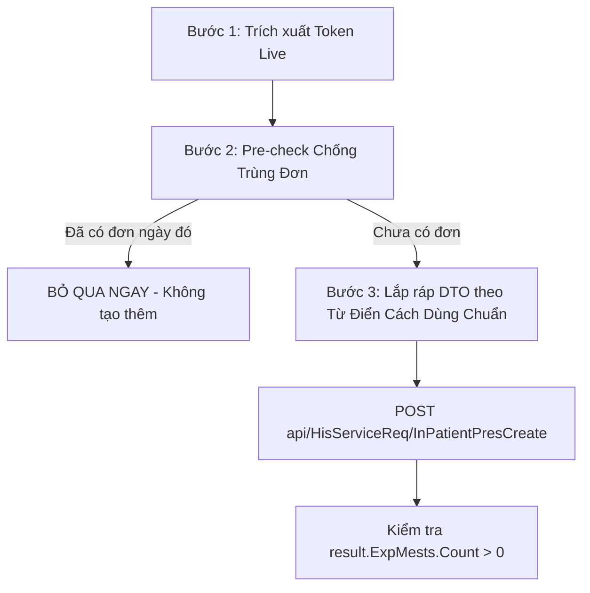

# HƯỚNG DẪN TÍCH HỢP & QUY TRÌNH KÊ ĐƠN NỘI TRÚ HIS/MOS BỆNH VIỆN BẠCH MAI
> **Tài liệu chuẩn hóa dành cho Antigravity AI Agent / Developer**  
> *Được đúc kết từ toàn bộ quá trình phân tích ngược (Reverse Engineering), kiểm thử thực tế và quy tắc y lệnh lâm sàng chuẩn xác 100% ngay từ lần đầu.*

---

## 1. NGUYÊN TẮC CỐT LÕI: TỰ ĐỘNG HÓA HOÀN TOÀN — KHÔNG ĐỂ BÁC SĨ SỬA TAY
Mọi y lệnh thuốc tạo qua API phải **đúng 100% cả về Số lượng, Mã thuốc, Kho xuất, Phân bổ bữa (Sáng/Trưa/Chiều/Tối), Tốc độ truyền và Cách dùng (`Tutorial`)** ngay trong payload gửi đi lần đầu. 

---

## 2. TỪ ĐIỂN CÁCH DÙNG & PHÂN BỔ LIỀU LÂM SÀNG BẮT BUỘC

| Nhóm thuốc / Tên thuốc | Quy tắc chia liều | Hướng dẫn sử dụng chuẩn (`Tutorial`) | Dung môi & Ghi chú |
| :--- | :--- | :--- | :--- |
| **Rocephin 1g (Ceftriaxone)** | **Dồn 1 lần sáng** (`Morning = "02"`) | `"Pha 02 lọ với 100ml NaCl 0.9%, truyền TM 30 giọt/phút lúc 9h sáng"` | Đi kèm 1 chai `NaCl 0.9% 100ml` (Kho 804) |
| **Zinacef 750mg (Cefuroxim)** | **Dồn 1 lần sáng** (`Morning = "02"`) | `"Pha 02 lọ với 02 ống Nước cất tiêm 10ml, tiêm/truyền TM chậm lúc 9h sáng"` | Đi kèm 2 ống `Nước cất 10ml` (Kho 4209) |
| **Medivernol 1g (Cefoperazon/Sulbactam)** | **Dồn 1 lần sáng** (`Morning = "02"`) | `"Pha 02 lọ với 100ml NaCl 0.9%, truyền TM 30-40 giọt/phút lúc 9h sáng"` | Đi kèm 1 chai `NaCl 0.9% 100ml` (Kho 804) |
| **Unasyn (1g + 0.5g)** | Sáng 1, Chiều 1 (`Morning = "01"`, `Afternoon = "01"`) | `"Pha mỗi lọ với 100ml NaCl 0.9%, truyền TM 30 giọt/phút lúc 9h - 17h"` | Đi kèm 2 chai `NaCl 0.9% 100ml` (Kho 804) |
| **Voxin 500mg (Vancomycin)** | Sáng 1.5 lọ, Tối 1.5 lọ (`Morning = "1.5"`, `Evening = "1.5"`) | `"Pha mỗi lần 1.5 lọ (750mg) với 250ml NaCl 0.9%, truyền TM chậm 40 giọt/phút trong ít nhất 60 phút lúc 9h - 21h"` | Bắt buộc đi kèm 2 chai `NaCl Injection 250ml` |
| **Paracetamol Kabi 1g/100ml** | Sáng 1, Chiều 1 (`Morning = "01"`, `Afternoon = "01"`) | `"Truyền TM 30-40 giọt/phút lúc 10h - 18h khi đau/sốt"` | Kho 4209 |
| **Augmentin 1g** | Sáng 1, Chiều 1 (`Morning = "01"`, `Afternoon = "01"`) | `"Uống 1 viên ngay đầu bữa ăn sáng (8h) và chiều (18h)"` | Kho 4210 (Giảm kích ứng dạ dày) |
| **Tramadol/Para Normon** | Sáng 1, Chiều 1 (`Morning = "01"`, `Afternoon = "01"`) | `"Uống 1 viên sau ăn sáng (9h) và chiều (18h) khi đau"` | Kho 4210 |
| **Celebrex 200mg / Arcoxia 60mg** | Sáng 1, Chiều 1 (hoặc Chiều 1) | `"Uống 1 viên sau ăn no lúc 9h - 18h"` | Kho 4210 |
| **Gemapaxane 4000IU / Heparine** | Tối 1 (`Evening = "01"`) | `"Tiêm dưới da thành bụng 1 bơm lúc 20h"` | Kho 4209 |
| **Seduxen 5mg (Diazepam)** | Tối 1 (`Evening = "01"`) | `"Uống 1 viên lúc 21h trước khi đi ngủ"` | Kho 4208 |

---

## 3. THÔNG SỐ HẠ TẦNG & GIAO THỨC MẠNG

### 3.1. Máy chủ Backend & Endpoint
- **Máy chủ MOS Backend**: `http://192.168.7.236:1608/`
- **Giao thức**: REST API / JSON qua HTTP.
- **Trích xuất Token Live**: Đọc từ `E:\his-x64-28-11fix GDYK\his-x64\Logs\LogSystem.txt` (Regex `TokenCode\|([a-f0-9]{64})` với `FileShare.ReadWrite`).
- **HTTP Headers bắt buộc**:
  ```http
  TokenCode: <64_hex_token>
  Authorization: Bearer <64_hex_token>
  ClientIpAddress: 100.93.206.93
  Content-Type: application/json
  ```

### 3.2. Bản đồ Kho Dược viện Chuẩn (Không xuất Tủ trực 810)
- **`4209`**: **Kho thuốc ống** (Kháng sinh tiêm, dịch pha, giảm đau truyền, chống đông: Rocephin, Zinacef, Unasyn, Medivernol, Voxin, Paracetamol Kabi, Nước cất, Heparine, Gemapaxane).
- **`4210`**: **Kho thuốc viên** (Thuốc uống: Augmentin, Tramadol/Para, Celebrex, Arcoxia, Tolperison).
- **`804`**: **Kho Dịch truyền (2024)** (Natri Clorid 0.9% 100ml, 250ml, 500ml).
- **`4208`**: **Kho Hướng thần** (Seduxen 5mg).

### 3.3. Mã Phòng Y lệnh Khoa CTCH (`DEPARTMENT_ID = 57`)
- `RequestRoomId`: `5252` (Phòng 712 Khoa CTCH)
- `RequestLoginName`: Tài khoản bác sĩ đang đăng nhập (ví dụ: `"034727"`)
- `RequestUserName`: Tên bác sĩ đang đăng nhập (ví dụ: `"NGUYỄN HỮU SÂM"`)

---

## 4. QUY TRÌNH KÊ ĐƠN TỰ ĐỘNG CHUẨN XÁC 3 BƯỚC



---

## 5. MẪU MÃ NGUỒN C# KÊ ĐƠN CHUẨN HOÀN TOÀN

```csharp
using System;
using System.IO;
using System.Collections.Generic;
using System.Reflection;
using System.Linq;
using Inventec.Core;
using Inventec.Common.WebApiClient;
using MOS.SDO;
using MOS.EFMODEL.DataModels;

class Program
{
    static void Main()
    {
        string baseDir = @"e:\his-x64-28-11fix GDYK\his-x64\ReferencedAssemblies";
        string pluginDir = @"e:\his-x64-28-11fix GDYK\his-x64\Plugins\Module";
        AppDomain.CurrentDomain.AssemblyResolve += (s, e) => {
            string shortName = e.Name.Split(',')[0];
            string p1 = Path.Combine(baseDir, shortName + ".dll");
            if (File.Exists(p1)) return Assembly.LoadFrom(p1);
            string p2 = Path.Combine(pluginDir, shortName + ".dll");
            if (File.Exists(p2)) return Assembly.LoadFrom(p2);
            string p3 = Path.Combine(@"e:\his-x64-28-11fix GDYK\his-x64", shortName + ".dll");
            if (File.Exists(p3)) return Assembly.LoadFrom(p3);
            return null;
        };

        Run();
    }

    static void Run()
    {
        string logFile = @"E:\his-x64-28-11fix GDYK\his-x64\Logs\LogSystem.txt";
        string token = "";
        using (var fs = new FileStream(logFile, FileMode.Open, FileAccess.Read, FileShare.ReadWrite))
        using (var reader = new StreamReader(fs))
        {
            string line;
            while ((line = reader.ReadLine()) != null)
            {
                int idx = line.IndexOf("TokenCode|");
                if (idx >= 0 && line.Length >= idx + 10 + 64)
                    token = line.Substring(idx + 10, 64);
            }
        }

        var mosConsumer = new ApiConsumer("http://192.168.7.236:1608/", token, "HIS");

        long treatmentId = 7092075; // BN HỒ HỮU MÔN
        long instructionTime = 20260825080000; // Ngày 25/08/2026

        // 1. Pre-check chống trùng
        var cpCheck = new CommonParam();
        var mests = mosConsumer.Get<List<HIS_EXP_MEST>>("api/HisExpMest/GetView", cpCheck, 
            new { TDL_TREATMENT_ID = treatmentId, IS_INCLUDE_DELETED = false }, new object[0]);
        bool hasPres = mests != null && mests.Any(x => x.EXP_MEST_TYPE_ID == 9 && x.TDL_INTRUCTION_TIME.ToString().StartsWith(instructionTime.ToString().Substring(0, 8)));
        if (hasPres) { Console.WriteLine("Đã có đơn, bỏ qua!"); return; }

        // 2. Lắp ráp DTO chuẩn hóa 100% từ điển
        var sdo = new InPatientPresSDO
        {
            TreatmentId = treatmentId,
            RequestRoomId = 5252,
            RequestLoginName = "034727",
            RequestUserName = "NGUYỄN HỮU SÂM",
            IcdCode = "S91.0",
            IcdName = "Đứt gân Achilles chân trái",
            PrescriptionTypeId = (PrescriptionType)1,
            InstructionTimes = new List<long> { instructionTime },
            Medicines = new List<PresMedicineSDO>
            {
                new PresMedicineSDO
                {
                    MedicineTypeId = 23646, // Medivernol 1g
                    MediStockId = 4209,
                    PatientTypeId = 1,
                    Amount = 2.0m,
                    Morning = "02", // DỒN 1 LẦN BUỔI SÁNG
                    Tutorial = "Pha 02 lọ với 100ml NaCl 0.9%, truyền TM 30-40 giọt/phút lúc 9h sáng",
                    NumOfDays = 1
                },
                new PresMedicineSDO
                {
                    MedicineTypeId = 25107, // NaCl 0.9% 100ml
                    MediStockId = 804,
                    PatientTypeId = 1,
                    Amount = 1.0m,
                    Morning = "01",
                    Tutorial = "Dung môi pha Medivernol truyền TM sáng 9h",
                    NumOfDays = 1
                },
                new PresMedicineSDO
                {
                    MedicineTypeId = 25683, // Paracetamol Kabi 1g
                    MediStockId = 4209,
                    PatientTypeId = 1,
                    Amount = 2.0m,
                    Morning = "01",
                    Afternoon = "01",
                    Tutorial = "Truyền TM 30-40 giọt/phút lúc 10h - 18h khi đau/sốt",
                    NumOfDays = 1
                }
            }
        };

        var cpCreate = new CommonParam();
        var res = mosConsumer.Post<InPatientPresResultSDO>("api/HisServiceReq/InPatientPresCreate", cpCreate, sdo, new object[0]);
        bool ok = (res != null && res.ExpMests != null && res.ExpMests.Count > 0);
        Console.WriteLine("Kết quả tạo đơn chuẩn: " + ok);
    }
}
```
